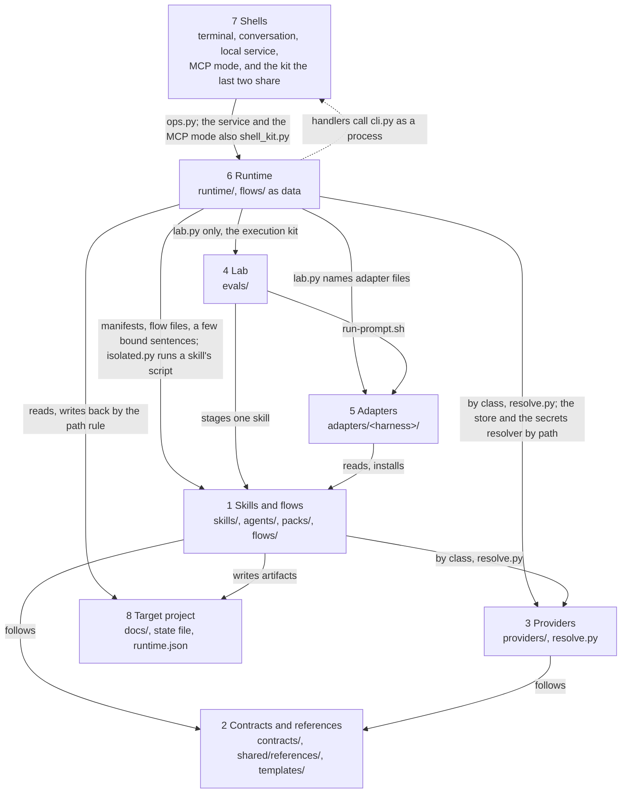
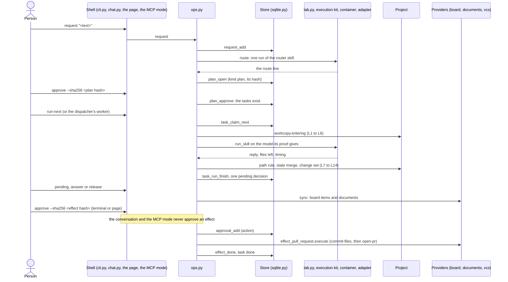

# The platform map

A living map of the whole repository: what each layer is, what it owns, what it may read, and where the rules that bind it are kept. It is written for three readers: the maintainer following the system's growth and looking for what to improve, a newcomer learning the platform, and a reviewer checking a change against the rules. It points to the contracts, the READMEs and the findings instead of repeating them; when a page and the file it points to disagree, the file wins and the page is corrected.

This folder is undated on purpose. Each page ends with its own "Changes" section.

## What the system is

ai-workbench is a workbench of skills that let a model build a digital solution end to end, and every skill is proven in a lab: run in a container, graded, and ranked by the evidence it has passed on each model (`evals/`). On top of the skills sits a task runtime: a person writes a request, a planning agent routes it, code turns the route into a plan of tasks, and area agents work through that backlog one task at a time, each task a run of one proven skill in the same container it was proven in. The model only reads and writes files in a copy; every external effect (a commit, a pull request, a post) is executed by code, under an approval recorded by its hash. The proof decides the model: a run goes to the inexpensive floor model only where the skill is proven there. A person reaches the runtime from the terminal, a conversation, a local page or an MCP client. The same skills install into several AI tools through adapters, so a person can also use them by hand, without the runtime.

## Start here

1. **Install a pack of skills into your tool.** A pack is the unit of installation ([packs/README.md](../../../packs/README.md)); `default` is every area except the optional ones. Pick the adapter of your tool from `adapters/` (each folder's `README.md` says what it installs and where):

   ```sh
   bash adapters/agents-dir/install.sh                     # pack "default", into the user-level skills folder
   bash adapters/agents-dir/install.sh --project .         # the same, into ./.agents/skills of one project
   bash adapters/claude-code/install.sh --pack default     # a plugin built from the core for one pack
   python3 scripts/select_skills.py --pack business        # which skills a pack selects, without installing
   ```

   With a pack installed you can run any skill by hand in your tool. The rest of this section is the runtime, which runs skills without you at the keyboard.

2. **Prepare a project for the runtime.** A project starts with the workbench state file, which the project-init skill writes (`skills/core-project-init/scripts/init_project.py --root <project> --apply --autonomy milestones`, or run the skill in your tool), and a configuration, `<project>/docs/workbench/runtime.json`, with three absolute paths ([runtime/README.md](../../../runtime/README.md), "Trying it"):

   ```json
   {"workbench": "<this checkout>", "data_dir": "<a folder outside every repository>", "store_db": "<data folder>/tasks.sqlite"}
   ```

   Every operation but `accept-config`, `config` and `service-check` refuses a configuration whose hash is not the one you accepted last (`config` reports the hash and never refuses). The refusal names the hash and the command that gets past it; read the file, then accept it:

   ```sh
   python3 runtime/cli.py accept-config --project <dir> --sha256 <hash>
   ```

3. **Run one request end to end**, from the workbench checkout the configuration names:

   ```sh
   python3 runtime/cli.py request  --project <dir> --flow market-positioning --text "<what you want>"
   uv run --with keyring==25.7.0 python3 runtime/cli.py run-next --project <dir>   # a model call: docker and the credential
   python3 runtime/cli.py pending  --project <dir>                                 # what waits for you
   python3 runtime/cli.py answer   --project <dir> --id <n> --text "<your answer>" # a question, or a review sent back
   python3 runtime/cli.py release  --project <dir> --id <n>                        # a delivery: done, still a draft
   python3 runtime/cli.py sync     --project <dir>                                 # only with a task board or documents platform
   python3 runtime/cli.py status   --project <dir>
   ```

   Without `--flow`, the request waits for its route: `route --project <dir> --request <id>` runs the router skill (a model call), and `approve --id <n> --sha256 <the plan's hash>` creates the tasks. `proof --project <dir>` shows, without a model call, which model each skill would run on and why. `run-next` again runs the next ready task; a run that asks waits for your `answer`, and the task runs again with it.

4. **Where the result lands.** The documents a skill writes come back into the project, under `docs/<area>/`, and the state file `docs/workbench/state.md` gets the skill's draft rows, decisions and open questions. Each run's copy, prompt and output are kept in `<data_dir>/task-runs/<run id>/`; the records (requests, tasks, runs, pending decisions, approvals) are in the store at `store_db`. A use of each skill is recorded in the project's `.workbench-local/evidence/`, and your verdict on a run is one command: `verdict --project <dir> --run <id> --word worked|corrected|failed`.

5. **Where to read next.** The runtime's page, [runtime.md](runtime.md); then [contracts/runtime.md](../../../contracts/runtime.md) for the contract and [AGENTS.md](../../../AGENTS.md) for the rules every file follows. The terminal conversation with the planning agent is `python3 runtime/chat.py --project <dir>` (`/help` lists its commands). Two more shells reach the same operations ([shells.md](shells.md)):

   ```sh
   uv run --with keyring==25.7.0 python3 runtime/service.py --project <dir> [--project <dir>]... [--port 8765] [--no-dispatch]
   python3 runtime/mcp.py --project <dir> [--project <dir>]...
   ```

   The local service prints one JSON line with its address and the path of its token file, and serves the pages of `interface/`: open the address in a browser and paste the token once per session. Unless it is started with `--no-dispatch`, it also dispatches the ready tasks of each project (`--dispatch-every`, 30 seconds by default), as far as the modes and the daily caps of the area agents allow; with `--no-dispatch`, `status` says `dispatch off` for every ready task of that service. The MCP mode is a process an MCP client starts, JSON-RPC on standard input and output, with no token and no port, and it has no tool that approves anything. For a project whose configuration is not accepted yet, both list the project with `accepted: false` and answer 412 to each route or tool until `accept-config` is typed in the terminal.

6. **What is not yet a replaceable piece.** If you want to know which layers cannot yet be swapped on their own, read [the review of 2026-10-06](review-2026-10-06.md): the findings, ranked, each with its state in a table at the top.

## Keeping the pages current

A table that changes with the code is generated, never edited by hand: it sits between `<!-- generated: <table> -->` and `<!-- /generated -->`, and `python3 scripts/architecture_tables.py --help` names each table and its one source. After a change to one of those sources, run `python3 scripts/architecture_tables.py --write`; `--check` names the stale blocks, and `scripts/validate.py` reports each one as a warning (`[architecture-tables]`). The prose around a block stays hand-written.

## The layers



An arrow is "may read or call". Nothing in layers 1 to 3 points to adapters, the lab or the runtime, and the one arrow into a shell is the dotted one: a handler (`runtime/handlers/*.py`) calls `runtime/cli.py` as a process (`execute-under-policy` for an effect, `contained-run` for the social agent's run). `scripts/tests/test_layer_map.py` scans code only (an import, or a string or path that names a `.py` or `.sh` file): every arrow that is code is a row of its `ALLOWED`, and an arrow the code violates is a row of its `TOLERATED`, named after the finding that removes it (`ops.py` reading the side-effect line of `scripts/validate.py`, finding 11; `mkt-engage`'s fallback to another skill's copy of a script, finding 17; the social handlers' calls of skill scripts, finding 9). The test fails on a tolerated row the scan no longer finds, so the list only shrinks. The arrows that are data (the layers reading contracts and references, the manifests and flow files, the project's files) are by convention: the test does not see them. `runtime/` also reaches three scripts of `scripts/`, which is tooling and not a layer (`select_skills.py`, `evidence.py`, `redact.py`).

| # | Layer | What it is | Page |
|---|---|---|---|
| 1 | Skills and flows | The capabilities and flow skills under `skills/`, the delegation agents under `agents/`, the packs under `packs/`, and the flow files `flows/<name>.json` that code reads; a skill the runtime runs also has a runtime manifest beside its eval cases | [skills-and-flows.md](skills-and-flows.md) |
| 2 | Contracts and references | The artifact, state, environment, runtime and secrets contracts under `contracts/` (the runtime's holds the contained run, the local service and the MCP mode), the cross-cutting and platform references under `shared/references/`, the templates | [contracts-and-references.md](contracts-and-references.md) |
| 3 | Providers | One script per implementation of a requirement class, reached through `providers/resolve.py` (`resolve.call` for a verb); the store is the runtime's own persistence and the secrets resolver one door to credentials | [providers.md](providers.md) |
| 4 | The lab | The eval runner, the container, the measurement, the status script and the evidence (`evals/`, `skills/<name>/evals/`), and the execution kit the runtime reads (`evals/execution.py`, with `evals/run_attempts.py`) | [lab.md](lab.md) |
| 5 | Adapters | Everything specific to one AI tool: installers, the eval entry `run-prompt.sh`, overrides (`adapters/<harness>/`), and the runner of the first runtime | [adapters.md](adapters.md) |
| 6 | The runtime | The task runtime under `runtime/`: requests, tasks, runs and contained runs in the container, pending decisions, approvals, mirrors, the dispatcher, the handlers, the table of operations, the roles file and the isolated runner | [runtime.md](runtime.md) |
| 7 | The shells | Thin fronts over the operations layer: the terminal (`runtime/cli.py`), the conversation (`runtime/chat.py`), the local service (`runtime/service.py`, with the pages of `interface/`) and the MCP mode (`runtime/mcp.py`); the last two share the shell kit (`runtime/shell_kit.py`) | [shells.md](shells.md) |
| 8 | The target project | The project a person works on: its documents, its state file, its configuration, its work data; never a file of this repository | [project.md](project.md) |

**The direction rules.**

- The core (`skills/`, `agents/`, `shared/`, `contracts/`, `templates/`, `providers/`, `packs/`) never reads an adapter and names no AI tool; adapters read the core ([AGENTS.md](../../../AGENTS.md), principles 1 and 2; enforced by `scripts/validate.py`).
- The runtime reads adapters only through the lab: `runtime/lab.py` is the one module of `runtime/` that imports anything under `evals/`, and the lab starts the adapter (`lab.py` names the adapters' `adapter.json` and `run-prompt.sh`). It loads the lab's execution kit (`evals/execution.py`, with `evals/run_attempts.py`), which is outside the measurement fingerprint (decision D1, review finding 2). This is why `runtime/` sits outside the core directories, as `evals/` does.
- A skill's script is run by the runtime only through `runtime/isolated.py`, as a subprocess with a scrubbed environment; no module of `runtime/` loads a file of `skills/` in its own process. The social handlers' host subprocesses are the tolerated rows of finding 9.
- A capability never invokes another skill. The one exception is the router, `core-orchestrator`, which names the skill and hands the request over and does none of its work ([AGENTS.md](../../../AGENTS.md), principle 4).
- What measures lives in the lab's measurement files (the grading template, `evals/measure.py`, `evals/measurement.json`, the executor and the container, `scripts/stage_skills.py`, the eval adapters' `run-prompt.sh` and `eval.json`), bound by the fingerprint in `evals/eval-gate.json`. The runtime imports the lab's functions and never edits a measurement file.

## A request, end to end

The path of one request from a text to its documents and a pull request, each step with the layer and the module or command that does it. The runtime's page states each rule in full.

1. **Request** (shell, then runtime). `cli.py request` (or a line typed in `chat.py`, a request sent from the local page or a tool of the MCP mode) calls `ops.request`, which records the request in the store (`request_add`). With `--flow`, the plan is the flow file's tasks at once; without it, the request waits for its route.
2. **Route** (runtime, through the lab). `ops.route` runs the router skill once, as it is, asked only for the route; `runtime/router.py` reads the one route line `Route: <name> (...)` or the question lines, and nothing else. A reply that asks becomes a `question`; anything else reaches the person whole.
3. **Plan approved** (runtime). `runtime/plan.py` builds the tasks from the flow file or a one-skill route, checks each skill against the packs of the enabled area agents (a skill outside them is refused with the pack to add, `plan.scope_refusal`), and opens a `plan` pending decision with the plan's hash. No task exists until `approve --sha256 <hash>`; the router creates none (limit L19).
4. **Task claimed** (runtime, store). `run-next`, the dispatcher's worker or the local service's own dispatch loop (every 30 seconds unless it is started with `--no-dispatch`) takes the project's run lock and claims the oldest ready task (`task_claim_next`): one task at a time per project.
5. **The copy that enters the run** (runtime). `runtime/workcopy.py` decides what enters a fresh copy (limits L1 to L6): the versioned files, the documents and the state file, the declared machine files and the task's file drop; only the declared artifacts for a task with the web; never the store, the configuration, a tool's settings or a credential.
6. **The run** (lab, adapter, container). `runtime/proof.py` chooses the model from the skill's proof; `lab.run_skill` stages the one skill and runs it in the eval container through the lab's execution kit (`evals/execution.py`) and the adapter's `run-prompt.sh`, with the attempts made by the kit's `evals/run_attempts.py`. The credential stays in a key proxy outside the run.
7. **What comes back** (runtime). Every file the run left gets one class from the path rule (`runtime/path_rule.py`); documents and machine files come back unless they changed at the origin, the state file comes back only through `runtime/state_merge.py`, and versioned files of a code task come back as one change set (`runtime/changeset.py`), never as loose files.
8. **The ending** (runtime). `runtime/endings.py` classifies the run from a closed list (`done`, `question`, `draft_with_questions`, `gate`, `blocked`, `unclassified`) and never guesses.
9. **The pending decision** (runtime, store). The task waits on exactly one: a `question` (it wrote nothing and asks), a `review` (a delivery, with the whole reply), or an `effect` (a skill stopped at its confirmation gate with a payload code recovered). `blocked` opens nothing.
10. **The person's answer or release** (shell). `answer` sends the task back with the person's words, written into the state file by code; `release` lets the delivery stand, still a draft. An area agent's autonomy mode may release a plain `done` delivery by itself, and never what the autonomy row of the cross-cutting table below lists (`runtime/autonomy.py`, `runtime/dispatcher.py`).
11. **The mirror** (runtime, providers). `sync` mirrors the tasks with the project's task board (`runtime/board.py`) and the documents with its documents platform (`runtime/documents.py`); an edit the person made there is taken back only when the skill's checker passes, and the next run is told that the content is the person's.
12. **The effect** (runtime, providers). For the pull-request skill, `approve --sha256 <the effect's hash>` records the approval (`approvals` table) and checks that nothing moved; it is typed in the terminal or sent from the local page, never from the conversation or the MCP mode (the channel rule, `EFFECT_CHANNELS`). Code then makes the one commit and opens the pull request through the code provider (class `integration:vcs`): `runtime/effect_pull_request.py` executes, and `runtime/effects.py` is the registry of effect kinds (`KINDS`, `module_for`) that calls the provider (`provider_call`).
13. **Progress recorded** (runtime). Every run is a row of `task_runs`, every decision a resolved pending decision, every effect an executed approval; `progress` and `status` read them, and no model writes them (`runtime/progress.py`).



## Cross-cutting rules

| Rule | Where it is enforced |
|---|---|
| Two promises: cheap with proof (a run goes to the floor model only where the skill is proven there) and safe by construction (the model reads and writes a copy; code executes every effect) | `runtime/proof.py` and `runtime/effects.py`; the limits of [contracts/runtime.md](../../../contracts/runtime.md) |
| An artifact has exactly one owner, the skill whose `outputs` lists it; others list it in `updates` | `scripts/validate.py` (the artifact contract); [contracts/project-layout.md](../../../contracts/project-layout.md) |
| The model only reads and writes its copy; code executes effects, with the exact content approved or inside an approved policy (L15); the social handlers keep their own gate until they are handed to the operations layer (WP-7.6) | `runtime/ops.py` (`execute_under_policy`, which calls `autonomy.covers`), `runtime/effects.py`; `runtime/tests/test_execute_under_policy.py`, `test_effects.py`, `test_standing_approval.py`; the exemption is `PORTED` in `runtime/tests/test_runtime_rules.py` |
| An effect is approved only from the terminal or the local page, with its hash; the conversation and the MCP mode never approve it (the channel rule, decision D8) | `runtime/ops.py` (`EFFECT_CHANNELS`), the `channels` column of `runtime/operations.py`; `runtime/tests/test_task_ops.py`, `test_an_effect_is_approved_from_the_terminal_and_the_page_and_from_no_other_channel` |
| The proof decides the model: the floor model only where the skill is `reliable` there, the measurement files are the recorded ones and the image is the evidence's | `runtime/proof.py`; `runtime/tests/test_proof_routing.py` |
| The measurement has a fingerprint; a change to a fingerprinted file is committed as a measurement change of one of three kinds | `scripts/validate.py` (fingerprint); `evals/eval_status.py measurement`; [reliability model](../reliability-model-2026-10-02.md), section 8 |
| A configuration is accepted only by the hash the person typed in the terminal; the one change code accepts is a narrowing of an area agent's mode (`set-mode`, also from the page), made under `config.lock` so that a stale copy of the file can never bring a widening | `runtime/ops.py` (`accept_config`, `set_mode`), `runtime/autonomy.py` (`narrows`); `runtime/tests/test_mode_narrowing.py`; `runtime/tests/test_service.py`, `test_accepting_a_configuration_is_not_a_route` |
| The local service answers only on the loopback address, to a Host and an Origin of its own, with a token on every `/api/` path, and one route calls one operation | `runtime/service.py` (its docstring numbers the rules of a request), [contracts/runtime.md](../../../contracts/runtime.md), "The local service"; `runtime/tests/test_service.py` |
| A contained run (one skill, once, in the eval container, for a caller that is not a task) sees only the artifacts its skill declares, receives no credential but the model's own, makes one attempt and never reaches the open network, and returns only the reply (R1 to R4) | `ops.contained_run`; [contracts/runtime.md](../../../contracts/runtime.md), "The contained run"; `runtime/tests/test_contained_run.py` |
| Skill code runs only through `runtime/isolated.py`, in a subprocess with a scrubbed environment, and no module of `runtime/` loads a file of `skills/` in its own process; the social handlers are the tolerated exception (finding 9) | `runtime/isolated.py`; `runtime/tests/test_isolated.py`; `scripts/tests/test_layer_map.py` (`TOLERATED`) |
| The dependency map between the layers is a test: an arrow the code has that the diagram does not is a failing test, and a tolerated arrow names the finding that removes it | `scripts/tests/test_layer_map.py`; the status table of [review-2026-10-06.md](review-2026-10-06.md), finding 14 |
| Credentials are passed by name only, through one resolver; never in a file, a flag, a prompt or a run | `providers/secrets/resolver.py`; [contracts/secrets.md](../../../contracts/secrets.md); the security scan; limit L6 |
| Principle 8: the repository holds no file of a project that uses it and names none of its people, accounts or hosts | [AGENTS.md](../../../AGENTS.md); the validator's `private-term` check where a maintainer keeps the local list |
| A standing policy's bounds are enforced by the operations layer, a configuration refuses an unknown key, a skill enters the runtime by its manifest and `runtime/roles.json`, an effect kind is a module, and a provider verb is called by `resolve.call` (the effect path starts its verbs through `resolve.invoke`, in `effects.provider_call`); the first runtime and the social handler keep loaders of their own | `runtime/ops.py`, `runtime/project_config.py`, `runtime/roles.json`, `runtime/effects.py`, `providers/resolve.py`; the status table of [review-2026-10-06.md](review-2026-10-06.md) |
| Autonomy modes: five per area agent, from three facts, with two daily caps (runs on the strong tier, dollars on the floor tier); a mode never releases a question, an unclassified reply, a draft with open questions, a `done` with no change, a blocked change set, an unproven skill or a mandatory milestone, and never executes an effect outside an approved policy | `runtime/autonomy.py`; `runtime/tests/test_autonomy.py` |
| One task at a time per project | the run lock in `ops.py`; the store's one running task per database; `runtime/tests/test_dispatcher.py` |
| What enters a run (L1 to L6) and what comes back (L7, L8, L12, L14), each by one module | `runtime/workcopy.py`, `runtime/path_rule.py`; `runtime/tests/test_run_limits.py` |
| The state file's merge: a run adds its own draft rows, its own decisions and new open questions; only code writes what is the person's | `runtime/state_merge.py`; `runtime/tests/test_state_merge.py` |
| Document types are `editable` (a person's edit is taken back when the checker passes) or `read_only` (an edit is kept aside, never imported, and the page is never written over while it differs) | the runtime manifest of each skill; `runtime/documents.py`; `runtime/tests/test_documents_mirror.py` |

## Glossary

The names fixed for this work. Use each exactly.

| Term | What it is |
|---|---|
| Task runtime | The code under `runtime/`; the older `scripts/runtime.py`, with `scripts/runtime_vote.py` and `scripts/vote_job.py`, is "the first runtime", which stays until stage 7 ends; its social agent already runs as handlers of the task runtime, as a contained run |
| Request | What the person asked for, in the person's words; in the store, a task with no parent and no skill |
| Task | One unit of work: one skill, run on the project until it is done; nine states |
| Task run | One run of a task's skill in the container (table `task_runs`); a run made again inside it is an attempt |
| Task board | Where tasks are shown and edited by a person, on the machine or a platform (class `integration:issue-tracker`) |
| Pending decision | What a task waits for the person to decide, of six kinds: `plan`, `question`, `review`, `effect`, `acceptance`, `your_document` |
| File drop | The folder through which the person hands a file to one task, `<project>/.workbench-local/drop/<task id>/` |
| Area agent | A scope: a pack of skills, a queue, two daily caps (runs on the strong tier, dollars on the floor tier) and an autonomy mode; no persona text and no file under `agents/` |
| Planning agent | The area agent named `planning`, whose pack holds the router skill; it returns a route and creates no task |
| Flow file | `flows/<name>.json`: the tasks of a flow and their written dependencies, read by code; not a `flow-` skill |
| Runtime manifest | `skills/<name>/evals/runtime-manifest.json`: what the runtime knows of a skill that its frontmatter does not declare |
| Project configuration | `<project>/docs/workbench/runtime.json`, accepted by its hash |
| Lab | The eval harness under `evals/`: the runner, the executor, the container |
| Lab facade | `runtime/lab.py`, the one file of `runtime/` that imports the lab's execution kit (`evals/execution.py`) |
| Operations layer | `runtime/ops.py`: every operation a shell can perform, once |
| Table of operations | `runtime/operations.py`: one row per operation (its verb, function, arguments, channels, whether it calls a model, whether it is a job); the terminal's parser is built from it, and the service's routes, the MCP tools and the conversation's commands exist only for the rows that list their channel |
| Channel | The surface that called an operation: `terminal`, `chat`, `page` or `mcp`; each row of the table of operations lists the channels that may call it |
| Channel rule | An effect is approved only from the terminal or the page (`EFFECT_CHANNELS`), with its hash; the conversation and the MCP mode never approve one |
| Job | An operation whose row says it calls a model or a platform: the local service and the MCP mode start it in a thread and answer at once with a job to ask for again |
| Shell | A thin front over the operations layer: the terminal command, the conversation, the local service and the MCP mode |
| Shell kit | `runtime/shell_kit.py`: what the local service and the MCP mode share (project ids, the words of the status codes, the argument kinds, the job registry); it is not a shell and imports nothing of the runtime |
| Run copy | The fresh folder a run sees: what entered from the project, plus the staged skill |
| Run folder | Where a run's copy and output are kept afterwards, `<data_dir>/task-runs/<run id>/` |
| Path rule | The one function that gives each path a run left one class: `state`, `machine`, `document`, `versioned`, `ignored`, `other` |
| Ending | How a run that did not fail ended: `done`, `question`, `draft_with_questions`, `gate`, `blocked`, `unclassified` |
| Release | The person, or an agent's mode, lets a delivery stand so the next task may start; the delivery stays a draft |
| Approve | Only the person approves; an approval is a row of the store's `approvals` table, and "approved" in the state file is written only by code |
| Milestone | A delivery the person reviews even in the `milestones` mode; a mandatory milestone is held in every mode |
| Effect | An action outside the project (today a commit and a pull request), shown at a skill's confirmation gate and executed by code once approved by its hash |
| Effect kind | What differs between two effects, written as one module of `runtime/` and a row of `effects.KINDS`; today the pull request (`runtime/effect_pull_request.py`) |
| Standing approval | The approval of a policy file by its hash, with bounds and an expiry of at most 365 days (a row of the `approvals` table with scope `standing`); `autonomy.covers` checks every bound before an effect runs under it |
| Contained run | One run of one skill in the eval container for a caller that is not a task (the social agent's run): `ops.contained_run`, one attempt, never on the open network, only the reply comes back |
| Effect hash | The sha256 of `<run folder>/effect.json`, which binds the repository, the base, the head, the title, the body and every file of the change set |
| Change set | What a code task did to versioned files, taken by git in the run's container and kept in its run folder until code commits it |
| Drop | Short for the file drop |
| Mirror | The runtime's copy of its tasks on a task board, and of its documents on a documents platform; only code talks to the platform |
| Record statuses | A mirrored document is `mirrored`, `read_only` or `rejected`; a saved platform comment is `open`, `used` or `dismissed`; an approval is `pending-execution`, `executed`, `active`, `expired` or `revoked` |
| Autonomy modes | `stopped`, `supervised`, `milestones` (the default), `autonomous`, `autonomous-with-policy` |
| Tiers | `strong` (the reference model) and `floor` (the floor model), both named only in `evals/eval-gate.json` |
| Reference model, floor model | The strong and the inexpensive model of the gate file; no file of `runtime/` names one |
| Spend split | The day's floor spend as `autonomy.spend_split` gives it: `usd_recorded` (the recorded costs) and `usd_reserved` (`max_cost_usd_per_run` for each floor run without a recorded cost); their sum is what the dollars cap compares |
| Proof | What the status script computes for a skill on a model and adapter; the runtime keeps a copy in `<data_dir>/proof.json` and routes by it |
| Proof file | That copy: a cache in the data folder, never a source, never committed |
| Band | A skill's standing on a model, computed by rules from lab evidence: `needs a test`, `watch` or `reliable` ([reliability model](../reliability-model-2026-10-02.md), section 5) |
| Dispatcher | The function that decides the next run and the releases a mode makes, started by the scheduler's two jobs and by the local service's own dispatch loop |
| Held task | A ready task the last dispatcher round did not start; its reason is one word of `REASONS` in `runtime/dispatcher.py`, kept in the cursor `dispatch:held` |
| Handler | A routine under `runtime/handlers/` that the dispatcher ticks, with verbs of its own: the weekly published-posts routine and the three files of the social agent (`social.py`, `social_vote.py`, `social_vote_job.py`, the last started by the scheduler and never by hand) |
| Roles file | `runtime/roles.json`: the skills the runtime is wired to, the code areas and the packs in use, as data read by `runtime/roles.py` |
| Isolated runner | `runtime/isolated.py`: runs a skill's script as a subprocess with a scrubbed environment, so that no module of the runtime loads a skill's file |
| Execution kit | `evals/execution.py`: the part of the lab the runtime reads, named by its `__all__`; it and `evals/run_attempts.py` are outside the measurement fingerprint |
| Narrowing | A move of an area agent's mode down the order of `MODES`; `set-mode` makes it and code accepts the changed configuration at once (`code:narrowing`); a move up is never accepted by code |
| Configuration lock | `<data_dir>/config.lock`: the lock that `accept-config` and `set-mode` take, so that a change finds the file and the accepted hash as it began |
| Change signal | `version`: a number the store keeps in its file's header (`change_counter`), raised by one with every write transaction that changed a row; a page compares two numbers to know it must reload |
| Service check | `service-check` (the operation `service_check`): what the local service finds at its start for each project (the secret store, the credential, docker, the eval image, whether it dispatches); it starts nothing |

## Known limits and improvements

| Limit | Where it is recorded |
|---|---|
| The proof covers one skill in one run with an input in the form of its cases; resuming with answers and running on another model's document were not measured, and only field evidence checks them | [contracts/runtime.md](../../../contracts/runtime.md), "What the proof covers" |
| The line that tells a run a document is the person's edit is built and tested, and not yet observed in a live run | [stage 3 findings](../stage-3-findings-2026-10-06.md), findings 8 and 15 |
| An answer that settles an open question does not close it in the state file | [stage 3 findings](../stage-3-findings-2026-10-06.md), finding 10 |
| A request written as bullets is read as several deliveries, one router run each, before the person sees the count | [stage 3 findings](../stage-3-findings-2026-10-06.md), finding 12 |
| The social platform layer is built for one platform of one shape | [AGENTS.md](../../../AGENTS.md), design rule 3 |
| The adapter's report of a loaded skill is not reliable; no rule reads it | [skeleton findings](../skeleton-findings-2026-10-05.md), finding 6; [backlog](../../backlog.md), R12 |
| A board's own status property is not written; the runtime's states live in a property of its own | [backlog](../../backlog.md), R13 |
| The workarounds listed under T23 wait for the next change of reference model (the dependency install step, the two `AGENTS.md` lines, the approvals copied into the state file, the manifest outside the frontmatter, a skill run up to its gate, among others) | [backlog](../../backlog.md), T23 |
| The review of 2026-10-06 ranks its findings against the goal of replaceable layers; its status table says which are fixed, which partly (skill code runs in an isolated host process, not yet in a container) and which wait for the next change of their layer | [review-2026-10-06.md](review-2026-10-06.md) |
| `runtime/ops.py` holds every operation and has grown since the review measured it, and `runtime/dispatcher.py` is both the decision and the scheduler's entry; the split waits for the next change of that layer | [review-2026-10-06.md](review-2026-10-06.md), finding 10, whose status row gives the size now; [runtime.md](runtime.md) |
| The social handlers keep three differences from the other handler until their step of stage 7 hands them to the operations layer: their own gate and records, their skill scripts run as host subprocesses (finding 9), and their own loaders (the third has no listed removal) | [runtime.md](runtime.md), "Known limits and improvements"; [review-2026-10-06.md](review-2026-10-06.md), findings 9 and 15 |
| The eval container's model routes are keyed by tier, and the eval contract has no shared conformance suite; both wait for the next change of the lab or an adapter | [review-2026-10-06.md](review-2026-10-06.md), findings 12 and 13; [lab.md](lab.md); [adapters.md](adapters.md) |
| `integration:documents` is in neither list of classes (the table of `contracts/environment.md` and `LISTED` in `providers/resolve.py`), though the runtime uses it; it resolves by its folder | [contracts-and-references.md](contracts-and-references.md); [providers.md](providers.md) |
| A local service started without dispatching makes its own `status` hold every ready task as `dispatch off`, though the scheduler's jobs may be dispatching: the service does not know of them | `runtime/service.py`, the docstring of `--no-dispatch`; [shells.md](shells.md) |

## Changes

- 2026-10-06: first version, with the runtime's page; the pages of the other seven layers follow.
- 2026-10-06: the layer list links the page of every layer; the shells' and the target project's pages added.
- 2026-10-06: the volatile tables of the layer pages are generated ("Keeping the pages current").
- 2026-10-06: the architecture review and its status table (review-2026-10-06.md).
- 2026-10-07: the close-out of the architecture fixes: the review's status table is final, and the cross-cutting rows and the known limits name what the fixes changed.
- 2026-10-07: the local service (`runtime/service.py`, `interface/`) is a shell of layer 7, with its own arrow to `runtime/ops.py` in the layer map.
- 2026-10-08: the layer map gives `runtime/service.py` and `runtime/mcp.py` an arrow to `runtime/shell_kit.py`, the kit they share (it imports nothing of the runtime); the other shells keep the one arrow to `runtime/ops.py`.
- 2026-10-09: brought to the code of the central branch after the eight layer pages: the start commands for the local service and the MCP mode, the configuration check, the layer diagram and its prose (the handlers' call of `cli.py`, the adapter files `lab.py` names, the store, the secrets resolver and the isolated runner), the layer rows, the request path (the execution kit, the effect kinds, the channel rule, the service's dispatch loop), new cross-cutting rows, the glossary's new terms and the known limits (closed rows deleted, open limits added).
