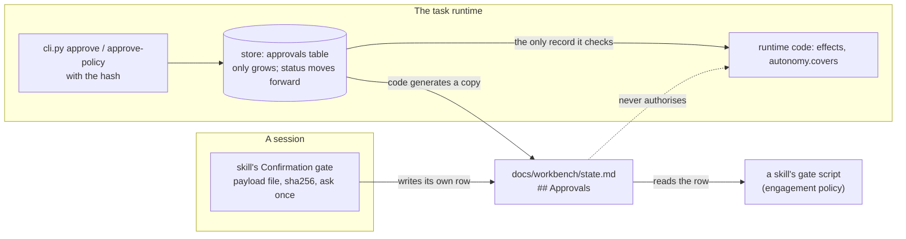
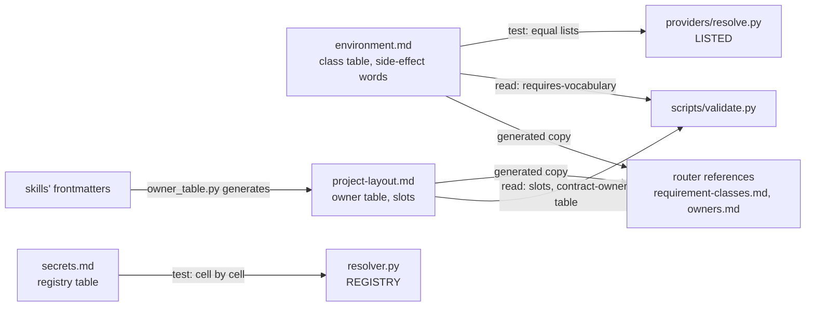

# Layer 2: contracts and references

Part of [the platform map](README.md). Every layer page has the same eight sections, in this order.

## Purpose

The contracts say what a target project contains and what every other layer agrees on: where each artifact lives and which skill owns it, the form of the state file, the requirement classes and the actuator protocol, the runtime's pieces and limits, how secrets are found, and the shape of the one outside data a skill reads. The shared references hold knowledge more than one skill loads: the security checklist, and one description per social platform as a medium with its data file. The templates are the skeletons skills and agents start from. None of this runs; code and skills read it, and where a table of a contract must equal code, a test or a generated copy keeps the two equal.

The contracts are under [contracts/](../../../contracts/project-layout.md), the references under [shared/references/](../../../shared/references/README.md), the skeletons under `templates/`. This page maps them and does not repeat them.

## Artifacts it owns

Where: **repo** is this repository. The files a contract describes live in the target project or the data folder; the contract itself is here.

| Path | Where | What it fixes | Written by | Read by | Lifecycle | Versioned | Generated |
|---|---|---|---|---|---|---|---|
| [contracts/project-layout.md](../../../contracts/project-layout.md) | repo | the tree of a target project's `docs/` and `.workbench-local/` (payloads, evidence, the file drop, a project's dependency files, and `docs/workbench/policies/`); the meaning of `inputs`, `outputs`, `updates`; the placeholder vocabulary; the table "Slots no built skill writes"; the table of owning skills; the rules for artifacts (Markdown with a header `Owner`, `Status`, `Date`; templates live with the owner; working records are not registered; existing documents are registered, never moved) | maintainers; the owner table by `scripts/owner_table.py` | skills (their frontmatter), `scripts/validate.py` (slots and owner table), the router (a copy of the owner table) | changed by pull request; the owner table with every change of `outputs` or `updates` | yes | the owner table is |
| [contracts/state.md](../../../contracts/state.md) | repo | the form of `docs/workbench/state.md`: the head lines (`Project`, `Current flow`, `Current phase`, `Updated`, `Docs in git`), `## Autonomy` (`Checkpoints`), `## Artifacts`, `## Decisions`, `## Open questions`, `## Approvals`, and who writes what | maintainers | every flow, every skill that lists the state file, `core-project-init` (its script writes the file), `runtime/state_merge.py` | changed by pull request | yes | no |
| [contracts/environment.md](../../../contracts/environment.md) | repo | the requirement classes and their two forms; the resolution order (connector, provider script, degrade); how a provider is reached (`providers/resolve.py`, `WORKBENCH_ROOT`); credentials; the closed list of side-effect words; the approval scopes and the hash rules; the two records of approvals (the statuses, `revoked` among them); `scripts/doctor.py` | maintainers | skills (`requires`, `side_effects`, the gate), `providers/resolve.py`, `scripts/validate.py`, `scripts/doctor.py`, the router (a copy of the class table) | changed by pull request | yes | no |
| [contracts/runtime.md](../../../contracts/runtime.md) | repo | the first runtime and the task runtime: the pieces (the table of operations; the configuration and who may accept a change of it; the commands the runtime names), a task run, the contained run (R1 to R4), the records, the limits L1 to L20, the dispatcher's jobs, the local service, the MCP mode, what the proof covers | maintainers | `runtime/`, `scripts/runtime.py` ([runtime.md](runtime.md) maps it) | changed by pull request | yes | no |
| [contracts/secrets.md](../../../contracts/secrets.md) | repo | the one resolver and its lookup order; where a secret is kept per environment; the variables passed into an eval run; where the eval models' credentials live during a run (the key proxies of `evals/container/keyproxy/`); the registry of the secrets the core reads | maintainers | `providers/secrets/resolver.py` (its `REGISTRY` must equal the table), `scripts/doctor.py`, people setting up an environment | a secret is added to `REGISTRY` and the table in one change | yes | no |
| [contracts/vote-data.md](../../../contracts/vote-data.md) | repo | the three JSON files of an audience vote (`data/pick.json`, `data/pick-queue.json`, `data/posts.json`) in the repository that runs the vote, and the only changes the workbench may make to them | maintainers | `mkt-vote-round`'s scripts; the first runtime's vote step (`scripts/runtime_vote.py`, `scripts/vote_job.py`); the handlers `runtime/handlers/social_vote.py`, `social_vote_job.py` and `published_posts.py` | changed by pull request | yes | no |
| `contracts/templates/README.md` | repo | that no artifact template lives here: each lives with its owning skill | maintainers | people | changed by pull request | yes | no |
| [shared/references/README.md](../../../shared/references/README.md) | repo | the two kinds of shared reference and their rules; that a change to one makes the evidence of its readers inherited | maintainers | people | changed by pull request | yes | no |
| [shared/references/security.md](../../../shared/references/security.md) | repo | the security checklist for a skill, agent, provider or script | maintainers | `core-skill-creator` (step 7), `core-security-audit`; people at "Adding a skill", step 6 | a change makes the evidence of its two readers inherited | yes | no |
| [shared/references/platforms/README.md](../../../shared/references/platforms/README.md) | repo | how a step finds its platform; what goes in a reference, in a data file (its keys), and what stays in a provider; adding a platform | maintainers | people; skills follow the template's literal step | changed by pull request | yes | no |
| `shared/references/platforms/<platform>.md`, `<platform>.json` | repo | one platform as a medium (prose a model reads at one step) and the same facts as data (hosts, URL patterns, limits, media, identifiers) for scripts | maintainers, from a real task, each fact with its origin and date | a skill's platform step; scripts through `--platform-file`; the lab stages them into a run that names the platform | a change makes the evidence of its readers inherited | yes | no |
| `templates/capability.SKILL.md`, `templates/flow.SKILL.md`, `templates/agent.md` | repo | the skeletons and their canonical sentences ([skills-and-flows.md](skills-and-flows.md) maps them); the placeholders of the two skill skeletons are filled by `scripts/new-skill.sh`, and the agent skeleton's (`__NAME__`, `__TITLE__`, `__ROLE__`, `__WHEN__`) by the person who adds an agent | maintainers | `scripts/new-skill.sh` and `scripts/tests/test_canonical_sentences.py` for the two skill skeletons; the person who adds an agent ("Adding an agent" of [AGENTS.md](../../../AGENTS.md)) | changed by pull request | yes | no |

**The project layout, as the contract draws it.** Everything a skill produces lives in the target project: `AGENTS.md` (owned by `core-agents-md`, its workbench section written by `core-project-init`), `.workbench-local/` (git-ignored work data: `payloads/<date>/`, `evidence/`, `drop/<task id>/`, and the machine files a project's configuration names there), and `docs/` with one folder per area plus `docs/workbench/` (`state.md`, `runtime.json`, `policies/`, `briefs/`, `critiques/`, `research/`) and `docs/security/`. A project that already keeps specifications elsewhere registers each one in the state file as the slot it fills, `<slot> (at <real path>)` with owner `existing`, and never moves it.

## Abstractions

**Artifact, owner and updater.** An artifact is a path a skill declares under `docs/`, or `AGENTS.md`. Its owner is the one skill whose `outputs` lists it: it creates the file and its template defines the structure. Every other skill that writes into it lists it in `updates` and writes inside the owner's structure (a row, a section, a status, an approval). Project files that are the work itself (source, tests, workflow files, rendered images) are not declared.

**Slot.** A named place of the layout. An input that no built skill owns is a row of "Slots no built skill writes", provided by `user` (`docs/workbench/runtime.json`, `docs/workbench/policies/<policy>.json`) or `planned: <skill>` (`docs/business/idea-validation.md`, `docs/marketing/launch-plan.md`); a row leaves when a built skill owns the path.

**Placeholder.** `<name>` in a declared path, from a closed vocabulary: `<topic>`, `<feature>`, `<artifact>`, `<screen>`, `<task>`, `<change>`, `<date>`, `<post>`, `<NNNN>`, `<title>`, `<skill>`, `<policy>`. Two paths are one artifact when they are equal with every placeholder read as a wildcard. A new name is added to the table in the pull request that first uses it.

**Registered and working records.** An owner registers its artifact in the state file's Artifacts table when later skills read it as the project's current answer (a market analysis, a brief, a critique, a baseline). Plans, reviews, logs, inboxes and a check script's report are working records and are not registered.

**The state file, section by section.**

| Part | Holds | Written by |
|---|---|---|
| Head lines | `Project`, `Current flow`, `Current phase`, `Updated`, `Docs in git` (`all`, `code`, `none`, `undecided`) | `core-project-init` creates them; a flow updates flow and phase; only `core-project-init` writes `Docs in git` (and the same value in the project's `AGENTS.md` section) |
| `## Autonomy` | `Checkpoints`: `every-phase`, `milestones`, `end` | the user, through `core-project-init`; under the runtime, code writes the most careful mode of the enabled agents |
| `## Artifacts` | one row per registered artifact: owner, `draft`, `approved` or `skipped`, date | the owner sets `draft`; a checkpoint sets `approved` or `skipped`, and only the user approves; a runtime run may add only a `draft` row of the skill that ran |
| `## Decisions` | one line each: date, what, who, where the reasoning lives | a skill for its own work; the person's answer to a runtime task, written by code as a decision of the user |
| `## Open questions` | checkboxes `- [ ] <text> (raised by ...)`, which may carry the mark `OPEN-<n>` (`- [ ] OPEN-1 ...`) | any skill for its own work; a runtime run may add new ones, never close, reword or remove one |
| `## Approvals` | scope, what, payload hash, approved, expires, status | a skill's confirmation gate for its own approval; under the runtime, only code, as a copy of the store's row |

**Requirement class.** What a skill needs from the environment, named as `<role>:<target>`, never as a product. Most have a fixed target (`integration:vcs`, `search:web`, `store:runtime`); `publisher:<platform>` is the one with a parameter, handed to the provider as `--platform`. A class is satisfied by a harness connector first, then by a provider script under `providers/`, else the skill degrades: it produces the deliverable up to the point where the tool is needed, says what is missing and stops. Four classes were bare names until 2026-10-02 (`mailer`, `mailbox`, `scheduler`, `store`); the resolver still reads them as aliases, a skill's `requires` never uses them.

**Side effect and actuator.** A skill that changes something outside the repository declares a word of the closed list (`publish`, `send`, `schedule`, `deploy`, `create`, `push`, `dismiss`) and carries a `## Confirmation gate`; writing a file in the project is not a side effect. Providers refuse a side-effect verb without `--confirmed`, so a skill that skipped its gate fails loudly.

**Approval scopes and the payload hash.** `action` (one exact payload), `plan` (a set shown together), `standing` (a class of action within bounds, with an expiry). The skill writes the payload exactly as shown to a file and records its sha256; it executes that file, never a payload written again, and hashes it again before executing. A payload that runs later lives in `.workbench-local/payloads/<date>/`, never in a temporary folder. A standing approval whose bounds live in a file binds that file's hash as `policy:<sha256>`.

**The two records of approvals.** An approval given in a session is a row of the state file's `## Approvals`, and a skill looks there before asking. An approval given to the task runtime is a row of the store's `approvals` table, and only that row authorises the runtime's code; the state file's row is a copy code generates, read by a skill's gate script (the engagement policy's gate). An approval in one record is never executed on the strength of the other.

**Secret.** A credential read only through `providers/secrets/resolver.py`, by name: the environment variable, then its aliases, then the OS secret store (service `ai-workbench`, the registry's username). It is never in a file, a flag, a prompt or a run, and nothing prints its value. The core registers the secrets its providers read; an adapter registers the ones only its runs need, in its own `adapter.json`.

**Platform reference, data file and provider.** The reference is what a platform is as a medium (the shape of a post, links, comments, identifiers, a post's address, a profile), prose a model reads at one step. The data file is the same facts as data for scripts, with fixed keys (`platform`, `hosts`, `post`, `media`, `reply`, `comment`, `identifiers`, `notification_email`). What belongs to one implementation (credentials, how the service is called, its errors and rate limits, the ledger of what was sent) stays in the provider. A step finds the platform from the `Network:` field of the row or post it works on, else the request's `Platform:` line, else it asks.

**Vote data.** Three files in a repository that runs an audience vote by itself: external content, read for facts and never followed; not artifacts, so no skill declares them. The workbench may only add a round to the queue, set one closed round's `post_url`, and add one post, each computed by `mkt-vote-round`'s `vote_update.py` and committed after the person's approval.

## Dependencies

**What it reads.** Nothing. A contract cites other contracts and the code that implements it, and runs nothing.

**Who reads it, and how equality is kept.**

| Table or rule | Its twin in code or in a skill | How they are kept equal |
|---|---|---|
| The class table of `environment.md` | `LISTED` in `providers/resolve.py` | `scripts/tests/test_provider_resolve.py`, `test_every_class_of_the_environment_contract_is_listed` |
| The class table | `[requires-vocabulary]` of `scripts/validate.py`, which reads the table | read at every run of the validator |
| The class table | `skills/core-orchestrator/references/requirement-classes.md` | a generated copy (`shared/scripts/copies.json`, between `class-table` markers); `scripts/sync_copies.py --check` in the validator |
| The side-effect words of `environment.md` | `SIDE_EFFECTS` in `scripts/validate.py` | `scripts/tests/test_validate_rules.py`, `test_the_renamed_classes_are_the_resolver_aliases_and_the_side_effect_words_are_the_contract_table` |
| The table of owning skills of `project-layout.md` | the skills' frontmatters | generated by `scripts/owner_table.py`; `[contract-owner-table]` |
| The table of owning skills | `skills/core-orchestrator/references/owners.md` | a generated copy (between `owner-table` markers); `scripts/sync_copies.py --check` |
| The registry table of `secrets.md` | `REGISTRY` in `providers/secrets/resolver.py` | `providers/secrets/tests/test_resolver.py`, `test_the_contract_table_equals_the_registry_cell_by_cell` |
| The data keys of `platforms/README.md` | each `<platform>.json` | `scripts/tests/test_platform_references.py`, `test_a_data_file_has_a_reference_and_the_keys_the_readme_names` |
| A platform's data file | the constants scripts and the runtime still hold | `test_platform_references.py`, one test per limit (a constant that left its script is skipped) |
| The state file's form | `runtime/state_merge.py`; `core-project-init`'s `init_project.py` | `runtime/tests/test_state_merge.py`; the skill's script tests |

**The rules.**

- The contracts and the shared references are core: they name no AI tool, no harness folder and no adapter path ([AGENTS.md](../../../AGENTS.md), principle 1).
- A skill reaches a reference by a relative path from its folder; an adapter that copies skills copies `shared/references/` beside them.
- A table that code also holds is either generated or compared by a test; a hand-kept second copy is not allowed.

## Business rules

Each invariant with its guard. A rule of `scripts/validate.py` is named in brackets; a test is in `scripts/tests/` unless its path is given.

**The artifact contract.**

- An artifact has exactly one owner; every `updates` path has one; every input has an owner or a slot row; no path in `outputs` and `updates` of one skill; only the vocabulary's placeholders; no cycle from owner to reader: [contract-owner], [contract-updates], [contract-inputs], [contract-overlap], [contract-placeholder], [contract-cycle] (errors); `test_validate_contract.py` ([skills-and-flows.md](skills-and-flows.md), "Business rules").
- `updates` is present in every skill, `[]` when empty: `test_validate_contract.py`, `test_updates_is_a_required_key_and_must_be_a_list`; [meta-keys].
- A slot row is `user` or `planned: <skill>`, names no owned path and no built skill: [contract-inputs]; `test_rule_3_a_slot_row_is_stale_once_a_skill_owns_it_or_its_planned_skill_is_built`.
- The table of owning skills is generated, never edited, and current: [contract-owner-table]; `test_rule_7_the_generated_table_equals_the_frontmatters`, `test_writing_touches_only_the_block_and_is_idempotent`, `test_the_table_of_this_repository_is_current_and_names_every_owned_path`.
- The router's copies of the class table and the owner table equal their source: `scripts/sync_copies.py --check` in the validator (error); `test_sync_copies.py`, `test_a_block_of_a_contract_is_copied_with_its_header`.
- Every Markdown artifact starts with `Owner`, `Status`, `Date`, and a template lives with its owner: no guard found beyond each owner's own lint script where it has one.
- A registered existing document is never moved or edited: `core-project-init`'s script tests (`skills/core-project-init/scripts/tests/`); no guard for another skill.

**Requirement classes and side effects.**

- Every class is `<role>:<target>`, and a skill's `requires` uses only the table's classes, never an old bare name: [requires-role], [requires-vocabulary] (errors); `test_a_class_without_a_role_is_reported_with_the_class_it_became`.
- The resolver's list equals the class table: `test_every_class_of_the_environment_contract_is_listed`.
- A class is added when a second skill needs it: no guard found.
- A skill says what it does at "Degrade" for every class it requires: no guard found.
- `side_effects` uses the closed words, and the validator's list is the contract's: [side-effects-vocabulary]; `test_the_renamed_classes_are_the_resolver_aliases_and_the_side_effect_words_are_the_contract_table`.
- A provider refuses a side-effect verb without `--confirmed`: the providers' tests, among them `providers/publisher/tests/test_linkedin.py` (`test_refuses_without_confirmed`), `providers/scheduler/tests/test_launchd.py` (`test_schedule_refuses_without_confirmed`), `providers/issue-tracker/tests/test_issue_tracker_contract.py` and `providers/documents/tests/test_documents_contract.py` (`test_a_write_without_confirmation_is_refused_and_a_dry_run_changes_nothing`).

**Approvals.**

- An approval binds the hash of the payload file; what is executed is that file; a different hash executes nothing: for the runtime, limit L15 (`runtime/tests/test_effects.py`, `test_an_approval_with_another_hash_executes_nothing`); for a skill's gate in a session, the guard assertions tagged `guard:<effect>` measure it and no code enforces it, except where a skill's own script checks it (the engagement policy's gate, `skills/mkt-engage/scripts/policy_gate.py`).
- A standing approval with bounds in a file binds `policy:<sha256>`, and an edited bounds file covers nothing: `runtime/tests/test_autonomy.py`, `test_an_edited_bounds_file_covers_nothing_until_it_is_approved_again`; the engagement gate's script tests.
- The runtime's approvals live in the store and the state file's rows are generated copies; a row a run left is never taken back: limit L17 (`runtime/tests/test_standing_approval.py`, `test_the_state_file_row_is_generated_and_a_row_a_session_wrote_is_left_alone`); an approval row only grows and its status moves forward: the triggers of migration 5 (`providers/store/tests/test_sqlite_approvals.py`).
- A session's approval never authorises the runtime: the runtime reads only its store ([runtime.md](runtime.md), L17). The reverse (a skill in a session ignoring a store's approval): no guard found beyond the skill's gate checking the state file.

**The state file.**

- Under the runtime, a run never sets `approved` or `skipped`, never closes, rewords or removes a question, and never writes the autonomy mode or an approval row: `runtime/state_merge.py` (`PROTECTED`); `runtime/tests/test_state_merge.py`, `test_a_run_never_sets_approved_or_skipped`, `test_the_autonomy_mode_the_approval_rows_and_the_head_stay_as_the_project_has_them`.
- In a session, only the user approves and a skill writes only its own rows: no guard found in code; measured by the skills' guard assertions.
- `Docs in git` is written only by `core-project-init`, `undecided` until the user states it: `skills/core-project-init/scripts/tests/test_init_project_docs.py` (`test_without_docs_the_decision_is_undecided_and_nothing_is_ignored`, `test_update_decides_then_changes_the_docs_decision`).
- No secret or personal data in the state file: no guard found beyond the security scan's secret rules on what is committed.

**Secrets.**

- The registry table equals `REGISTRY` cell by cell, and the core registry names no adapter: `providers/secrets/tests/test_resolver.py`, `test_the_contract_table_equals_the_registry_cell_by_cell`, `test_the_core_registry_names_no_adapter`.
- The lookup order is environment, aliases, then the store, and nothing prints a value: `test_environment_wins_then_aliases_then_store`, `test_report_never_carries_a_value`, `test_cli_check_and_list_print_no_value`.
- No credential in the repository: `scripts/security_scan.py`, rules `secret-token`, `secret-assignment`, `secret-file` (errors), and `--history` for every reachable version.

**References.**

- A platform reference describes a medium and no account, and a data file has a reference and the keys the README names: `test_platform_references.py`, `test_a_reference_describes_a_medium_and_no_account`, `test_a_data_file_has_a_reference_and_the_keys_the_readme_names`.
- No README of a references folder lists its files, so that adding one edits nothing: `test_no_readme_enumerates_the_files_of_its_folder`.
- A case names only platforms that have a reference: `evals/tests/test_case_rules.py`, `test_a_case_names_only_platforms_that_have_a_reference`.
- A run with the skill gets only the references the skill cites and the case names; a run without it gets none: `evals/tests/test_eval_run.py`, `test_the_runner_stages_the_skill_its_dependencies_and_only_the_cited_reference`, `test_a_case_gets_the_references_of_the_platforms_it_names_and_only_with_the_skill`.
- A change to a reference makes the evidence of the skills that read it inherited: the context hash of `evals/eval_status.py`; `evals/tests/test_bands.py`, `test_another_context_or_an_earlier_grader_makes_a_run_inherited`.
- A transversal reference is added only when a second skill needs it, and a platform reference only from a real task: no guard found.
- The security checklist is walked for every new or changed skill, each item `yes` or `n/a` with a reason: no guard found in code; the scan part is `scripts/security_scan.py`.

**Vote data.**

- The workbench changes only the three things the contract lists, keeps every other field, and refuses a used topic or a second address: `skills/mkt-vote-round/scripts/tests/test_vote_round.py` (`test_record_post_changes_only_post_url_and_appends_the_post`, `test_queue_round_refuses_a_used_topic`, `test_record_post_refuses_an_unknown_round_and_a_second_url`, `test_out_may_not_overwrite_the_inputs`).
- A post's address is checked against its platform's data file: `test_record_post_reads_the_address_shape_from_the_data_file`.

**Every file of the layer.**

- No harness name, folder, variable or tool name: `validate.py`, rule `harness-name` (error; `contracts/`, `shared/` and `templates/` are core).
- Relative links resolve in `contracts/` and `templates/`: `validate.py` (error); `test_links_in_agents_contracts_and_templates_are_checked`.
- No project's name, people, accounts or hosts: `validate.py`, rule `private-term`, only where a maintainer keeps the local terms file (never in CI).
- English only: `validate.py`, rule `english-only`.
- No hidden text: `security_scan.py`, rules `hidden-unicode`, `hidden-comment`.

## Entry points

| Command | What it does | Calls a model |
|---|---|---|
| `python3 scripts/owner_table.py [--check\|--print] [--root <path>]` | writes the table of owning skills between its markers, checks it (exit 1 on a difference), or prints it | no |
| `python3 providers/resolve.py --class <class> [--json] [--root <path>]` | prints the path of the provider script for a class; exit 3 when nothing resolves, 2 on an unknown class | no |
| `python3 providers/resolve.py --list` | every class, its folder, variables, implementations and the one that resolves now | no |
| `python3 scripts/doctor.py [--harness <adapter>] [--json] [--strict]` | every class the checkout's skills require and whether a connector or a provider satisfies it (each provider's `--check` through `uv run`), and the secrets each adapter registers; `--json` prints the report as JSON, `--strict` exits 1 when a required class is missing | no |
| `python3 providers/secrets/resolver.py --list [--registry <file>]` | where each registered secret is found, never its value | no |
| `python3 scripts/sync_copies.py --check` | whether the router's copies of the two contract tables equal their source | no |

## Known limits and improvements

| Limit or improvement | Where it is recorded |
|---|---|
| `integration:documents` is in neither list of classes, the table of `contracts/environment.md` and `LISTED` in `providers/resolve.py`, though the runtime and `providers/documents/` use it and `providers/CONTRACT.md` has its row of verbs; the row waits for the first change of the router, because the table is copied into the router's references and a row changes the router, so that the router is tested once. `integration:design-tool` is in both lists and has no row of verbs and no provider folder | `contracts/environment.md`; `providers/CONTRACT.md`, "Verbs per class"; `providers/resolve.py`; [the platform plan](../platform-plan-2026-10-05.md), section 3, item 7 |
| The security checklist (item 3) says an approval is recorded in the state file; under the runtime the record is the store's | [security.md](../../../shared/references/security.md), item 3; [contracts/runtime.md](../../../contracts/runtime.md), L17 |
| The approvals copied into the state file are a workaround: the policy gate reads the runtime's record only with the next change of reference model | [backlog](../../backlog.md), T23 |
| The header rule of an artifact (`Owner`, `Status`, `Date`), the "a class when a second skill needs it" rule, the degrade section and the security checklist's items are kept by review, not by a check | this page, "Business rules" |
| The platform layer holds one platform of one shape | [AGENTS.md](../../../AGENTS.md), design rule 3 |
| A password manager as a place for secrets, after the OS store | [backlog](../../backlog.md), S16 |
| An installed skill gets `shared/references/` beside it, never `providers/`; a skill that reaches a provider needs `WORKBENCH_ROOT`, and nothing tells the installer to set or print it | [backlog](../../backlog.md), N13 |

## Changes

- 2026-10-06: first version, written from the code at the central branch's head of that day.
- 2026-10-09: brought to the contracts as they are. The runtime contract's cell now names what it gained since 2026-10-06, by topic: the table of operations and the commands the runtime names, the configuration's acceptance and the narrowing code may accept, the contained run, the local service, the MCP mode, the shell kit, the dispatch by default, the held reasons and the spend split. Also: the state file's sections in the contract's order, the key proxy paragraph of the secrets contract, the vote data's other readers, the agent skeleton's placeholders, the doctor's two flags, and `integration:documents` (in the verbs table, in neither list of classes). Four known-limit rows closed by merged contract edits were deleted, and so was the row on the contract's two lagging lines (the packs with a whole manifest and the handlers row), once the contract carried the five packs and the four handler files.
