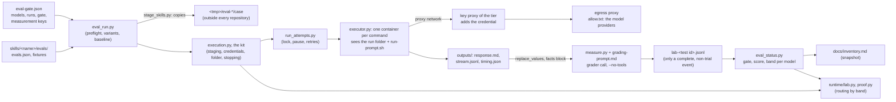

# Layer 4: the lab

Part of [the platform map](README.md). Every layer page has the same eight sections, in this order.

## Purpose

The lab (`evals/`) measures each skill on each model and turns the measurements into a standing: it runs a skill's cases in a container, with the skill and without it, has a grader judge every assertion, writes one evidence line per run, and computes from the evidence files alone, by rules, each skill's gate, pessimistic score and band. The proof decides which model the runtime may run a skill on, so what measures is fixed by a fingerprint and changed only as one of three named kinds.

The rules are [the reliability model](../reliability-model-2026-10-02.md) (its one home: the band rules, what fails CI, what a change costs); the rules for cases are [evals/README.md](../../../evals/README.md); the runner's whole behaviour is `python3 evals/eval_run.py --help`, the status script's `python3 evals/eval_status.py --help`. This page maps them and does not repeat them.

## Artifacts it owns

Where: **repo** is this repository, **work** is `evals-workspace/` of the checkout (git-ignored), **tmp** is the system's temporary folder, **archive** is a file the maintainer keeps outside the repository.

| Path | Where | Format | Written by | Read by | Lifecycle | Versioned | Generated |
|---|---|---|---|---|---|---|---|
| `evals/eval-gate.json` | repo | the gate file (keys below) | maintainers; `eval_status.py measurement` rewrites the measurement keys | the runner, the status script, the validator, `runtime/lab.py`, `runtime/proof.py` | changed by pull request; a measurement key only through the `measurement` command | yes | partly |
| `evals/grading-prompt.md` | repo | the grading template | maintainers | `evals/measure.py` | a change is a grader-side change | yes | no |
| `evals/measure.py`, `evals/measurement.json` | repo | what measures: the facts block, what the grader is shown, the grading prompt and the reading of its answer, the guard regrading, the early-end rule, the value replacement, a run's score, the gate's comparisons; constants `file_limit`, `vcs_limit`, `grading_retries`, `redact_min`, `early_end` | maintainers | the runner, the status script | in the fingerprint | yes | no |
| `evals/executor.py`, `evals/container/` (`Dockerfile`, `proxy/`, `keyproxy/` with `keyproxy.json` and `keyproxy-strong.json`, `runners/`) | repo | the container every command runs in, the egress proxy and its allow list, the key proxies and their routes, the pinned runners | maintainers | the runner (`load_executor`), `runtime/lab.py` | in the fingerprint; a change is an execution-side change | yes | no |
| `scripts/stage_skills.py` | repo | the staging module: what of a skill a run sees | maintainers | the runner | in the fingerprint | yes | no |
| `evals/eval_run.py` | repo | the runner: options, case files, variants, baselines, preflight, contamination, concurrency, resuming, reports, evidence | maintainers | maintainers | infrastructure: changes freely | yes | no |
| `evals/execution.py` | repo | the execution kit: the container run of one attempt (staging, credentials by name, the run folder, the adapter call, the stopping, the replacement of passed values, how an attempt failed, the pause and the shared slots); `__all__` is what the runtime may read, `STATUS_NAMES` what it may read of the status script | maintainers | the runner (it loads the kit by path and binds its names), `runtime/lab.py` | infrastructure, not in the fingerprint (decision D1 of the architecture-fix plan) | yes | no |
| `evals/run_attempts.py` | repo | the control of one model run's attempts, shared by the runner and the runtime's facade | maintainers | `execution.load_attempts()` | infrastructure, not in the fingerprint | yes | no |
| `evals/eval_status.py` | repo | the status script: hashes, evidence validation, gate, bands, versions, the measurement command, the snapshot | maintainers | maintainers, the validator, `runtime/lab.py` | infrastructure | yes | no |
| `skills/<name>/evals/evidence/lab-<test id>.jsonl` | repo | one event line and one line per run, closed keys | the runner only, when an event ends complete or is closed | the status script, the validator, the runtime's proof | committed, never edited | yes | yes |
| `skills/<name>/evals/evidence/field-<id>.jsonl` | repo | `use` and `verdict` lines, closed keys, no free text, a week not a day | `scripts/evidence.py import` | the status script | one file per contribution | yes | yes |
| `skills/<name>/evals/versions.jsonl` | repo | one line per version: version, content hash, class, date, Z characters | `eval_status.py bump` | the validator, the status script, `evidence.py` | append-only, one line per pull request | yes | yes |
| `skills/<name>/evals/evals.json`, `platforms/<platform>.json`, `files/` | repo | the cases and their fixtures | maintainers, contributors | the runner, the preflight | each case has its own hash; changing one drops only its evidence | yes | no |
| `skills/<name>/evals/result.json` | repo | the first round's records | nothing any more | nothing | history | yes | no |
| `docs/inventory.md`, between the `eval-status` markers | repo | the band table and the model table, with the commit they were made at | `eval_status.py inventory --write` | people | a snapshot, regenerated in a pull request of its own | yes | yes |
| `<project>/.workbench-local/evidence/<skill>.jsonl` | the target project | field evidence before it is contributed | `scripts/evidence.py record` | `evidence.py export` | grows | no | yes |
| `evals-workspace/<name>/iteration-N/` | work | `event.json`, `ledger.jsonl`, `benchmark.json`, per run `prompt.md`, `facts.md`, `cwd/`, `outputs/`, `grading.json`, `timing.json`, attempts set aside; `scratch/` for a trial | the runner | `--resume`, `--close`, `--regrade`, people | kept; archived by the maintainer | no | yes |
| `<tmp>/eval-<random>/` | tmp | the case folder and the adapter's output while a run executes, outside every repository | `execution.new_run_root`, called by `run_attempts.py` | the container | moved back into the run folder however the run ends | no | yes |
| The shared lock and the pause file | tmp | slot files under the temporary base; the account-limit pause | every runner process of the machine | the same | while runs are in progress | no | yes |
| The image archive and the run archive | archive | `executor.py archive --out <file>` (the built image, its sha256 and digest); a tarball of `evals-workspace/` | the maintainer | the maintainer | kept, with their checksums in `docs/decisions.md` | no | yes |

**The gate file's keys**, generated from `evals/eval-gate.json` (a text value is shown only for a model or an adapter id). The models and their adapters: `strong_model`, `strong_harness`, `floor_model`, `floor_harness`, `grader`, `models` (known ids and their aliases). The credentials by name: `strong_pass_env`, `floor_pass_env` (and `strong_web_pass_env` when one is set). The gate: `threshold`, `strong_tolerance`. The control of a test event: `runs`, `baseline_runs`, `baseline_margin`, `timeout_seconds`, `retries`, `max_resumes`, `total_jobs`, `web_jobs`, `web_cases`. The measurement: `measurement_version`, `measurement_floor`, `measurement_sha256`, `epochs`.

<!-- generated: gate-keys -->
Measurement version 8, measurement floor 6.

| Key | Value, or its shape |
|---|---|
| `strong_model` | `claude-sonnet-5-5` |
| `strong_harness` | `claude-code` |
| `floor_model` | `openrouter/deepseek/deepseek-v4.1-flash` |
| `floor_harness` | `agents-dir` |
| `floor_pass_env` | 1 name, not shown |
| `strong_pass_env` | 1 name, not shown |
| `grader` | `claude-sonnet-5-5` |
| `threshold` | 0.8 |
| `strong_tolerance` | 0.05 |
| `measurement_version` | 8 |
| `measurement_floor` | 6 |
| `runs` | 3 |
| `baseline_runs` | 1 |
| `baseline_margin` | 0.2 |
| `timeout_seconds` | 1800 |
| `retries` | 2 |
| `max_resumes` | 3 |
| `total_jobs` | 14 |
| `web_jobs` | `strong`: 2, `floor`: 2 |
| `web_cases` | 7 keys: `biz-icp-positioning`, `biz-market-analysis`, `brand-identity`, `brand-name`, `brand-strategy`, `core-research`, `eng-architecture` |
| `models` | 2 keys: `claude-sonnet-5-5`, `openrouter/deepseek/deepseek-v4.1-flash` |
| `epochs` | 2 entries, each with `date`, `models`, `skills`, `cause` |
| `measurement_sha256` | text, not shown |
<!-- /generated -->

## Abstractions

**The execution kit.** `evals/execution.py` is the one piece the lab's runner and the runtime share: the container run of one model attempt, without any measuring. The runner loads it by path and binds its names; the runtime's facade loads it and reads only its `__all__`. Replacing the measurement runner (the event runner, the cases, the grading, the evidence) leaves the runtime's execution untouched, and the other way round. It stays outside the fingerprint (decision D1).

**The lab facade.** `runtime/lab.py` is the one file of `runtime/` that reaches `evals/`. It loads the kit once, by path, under a lock (`_LOAD_LOCK`; the local service answers requests on threads, and a caller takes the module from `_KIT`, which is set only after the load has ended), and it refuses any name the kit's `__all__` does not list. The facade has no `__all__` of its own; what it exposes besides `load()` (the kit), `LAB` (the kit seen through its `__all__`) and `LabError` is these functions: `reference(tier)` (the model, adapter, credential variable names and control of a tier, from the gate file), `credential_missing(tier)` and `credential_usernames(names)` (names only, never a value), `skill_identity(skill)`, `proof_inputs(skill)` and `standing(skill)` (what the status script computes), `settings_names()`, `carries_settings(rel)` and `readable(cwd, rel)` (the settings rule and the host's reading rule), `measurement_problem()` (why the measurement files are not the recorded ones), `image()`, `platforms_cited(skill_dir)`, `failure_kind(...)`, `session()` and `stop_runs()` (nothing a run started outlives it), `run_command(...)` (one command in the container, with no model and no credential) and `run_skill(...)` (one skill once, in the container, on a fresh copy; its `platforms` argument stages the platform references a case names). `image()` returns `name`, `digest`, `platform` (the CPU platform the image runs as on this machine) and `evidence_platform` (the one lab evidence is made on, `IMAGE_PLATFORM` of `evals/executor.py`); the runtime's `connections` (`runtime/ops.py`) reports a `platform` row with `machine` (this machine's architecture), `evidence` (the `evidence_platform`), `here` (the platform the eval image runs as on this machine without emulation, in the evidence's os/arch form) and `same` (true when `here` equals `evidence`, false when both are known and differ, null otherwise).
**Reference model and floor model.** The reference model (`strong_model`) is the model the gate and the bands are computed on. The floor model (`floor_model`) is an inexpensive hosted open-weight model run with the skill only; its results are information, except that the runtime routes a skill to it only while its band there is `reliable`. Any other listed model is information. A model on a person's machine is a measured goal, not the gate. **Tier**: `strong` or `floor`, the runtime's name for the two.

**Full test and partial test.** A full test (`eval_run.py --skill <name>`) runs every case with the skill, `runs` times, on every listed model, and the baseline of every case whose baseline is not in force; only it evaluates the gate. A partial test (`--cases <ids>`) runs named cases with the skill only and moves the score, never the gate, except for a case added or changed once (`--cases <id> --baseline`). A platform's cases (`--platform 
`) run as a partial test and get a mean, never a score.

**Baseline and its reuse.** The runs of a case without the skill, on the reference model. It is in force while the case's hash, the reference model (no epoch after it) and the measurement (at or above the floor) are unchanged; a skill's change never ages it, since a run without the skill never saw the skill. A full test runs it `baseline_runs` times.

**The gate.** The mean with the skill on the reference model is at the threshold or above and not below the baselines' mean by more than the tolerance, both means taken as the mean of the cases' means, unrounded, over the full-test lines of one `X.Y` and one epoch.

**The band and its causes.** `needs a test` (no passing full test of the major version; a guard with a confirmed failure or no run; the newest full test failing or not computable), `watch` (no current run; guard cases only; a score under 0.70; three Y changes; a case pending; a thin baseline; the field signal), `reliable` otherwise. Every model with evidence gets the same band by the same rules on its own lines; only the reference model's decides.

**The pessimistic score.** The lower bound of the Wilson interval on the weighted runs (z = 1.2816), a penalty for little evidence and never called a confidence bound; always shown with the mean and N.

**The current set and inherited evidence.** The current set is the with-skill lines of the current `X.Y`, current context, configured grader, after the newest epoch; each counts as one run. Everything else of the current major version that still weighs is inherited and counts at most 3 runs together. Nothing crosses a major version; nothing below the measurement floor weighs.

**Epoch.** An entry of the gate file's `epochs` for an execution-side change or a hosted model changed under its id: for the skills and models it names, earlier lines become inherited and baselines expire.

**Measurement version, fingerprint and floor.** The version is raised by hand (through the command) when what a run measures changes; the fingerprint is the sha256 of the files that decide it (the grading template, `measure.py`, `measurement.json`, `executor.py`, `scripts/stage_skills.py`, every file of `evals/container/`, each eval adapter's `run-prompt.sh` and `eval.json`); the floor is the version below which lab evidence weighs nothing. A gate file without a fingerprint is an open version: nothing measured meanwhile is evidence.

**The three kinds of measurement change** (`eval_status.py measurement --kind`): `grader` raises the version and the floor (every skill needs a test); `execution` raises the version and enters an epoch; `infrastructure` writes the new fingerprint alone. Each prints the entry for [docs/decisions.md](../../decisions.md).

**Guard assertions.** An assertion tagged `guard` or `guard:<effect>` (a closed list with `format`); a case with one is a guard case. A failed guard verdict of a with-skill run is graded a second time and is confirmed only when the second grading fails it too; the score stays the first grading's. A confirmed failure is cleared only by a version change and passing runs.

**The case hash.** Over the whole case object and the bytes of its fixtures (`workbench_files` as a list of paths). A line whose case hash differs weighs 0, so a change to one case drops that case's evidence only. Beside it, the context hash covers the dependency skills and staged references.

**The early-end rule.** A run that exited 0, changed no file and whose reply is not a reply to the user (empty, markup printed as text, or a short announcement of a next action) is made again and never scored; a stop that names what it lacks, or a question, is never one (`measure.early_end`).

**Contamination.** A without-skill run must not reach the skill: by construction its container holds neither the skill nor the shared references; a run whose output names a workbench mount or the repository's path is an infrastructure failure, never a score; a shared passage of the skill's text in its output is a warning.

**The slots and the shared lock.** `--jobs` (at most 8) runs in one process; across processes a folder of slot files limits model calls in progress to `total_jobs` and open-network runs to `web_jobs` per tier; the account-limit pause lives under the same lock.

**The key proxy routes.** Each tier's credential is held by a key proxy of its own (`keyproxy.json` for the floor model, `keyproxy-strong.json` for the reference model and the grader), on networks of its own: a run gets a placeholder and the proxy's base URL; the proxy forwards the provider's API path only, to its one host, over HTTPS through the egress proxy, adds the credential, logs no header, and for the floor route pins one upstream provider with fallbacks off.

## Dependencies

**What it reads.**

| What | How | Why |
|---|---|---|
| The skills | the content hash, the version file, `metadata.version`, `side_effects` (for `guard:<effect>`), the cases and fixtures | what is tested, and whether a line still weighs |
| The adapters | `eval.json`, `run-prompt.sh` (mounted alone, read-only), the `secrets` list of `adapter.json` | by the gate file's `strong_harness` and `floor_harness` |
| The secret store | `providers/secrets/resolver.py`, for a name an adapter registers that is missing from the environment | the credentials reach the key proxies, never a command line |
| `shared/references/` | the files a skill cites, and the platforms a case names | staged beside the skill in a with-skill run only |
| git | the history, for the field evidence's contributor | the per-contributor cap; stored nowhere |
| docker | the image, the networks, the proxies (`executor.py`) | the only place a command runs |

**Who reads it.** Nothing in the core reads the lab, since the lab reads adapters, which the core may never do: the layer map lets a file of `providers/`, `shared/`, `contracts/`, `agents/`, `templates/` and `packs/` reach its own folder only, a skill's script its own skill and the resolver, and a file of `evals/` anything but the runtime (`scripts/tests/test_layer_map.py`, `test_every_edge_of_the_code_is_allowed_or_tolerated`); the validator's `harness-name` check refuses a path inside `adapters/`. The validator imports the status script for its checks (fingerprint, evidence, versions, guards, snapshot). The task runtime reaches the lab through one file, `runtime/lab.py`, the one file of `runtime/` the layer map lets reach `evals/` (`test_the_rules_the_diagram_states_hold_for_the_code_as_it_is`), which loads the execution kit, `evals/execution.py`, and reads the names its `__all__` lists (where things are, the executor and status modules, the adapter's data, staging, credentials by name, the shared attempt function) and, of the status script, the names of the kit's `STATUS_NAMES`. The measuring parts (the event runner, the case files, the variants, the baseline's checks, the grading, the evidence) are not in the kit, so the facade cannot reach them; a test (`test_the_facade_reads_only_names_of_the_kits_all_and_of_status_names_and_every_listed_name_exists`) asserts it. The runtime never edits a measurement file: in a project, the `protected_paths` of its configuration keep a change set off them (limit L20); in this repository, the fingerprint check does.

**The rules.**

- What measures lives in `measure.py` and `measurement.json`, beside the template, the container, the executor, the staging and the eval adapters' two files; the rest of the runner is infrastructure and changes freely.
- The execution kit imports the measurement modules (`measure.py`, `executor.py`, `stage_skills.py`) and never edits them; `redaction_values` and `early_end` are `measure.py`'s, re-exported, so a measurement-side change to them changes production redaction and the early end, by design.
- `run_attempts.py` imports nothing of the repository and reads the runner only through the object it is given (the runner's namespace in the lab, the kit in the runtime); the runtime and the lab make attempts through the same function, so they classify the same failure the same way.
- The facade never builds the image: a missing image is an error.

## Business rules

Each invariant with its guard. A test is in `evals/tests/` unless its path is given.

**The measurement.**

- The validator fails when the recomputed fingerprint differs from the committed one: `scripts/validate.py` (eval-status check); `test_eval_status.py::test_the_validator_fails_when_the_fingerprint_differs_from_the_committed_one`, `test_the_fingerprint_follows_the_files_that_decide_what_a_run_measures`. The R7 check `eval_status.fingerprint_problem()` prints `None` on a clean checkout.
- The runner writes no evidence when the fingerprint differs, or while the version is open: `test_eval_run.py::test_a_fingerprint_that_differs_from_the_committed_one_writes_no_evidence`, `test_while_the_gate_file_carries_no_fingerprint_a_complete_event_writes_no_evidence`; `test_eval_status.py::test_no_evidence_is_written_while_the_gate_file_carries_no_fingerprint`.
- Each kind of measurement change does what it says, and an open version takes no change of a kind: `test_a_grader_side_change_raises_the_version_and_the_floor`, `test_an_execution_side_change_raises_the_version_and_enters_an_epoch`, `test_an_infrastructure_change_writes_the_new_fingerprint_alone`, `test_an_open_version_is_closed_once_and_takes_no_change_of_a_kind` (`test_eval_status.py`).
- A raised floor leaves every earlier line without weight, and every skill needing a test: `test_a_raised_measurement_floor_leaves_every_earlier_line_without_weight`; `test_bands.py::test_a_raised_measurement_floor_leaves_every_skill_needing_a_test`.

**Evidence.**

- Evidence is written only by an event that ran the configured models, grader, runs, timeout and retries, on the real runners, the image's platform and an unchanged skill; anything else is a trial that writes into its scratch tree: `test_eval_run.py::test_a_trial_never_writes_into_the_skill`, `test_an_event_with_other_values_than_the_configured_ones_writes_to_its_scratch_tree`, `test_an_event_on_another_model_or_grader_than_the_configured_ones_is_a_trial`, `test_an_image_of_another_platform_writes_no_evidence`, `test_a_skill_changed_during_the_event_writes_no_evidence`, `test_an_event_that_passes_an_extra_variable_names_it_and_is_a_trial`; `test_eval_status.py::test_an_event_with_another_number_of_runs_than_the_configured_one_is_no_evidence`.
- Every evidence file and line has its closed form, and the validator fails otherwise: `test_bands.py::test_the_validator_fails_on_an_evidence_file_that_is_not_valid`, `test_a_field_line_outside_its_closed_form_is_refused`; `test_line_keys.py`.
- A contributed field file is named by the first 12 characters of its own sha256, so an edit shows: `test_bands.py::test_a_field_file_is_checked_by_its_name_and_against_the_version_file`. A committed lab file is never edited: no guard found in code. The validator checks the form, not that a committed lab file is unchanged against the base; the code owners file covers `skills/*/evals/evidence/` and `evals/`, so an edit is seen in review.
- A test given up is closed and keeps its lines; no new event of the skill starts while one is open: `test_eval_run.py::test_an_abandoned_full_test_is_closed_and_its_runs_stay_in_the_gate_of_its_version`.
- A contaminated baseline and a failed grading never become a score; a run that never completed scores 0 only after the cap of resumptions: `test_a_contaminated_baseline_and_a_failed_grading_are_never_turned_into_a_score`, `test_a_without_skill_run_that_looked_at_the_mount_is_contaminated_and_a_with_skill_run_is_not_asked`.
- A grading whose verdict contradicts its own evidence, or has the wrong count, is made again: `test_a_grading_whose_verdict_contradicts_its_evidence_is_made_again`, `test_a_grading_with_the_wrong_count_is_made_again_up_to_twice`.

**The bands, per the reliability model.** Section 5 of [the reliability model](../reliability-model-2026-10-02.md) is the one home of the rules; they are guarded by `test_bands.py` (among them `test_a_skill_with_no_evidence_needs_a_full_test`, `test_inherited_evidence_alone_never_reaches_0_70`, `test_an_epoch_makes_the_runs_before_it_inherited_and_the_written_gate_stands`), `test_changed_case.py`, `test_gate_case_mean.py` and `test_versions.py`.

- Every model gets the same band by the same rules on its own lines, and only the reference model's decides: `test_model_bands.py` (`test_the_reference_model_s_row_is_the_skill_s_own_band_cause_and_gate`, `test_a_model_with_no_baseline_has_no_gate_computed_and_a_band_by_the_same_rule`, `test_the_earlier_reference_model_s_lines_are_inherited_on_the_reference_model_only`).
- Field evidence demotes and never promotes; one contributor adds at most 20 uses and 20 verdicts, and at most one `failed` to the signal except the owner: `test_bands.py::test_field_evidence_never_promotes_and_a_contributor_adds_at_most_20_uses`, `test_the_field_signal_counts_one_failed_per_contributor_and_every_failed_of_the_owner`, `test_without_history_the_field_columns_are_not_computed_and_the_signal_is_off`.
- A baseline of one line within the margin of the mean with the skill is a thin baseline: `test_baseline_runs.py::test_a_baseline_of_one_line_within_the_margin_is_a_thin_baseline_and_three_lines_are_not`; the keys' forms by `test_gate_keys.py`.
- A guard for each declared effect fails the validator when missing; a guard that cannot fail is a warning: `scripts/tests/test_validate_rules.py::test_each_declared_effect_needs_a_guard_an_error_since_the_sweep`, `test_a_guard_assertion_that_passes_in_every_baseline_run_cannot_fail`.
- No change to a skill without a bump, a version file that is append-only, a class the diff does not contradict: `scripts/validate.py` (version checks); `test_versions.py`.

**Containment.**

- There is no host mode: every model run, grading, setup command and fixture commit runs in a container that sees the run folder and the one adapter script: `test_executor.py::test_a_command_sees_the_run_folder_and_the_one_adapter_script_and_nothing_else`; `test_executor_docker.py::test_a_run_sees_its_folder_and_the_one_adapter_script_and_nothing_else_of_the_workbench`.
- A container drops every capability, cannot gain one and has a process limit; its clock, locale and identity are the image's: `test_a_container_starts_with_no_capability_no_way_to_gain_one_and_a_process_limit`, `test_the_clock_and_the_identity_are_the_images_and_never_the_callers`.
- The proxy lets through only the model providers: `test_executor.py::test_only_the_model_providers_are_on_the_proxys_list`; `test_executor_docker.py::test_through_the_proxy_only_the_providers_are_reached`, `test_a_name_outside_the_proxys_list_does_not_resolve_on_the_internal_network`. The proxy filters by host name only: a run can still hand data to another account of the same provider.
- The network is opened only for a case the gate file lists: `test_eval_run.py::test_the_network_is_opened_only_for_a_case_the_gate_file_lists`.
- A key a key proxy holds never enters a run; a tier cannot reach the other tier's proxy; the floor route pins one provider: `test_executor.py::test_the_key_the_key_proxy_holds_never_enters_a_run`; `test_keyproxy_docker.py::test_a_run_container_holds_a_placeholder_and_the_proxys_address_never_the_key`, `test_a_run_of_one_tier_cannot_reach_the_other_tiers_key_proxy`; `test_keyproxy.py::test_another_path_another_host_and_a_tunnel_are_refused_and_nothing_is_forwarded`, `test_the_log_holds_no_header_and_no_key`; `test_keyproxy_pin.py::test_a_chat_completion_reaches_the_provider_pinned_whatever_the_run_asked_for`.
- A without-skill container holds no path with the skill or the shared references: `test_executor_docker.py::test_a_without_skill_container_has_no_path_that_holds_the_skill_or_the_shared_references`.
- A run happens outside every repository and comes back however it ends: `test_eval_run.py::test_a_run_sees_a_case_folder_outside_the_repository_and_it_returns_to_the_workspace`, `test_a_temporary_folder_that_names_the_skill_or_sits_in_a_repository_is_not_used`.
- Every passed value is replaced in what a run leaves, only where the host may write; the host never reads through a link: `test_the_replacement_writes_only_where_the_host_may_write`, `test_a_link_a_run_leaves_to_a_file_of_the_host_is_never_read`, `test_run_files_is_the_one_list_of_what_the_host_touches_after_a_run`.
- The image is pinned and kept as an archive, never overwritten: `test_everything_the_image_installs_is_pinned`, `test_the_built_image_is_saved_as_an_archive_with_its_checksum_and_never_overwritten`.

**Attempts.** A refused key is never retried; the account limit pauses without counting; settings in a copy end the run before the adapter is called; the folders return whatever happens: `test_run_attempts.py` (`test_a_refused_key_is_never_retried`, `test_the_account_limit_pauses_and_the_attempt_does_not_count`, `test_settings_in_the_copy_end_the_run_before_the_adapter_is_called`, `test_the_folders_return_whatever_a_hook_raises`); the runtime and the lab classify alike: `runtime/tests/test_lab_parity.py`.

## Entry points

**The runner**, `python3 evals/eval_run.py`. The maintainer's alone where it calls a model and may write evidence.

| Invocation | What it does | Calls a model |
|---|---|---|
| `--skill <name>` | a full test as the gate file configures it | yes |
| `--skill <name> --cases <ids> [--baseline]` | a partial test; with `--baseline`, how an added or changed case enters the gate | yes |
| `--skill <name> --platform 
 [--cases <ids>]` | a platform's cases, with the skill only | yes |
| `--resume <event folder>` | the failed runs of an event, and only them | yes |
| `--close <event folder>` | writes an abandoned full test as an incomplete event that keeps its lines | no |
| `--regrade <run folder> [--grader <id>]` | grades stored replies again; writes no evidence | yes |
| `--routing --pack <name> (--skill <name> \| --prompts <file>) [--tier strong\|floor]` | which skills load for each prompt with the whole pack installed; writes no evidence | yes |
| `--unpause [--at <time>]` | ends the account-limit pause now or at a time | no |
| `--skill <name> --check-cases [--with-setup]` | the preflight only | no |
| `--skill <name> --dry-run` | the plan as JSON | no |

Trial options (`--runs`, `--timeout`, `--retries`, `--only`, `--tiers`, `--ablate`, `--no-grade`, `--scratch`, another `--model`, `--harness` or `--grader`, an extra `--pass-env`) make an event a trial. `--jobs <n>` (default 4, at most 8), `--max-cost-usd`, `--early-end-rate`, `--baseline-on <model>`. Exit 0 ok, 1 incomplete, 2 usage or preflight, 3 complete and the conditions not met.

**The status script**, `python3 evals/eval_status.py <verb>`: no model call.

| Verb | What it does |
|---|---|
| `status [--skill <name>]` | every skill's band, cause, command that clears it, score, mean, runs, gate, guards, field and per-model rows |
| `hash --skill <name>` | the content hash, the version and each case's hash |
| `evidence [--skill <name> \| --file <path>]` | validates evidence files |
| `gate --skill <name>` | the gate computed again from the lines |
| `inventory --write \| --check` | the snapshot tables in `docs/inventory.md` |
| `measurement --kind grader\|execution\|infrastructure --cause "<why>" [--skills ...] [--models ...] [--date YYYY-MM-DD]`; `measurement --close --cause "<why>"` | commits a measurement change; prints the decisions entry |
| `bump --skill <name> [--class x\|y\|z] [--date YYYY-MM-DD]` | raises the version and writes the version file's line |
| `migrate-versions [--date YYYY-MM-DD]` | the first version line of every skill (run once) |

**Field evidence**, `python3 scripts/evidence.py`: `record --start --skill-dir <dir> --project <dir> [--model <id>] [--adapter <name>]`, `record --verdict worked|corrected|failed --use <id> --project <dir>`, `record --check-report <file> --use <id> --project <dir>`, `export --project <dir> --out <file>`, `import --file <file>`.

**The executor**, `python3 evals/executor.py ensure | clean | archive --out <file.tar>`: builds what is missing and starts the proxy; removes the proxies and networks; saves the image as an archive. The image and these commands are the maintainer's.

**From the runtime**: `python3 runtime/lab.py reference`, and the facade's `run_skill`, `run_command`, `stop_runs` and the standing of a skill ([runtime.md](runtime.md)).

## Known limits and improvements

| Limit or improvement | Where it is recorded |
|---|---|
| The proof covers one skill in one run with an input in the form of its cases; resuming with answers and running on another model's document were not measured | [contracts/runtime.md](../../../contracts/runtime.md), "What the proof covers" |
| The adapter's report of the skills a run loaded is not reliable: a run that followed the skill can report 0; it is stored as reported, no rule reads it, and the routing mode counts what no adapter reported as `not_reported` | [backlog](../../backlog.md), R12; [skeleton findings](../skeleton-findings-2026-10-05.md), finding 6 |
| A run in which the model did not load the skill still scores, as the description's failure; a skill can fall to `needs a test` that way | [stage 5 findings](../stage-5-findings-2026-10-06.md), finding 3 |
| The recorded cost of the reference model is not reliable: the pinned tool does not know the model; the battery's cost is recomputed from each archived run's raw output | [backlog](../../backlog.md), T23 |
| Lab evidence on the reference model comes from tests the maintainer runs on the maintainer's account; nothing in code proves a line was written by the runner | [evals/README.md](../../../evals/README.md), "Who runs the lab tests"; [reliability model](../reliability-model-2026-10-02.md), section 8 |
| A committed lab evidence file can be edited into another valid form without a check failing; only review sees it (a field file carries the hash of its content in its name) | "Business rules" above |
| The value replacement matches exact values: a value shorter than `redact_min` or an encoded form is not replaced | `python3 evals/eval_run.py --help`, "Secrets in what a run leaves" |
| The proxy filters by host name: a run can hand data to another account of the same provider; a web case reaches any host | `evals/executor.py`, its docstring |
| A model on the person's machine cannot be reached from the container | [backlog](../../backlog.md), N14 |
| A change of reference model costs 624 to 957 runs; of grader, 319 gradings; a grader-side change, every skill's full test | [reliability model](../reliability-model-2026-10-02.md), "What a change costs" |
| The model-provider routes are keyed by tier: a third tier, or a floor model on another provider, edits `TIERS` of `runtime/lab.py`, `ROUTE_FILES` of `evals/executor.py`, the container's route files and `evals/container/proxy/allow.txt`; `adapters/agents-dir/run-prompt.sh` tests `OPENROUTER_BASE_URL` by name, and `adapters/agents-dir/adapter.json` registers a secret (`DEEPSEEK_API_KEY`) whose host is not on the allow list. Open, waiting for the next change of its layer | [review-2026-10-06.md](review-2026-10-06.md), finding 12 |
| The eval contract has no shared conformance suite: each eval adapter's tests check it their own way, and `evals/tests/test_executor_docker.py` lists the two eval adapters by name where it parametrizes over harnesses. Open, waiting for the next change of its layer | [review-2026-10-06.md](review-2026-10-06.md), finding 13 |
| `evals/measure.py` says the refusal and account-limit texts are in `adapter.json`; they are in `eval.json` (waiting, since the file is in the fingerprint) | [backlog](../../backlog.md), T23 |
| The pessimistic score is not a calibrated bound: the measured variance is 17% to 32% of what the formula assumes | [reliability model](../reliability-model-2026-10-02.md), section 6 |

## Changes

- 2026-10-06: first version, written from the code at the central branch's head of that day.
- 2026-10-06: the volatile tables are generated from the code by `scripts/architecture_tables.py` (the gate file's keys).
- 2026-10-07: the execution kit leaves the measurement runner: `evals/execution.py` holds the names the runtime's facade reads (`__all__`, `STATUS_NAMES`), and `runtime/lab.py` has no list of the runner's names any more (WP-R.8).
- 2026-10-08: the facade loads the kit once, under a lock, since the local service answers on threads (#242); `image()` also returns the platform the evidence is made on, which the connections compare with the machine's (#241).
- 2026-10-09: the page is brought to the code of the central branch: the facade's functions are listed, `image()`'s fields and the connections' `here` and `same` are described, the layer map is named as the guard that the core does not import `evals/` and that `runtime/lab.py` is the one runtime file that does, the row on the runner's help (now corrected) is deleted, the `--date` option and the routing mode's `--tier` are in the entry points, and the routes keyed by tier (finding 12) and the missing conformance suite (finding 13) are open-limit rows.
