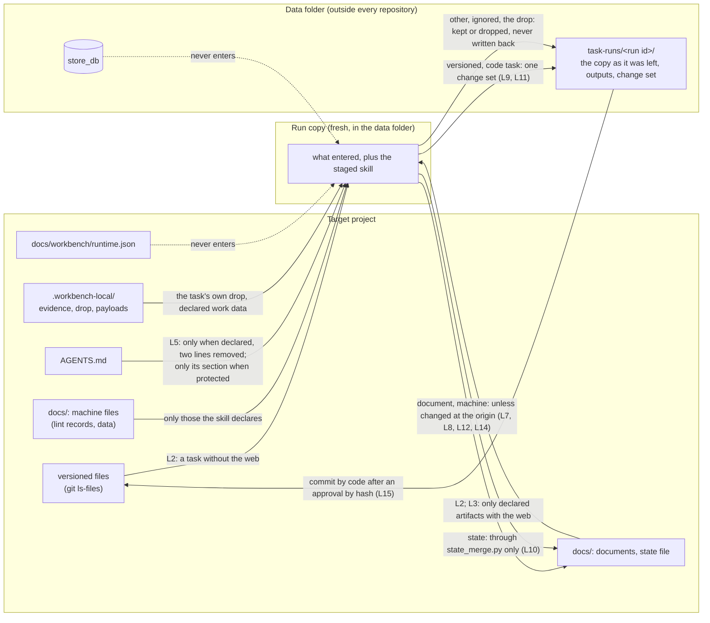

# Layer 8: the target project

Part of [the platform map](README.md). Every layer page has the same eight sections, in this order.

## Purpose

The target project is the repository of the person who uses the workbench: their code, their documents, and the few files that let the workbench operate it. It is never a file of this repository (principle 8 of [AGENTS.md](../../../AGENTS.md)): the workbench holds the skills and the runtime, and a project holds its own data, decisions and history, in its `docs/` folder, in a git-ignored `.workbench-local/` folder, and in a data folder outside every repository.

A project is set up by `core-project-init` (the state file, the workbench section of `AGENTS.md`, the `Docs in git` decision) and, for the runtime, by a configuration the person writes, `docs/workbench/runtime.json`, accepted by its hash. The layout is [contracts/project-layout.md](../../../contracts/project-layout.md); the state file is [contracts/state.md](../../../contracts/state.md); what the runtime reads and writes is [contracts/runtime.md](../../../contracts/runtime.md). This page maps them and does not repeat them.

## Artifacts it owns

Where: **project** is the target project, **data** is the project's data folder (`data_dir` of its configuration, outside every repository and outside the workbench checkout). Nothing in this table lives in this repository.

| Path | Where | Format | Written by | Read by | Lifecycle | Versioned | Generated |
|---|---|---|---|---|---|---|---|
| `AGENTS.md`, the workbench section between `<!-- workbench:start -->` and `<!-- workbench:end -->` | project | Markdown, from the asset `skills/core-project-init/assets/agents-md-section.md`: eleven numbered rules, the autonomy mode, the `Docs in git` value, how to record a use and the skill check | `core-project-init` (the section); `core-agents-md` owns the rest of the file and keeps the section byte for byte | any AI tool working in the project; a run whose skill declares `AGENTS.md` (L5) | rewritten by the script only, when the mode or the docs decision changes | yes, and left uncommitted by the script | the section is |
| `.gitignore`, the block between `# workbench:start (...)` and `# workbench:end` | project | ignore lines: the workbench folders under `docs/` kept out of git | `core-project-init` (`--docs code` or `none`; no block for `all` or `undecided`) | git; the change set (a path git would keep out never enters one) | rewritten when the decision changes | yes, and left uncommitted by the script | yes |
| `docs/workbench/state.md` | project | the state contract: a head (`Project`, `Current flow`, `Current phase`, `Updated`, `Docs in git`), then `## Autonomy` (`Checkpoints`), `## Artifacts`, `## Decisions`, `## Open questions`, `## Approvals` | `core-project-init` owns it; 33 skills list it in `updates`; the runtime writes into it through `runtime/state_merge.py` and code only | every flow first; every run (it enters every copy without the web); `mkt-engage`'s policy gate (the approval rows) | updated after each run, answer, approval and mode change | the project's `Docs in git` decision | the `Checkpoints` line and the runtime's approval rows are |
| `docs/workbench/runtime.json` | project | JSON, no secret: `workbench`, `data_dir`, `store_db` (required, absolute); `area_agents`, `protected_paths`, `task_board`, `documents`, `code`, `dependencies`, `handlers`, `path`, `max_cost_usd_per_run`; the first runtime's keys (`agent`, `harness`, `model`, `mailbox`, `publisher`, `vote`, ...) in the same file; the keys are closed: an unknown key is refused with the nearest known name | the person | `runtime/project_config.py`; `scripts/runtime.py`; the scheduler's entry | accepted by its hash; every change accepted again (`accept-config`), and pinned again for the scheduled jobs | the project decides | no |
| `docs/workbench/policies/<policy>.json` | project | bounds of a standing approval | the person | `runtime/autonomy.py` | bound by its hash | the project decides | no |
| `docs/workbench/briefs/`, `critiques/`, `research/` and `docs/<area>/...` | project | the artifacts the skills own, each with its owner's template; the table of owners is generated in [contracts/project-layout.md](../../../contracts/project-layout.md) | the owning skill, and the skills that list the path in `updates` | the skills that list it in `inputs`; the documents mirror, for a type a runtime manifest lists | `draft` until the person approves it | by the `Docs in git` decision | no |
| `.workbench-local/evidence/<skill>.jsonl` | project | field evidence: closed keys only (skill, version, content hash, model, adapter, use, week; a verdict's score and judge), no free text | `scripts/evidence.py record`, called by the runtime for each run or by the tool under the `AGENTS.md` section's rule 10 | `evidence.py export` | grows; leaves the project only in a file a person exports and contributes by pull request | no (git-ignored) | yes |
| `.workbench-local/drop/<task id>/` | project | the files the person handed to one task | `runtime/drop.py` (`hand-over`) | `runtime/workcopy.py`: that task's runs only | never comes back changed | no (must be ignored, else the hand-over is refused) | no |
| `.workbench-local/payloads/` | project | approved payloads that run later (a post, a drafted reply, an alert comment) | `mkt-publish`, `mkt-engage`, `eng-security-review` | the same skills, the scheduled job | kept until the payload ran | no (the skill checks it is ignored) | no |
| Dependency files a configuration names (example: `.workbench-local/requirements-dev.txt`) | project | a recipe's files (`node-npm`, `python-requirements`) | the person | `runtime/deps.py` | read at each install | the project decides | no |
| The store (`store_db`) | data | SQLite: the task tables, approvals, mirrors' records, the conversation, the accepted configuration's hash (cursor `config:accepted-sha256`), and the first runtime's tables | `runtime/ops.py`; `scripts/runtime.py` | the same | `approvals` never loses a row | no | no |
| `task-runs/<run id>/`, `prepared/`, `run.lock`, `proof.json`, `deps/`, `effects/`, `dispatch-pin.json` | data | the runtime's run folders and caches ([the runtime's page](runtime.md), "Artifacts it owns") | `runtime/` | `runtime/` | kept, or rebuilt | no | yes |
| `documents/not-taken/`, `documents/imported.json`, `documents/notices.json` | data | page texts not taken; the last import of each document; the read-only pages that carry the notice | `runtime/documents.py` | `runtime/documents.py`, `ops.task_prompt` | grows | no | yes |
| `tick-pin.json`, `tick.lock`, `events/`, `runs/` | data | the first runtime's pin, lock, inbox files and run folders | `scripts/runtime.py` | `scripts/runtime.py` | until stage 7 | no | yes |
| A local task board's folder (`task_board.dir`) | outside the project's `docs/` and the checkout | the local board provider's items | `runtime/board.py`, the person | `runtime/board.py` | mirrored at each `sync` | no | no |

The local service (stage 9) writes `<data_dir>/service.token` (mode 0600, new at every start, removed when it stops) and, for a file a page hands to a task, `<data_dir>/uploads/<random>/<name>` (removed right after the hand-over).

**What a project versions.** The `Docs in git` decision of the state file, taken once per project: `all` (every workbench folder under `docs/` is committed), `code` (only `docs/product/`, `docs/design/`, `docs/engineering/`, `docs/ai/`, `docs/delivery/`; the work data in `docs/workbench/`, `docs/business/`, `docs/brand/`, `docs/marketing/`, `docs/security/` is ignored), `none`, or `undecided` (an open question; nothing is ignored, and a skill asks before the first commit that would include a workbench folder). The decision reaches a commit only through git: a `docs/` path git keeps out never enters a change set (L11), and a `docs/` path git versions travels in a code task's change set as `versioned`, not as a loose document.

## Abstractions

**Project root and its detection.** For `core-project-init`, a folder is a project root when it has a `.git` folder or a manifest (`package.json`, `pyproject.toml`, `go.mod`, `Cargo.toml`, `composer.json`, `pom.xml`, `build.gradle`, `Gemfile`); otherwise the skill writes nothing and asks (its stop rule 1). A monorepo is one project. For the runtime, the project is the folder `--project` names, resolved to its real path; there is no detection.

**The state file as the memory of flows.** A table of contents with status, not a journal: what phase a flow is in, which artifacts exist and whether the person approved them, what was decided and by whom, what is still open, which approvals are in force. A flow resumes from its first phase whose artifacts are not `approved` or `skipped`. A run may add only its own `draft` row, a decision attributed to its own skill and a new open question; only code writes what is the person's (an answer, the `Checkpoints` line, an approval row).

**The configuration and its hash.** `docs/workbench/runtime.json` binds what the runtime may do on this project: the checkout it runs from, where its data lives, its area agents and their modes and caps, the protected paths, the task board and documents platforms with their expiry dates, where a change becomes a pull request, the dependency recipes, the handlers. The sha256 of its bytes is accepted by the person (`accept-config --sha256`), kept in the store, and compared by every operation; a file that changed stops everything until it is accepted again.

**Area agents and their modes.** An entry of `area_agents`: a pack of skills, enabled or not, one of five modes (`stopped`, `supervised`, `milestones`, `autonomous`, `autonomous-with-policy`), runs per day on the reference model and dollars per day on the floor model (an absent cap is 0). The agent named `planning` holds the router. The state file's `Checkpoints` line is derived from them by code.

**The task board and the documents configuration.** `task_board` and `documents` name a provider (`local`, or another with an `expires` date) and its own keys. They are the bounds of what the runtime writes to a platform, inside the hashed file. Only documents a skill's runtime manifest lists are mirrored, each type `editable` or `read_only`.

**Protected paths.** Globs of `protected_paths` (`*` crosses `/`; an entry ending in `/` covers everything under it). A protected path still enters a copy; a change set that touches one is blocked. A protected `AGENTS.md` enters a run whose skill is not of a code area as its workbench section only.

**Dependency recipes.** Each set of `dependencies` names a recipe of the closed table `RECIPES` of `runtime/deps.py` (`node-npm`, `python-requirements`) and, where it has one, its file. Code installs it in the eval image, in a step with no model that sees only those files, and a code run gets a copy.

**The project's ledger of evidence.** `.workbench-local/evidence/`: one `use` line per run or per use by hand, and one verdict per use, given by the person (or the skill's check script), never by a model. It holds no project name, no free text and the week, never the day, so that an exported file can enter the workbench without carrying the project.

**The work checkout and the runtime's checkout.** The project is the work checkout, where the person and the agents' results land. The workbench checkout the runtime runs from is another folder, named by `workbench` in `runtime.json`, kept on a revision the person reviewed. When the project is itself a checkout of the workbench, the two are still two folders.

**The run copy.** The fresh folder one run sees: what entered from the project by limits L1 to L6, plus the one staged skill. It is made in the data folder and kept afterwards as the run folder; the project is never the folder a model works in. A person's edit of a document is checked on a second scratch copy before it is taken.

## Dependencies

**Who reads a project.**

| Reader | What it reads | How |
|---|---|---|
| A skill, in a run | only what entered the run copy (L1 to L6): the versioned files, the documents and the state file, the machine files it declares, the task's drop; with the web, only its declared artifacts; never `runtime.json`, the store or the data folder | `runtime/workcopy.py`, `entering` |
| A skill, used by hand in a tool | the project as the tool allows, under the `AGENTS.md` section | the tool |
| The runtime | the configuration and its hash; the state file (to merge, to write the generated lines); git's view of the project (tracked files, the clean-tree check, the head); the dependency files; `AGENTS.md` | `runtime/project_config.py`, `state_merge.py`, `ops.py`, `deps.py`, `workcopy.py` |
| The mirrors | the documents the manifests list; the tasks | `runtime/documents.py`, `runtime/board.py` |
| The recorder | its own folder, `.workbench-local/evidence/` | `scripts/evidence.py` |
| The first runtime | `runtime.json`; the brand profile, the engagement policy, inbox and log under `docs/`; the state file's approval rows, through `mkt-engage`'s gate script | `scripts/runtime.py` |

**What a project reads of the workbench.** Nothing directly. A skill reaches a provider through `python3 <workbench root>/providers/resolve.py --class <class>`, the root being `WORKBENCH_ROOT`; the `AGENTS.md` section tells a tool to run `<workbench root>/scripts/evidence.py`; the runtime is the checkout `runtime.json` names, and every operation refuses to run from another one.

**The live agent's checkout rule.** One workbench checkout per project, named in `runtime.json`, shared by the first runtime and the task runtime. Neither runtime's pin covers its revision (open point O11): a pull in that checkout changes what the next scheduled firing loads, without a new approval. So the person advances it, on a revision they reviewed, never an agent and never a scheduled job.

## Business rules

Each invariant with its guard. A test is in `runtime/tests/` unless its path is given.

**What only code writes in the state file.**

- A run never sets `approved` or `skipped`, never closes, rewords or removes a question, and adds only its own skill's rows and decisions: `test_state_merge.py`, `test_a_run_never_sets_approved_or_skipped`, `test_a_draft_row_of_the_skill_that_ran_is_accepted_and_a_row_of_another_skill_is_not`, `test_a_decision_is_accepted_only_when_attributed_to_the_skill_that_ran`, `test_a_new_open_question_is_accepted_and_none_is_closed_or_removed`.
- A run cannot change the `Checkpoints` line, an approval row or the head (`Docs in git` included): `test_the_autonomy_mode_the_approval_rows_and_the_head_stay_as_the_project_has_them`.
- The person's answer is written by code, as a decision of the user: `test_the_persons_answer_is_written_by_code_as_a_decision_of_the_user`.
- The `Checkpoints` line is the most careful mode of the enabled agents, rewritten by `accept-config` and the poll: `test_autonomy.py`, `test_the_state_file_s_checkpoints_line_is_the_most_careful_of_the_enabled_agents`.
- The approval rows are generated copies of the store's `approvals` table, and a row a session wrote is left alone: `test_standing_approval.py`, `test_the_state_file_row_is_generated_and_a_row_a_session_wrote_is_left_alone`, `test_the_generated_row_is_the_row_the_engagement_gate_reads`, `test_revoking_removes_the_row_from_the_state_file`; `test_run_limits.py`, `test_limit_17_...`.
- What changed at the origin during a run wins line by line; a state file a run emptied is a conflict: `test_what_changed_at_the_origin_since_the_copy_wins_line_by_line`; `test_a_state_file_a_run_emptied_is_a_conflict_and_nothing_is_written`.

**Setup.**

- `core-project-init` changes `AGENTS.md` and `.gitignore` only between their markers, and records `undecided` with an open question when the docs decision was not stated: `skills/core-project-init/scripts/tests/test_init_project.py`, `test_apply_writes_state_keeps_agents_md_and_prints_the_report`; `test_init_project_docs.py`, `test_docs_code_keeps_work_data_out_and_keeps_the_rest_of_gitignore`, `test_without_docs_the_decision_is_undecided_and_nothing_is_ignored`.
- `--apply` on an initialised project is refused; an update changes only what was asked: `test_apply_without_agents_md_creates_it_and_dry_run_writes_nothing`; `test_update_changes_only_the_mode_and_reports_the_kept_rows`.
- A name or a decision with other characters travels in a file, never on the command line: `test_init_project_free_text.py`, `test_init_takes_free_text_from_a_file_not_the_command_line`.
- The script leaves two tracked files uncommitted (the `AGENTS.md` section and the `.gitignore` block), so a document task must run on a project that is not clean: `test_a_document_task_runs_while_tracked_files_of_the_project_have_uncommitted_changes`. Who commits those two files: no guard found, and no rule says.

**The configuration.**

- Every operation refuses a configuration whose hash is not the accepted one: `test_config_hash.py`, `test_no_operation_runs_before_the_person_accepted_the_configuration`, `test_a_configuration_that_changed_after_it_was_accepted_stops_every_operation_and_names_both_hashes`.
- The configuration never enters a run: `test_the_runtimes_own_configuration_never_enters_a_run`.

**The clean-tree rule.** A code task runs only while the project's tracked files other than the state file have no uncommitted change; a document task is not held to it and makes no change set: `test_a_code_run_is_refused_while_tracked_files_of_the_project_have_uncommitted_changes`, `test_a_code_task_runs_when_the_only_uncommitted_tracked_change_is_the_state_file`, `test_a_document_task_never_makes_a_change_set_and_lists_a_tracked_file_it_changed_in_kept`.

**Documents and commits.**

- A working document (under a `docs/` folder git keeps out) never enters a commit: `test_changeset.py`, `test_limit_11_a_working_document_never_enters_a_commit`. A `docs/` folder the project versions travels in the change set: `test_a_docs_folder_the_project_versions_travels_in_the_change_set`.
- A versioned file is never written into the project as a loose file, and nothing is deleted there: `test_a_versioned_file_is_never_written_into_the_project_and_nothing_is_deleted_there`.
- A file that changed in the project during the run is never overwritten: `test_a_file_that_changed_in_the_project_during_the_run_is_never_overwritten`.

**The drop.** What a run leaves in the drop never comes back; a hand-over is refused in a git project that does not ignore the drop: `test_file_drop.py`, `test_what_a_run_leaves_in_the_drop_never_comes_back`, `test_a_hand_over_is_refused_in_a_git_repository_that_does_not_ignore_the_drop_and_allowed_in_a_folder_that_is_no_repository`.

**Work data outside the public repository.**

- `data_dir` and `store_db` lie outside the project and outside the workbench checkout; a local board's folder lies outside the project's `docs/` and the checkout: `test_task_ops.py`, `test_a_project_that_is_not_configured_or_names_another_checkout_is_refused`; `test_board_mirror.py`, `test_a_board_dir_inside_docs_or_inside_the_checkout_is_refused`.
- `.workbench-local/` is git-ignored: the recorder only says so on stderr when it is not (`scripts/tests/test_evidence.py`, `test_the_recorder_says_when_the_project_would_commit_its_evidence`), the drop refuses (above), and `core-project-init` writes no line for it. No guard found for the folder as a whole.
- An evidence line holds closed keys and no project name; an exported or imported file is refused whole when one line leaves that form: `scripts/tests/test_evidence.py`, `test_record_start_writes_a_use_line_of_the_closed_form_and_prints_its_id`, `test_import_refuses_a_whole_file_with_one_line_outside_its_form`, `test_import_names_the_file_by_its_hash_and_stores_no_account_name`.

**Nothing of a project in the workbench repository** (principle 8). The validator's `private-term` check refuses the terms of a maintainer's local, git-ignored list: `scripts/tests/test_validate_private_terms.py`. It runs only where that list exists, never in CI, so a pull request made elsewhere is not checked for those terms; beyond it, no guard found.

## Entry points

| Command | What it does to the project |
|---|---|
| `python3 <workbench>/skills/core-project-init/scripts/init_project.py --root <dir> --detect` | prints whether it is a project root, the name guess, the documents it would register, the current mode and docs decision; writes nothing |
| `init_project.py --root <dir> --apply --autonomy every-phase\|milestones\|end [--name] [--docs all\|code\|none] [--register <path>=<slot>]... [--input <file>] [--dry-run]` | creates the state file and the `AGENTS.md` section, and the `.gitignore` block for `code` or `none` |
| `init_project.py --root <dir> [--set-autonomy <mode>] [--docs ...] [--register ...] [--input <file>]` | updates an initialised project: the mode, the docs decision, more registrations |
| `python3 runtime/cli.py accept-config --project <dir> --sha256 <hash>` | accepts the configuration's hash and rewrites the state file's `Checkpoints` line when the configuration has area agents |
| `python3 runtime/cli.py pin --project <dir>` | pins the accepted configuration for the scheduler's two jobs |
| `python3 runtime/cli.py status --project <dir>` | the configuration's path and hash, the requests, tasks, pending decisions and mirrored documents |
| `python3 runtime/project_config.py --project <dir>` | prints the configuration and its hash, as JSON |
| `python3 <workbench>/scripts/evidence.py record --start --skill-dir <dir> --project <dir> [--model] [--adapter]` | appends a use, prints its id |
| `evidence.py record --verdict worked\|corrected\|failed --use <id> --project <dir>`, `record --check-report <file> --use <id> --project <dir>` | appends a verdict on that use |
| `evidence.py export --project <dir> --out <file> [--skill]` | writes the project's evidence lines that have the closed form, for a contribution |
| `python3 runtime/cli.py verdict --project <dir> --run <id> --word ...` | the same verdict, on the use a runtime run recorded |
| `python3 runtime/cli.py hand-over --project <dir> --task <id> --file <path>` | puts a file in the task's drop |

## Known limits and improvements

| Limit or improvement | Where it is recorded |
|---|---|
| A linked git worktree (its `.git` is a file) is not detected as a project root | [backlog](../../backlog.md), T29 |
| The first runtime and the task runtime side by side, in one `runtime.json`, one store and one checkout, until stage 7 | [contracts/runtime.md](../../../contracts/runtime.md), "What the runtime is" |
| A `docs/` file the project versions comes back in a code task's change set, not as a document, so the documents mirror does not take it; how the documents a project versions meet the platform is an open point | [stage 4 findings](../stage-4-findings-2026-10-06.md), finding 5 and O-12 |
| `core-project-init` leaves the `AGENTS.md` section and the `.gitignore` block uncommitted, and nothing says who commits them; a code task is refused until they are committed or stashed | `runtime/ops.py`, `code_task`; [stage 3 findings](../stage-3-findings-2026-10-06.md), finding 9 |
| `core-project-init` does not add `.workbench-local/` to `.gitignore`, though the layout contract says git ignores it and the drop refuses a project that does not | `skills/core-project-init/scripts/init_project.py`; [contracts/project-layout.md](../../../contracts/project-layout.md) |
| The layout contract's line for `.workbench-local/` names `payloads/` and `evidence/`, not the drop or dependency files | [contracts/project-layout.md](../../../contracts/project-layout.md) |
| The state contract's approval statuses stop at `executed` and `expired`; the store also has `revoked` | [contracts/state.md](../../../contracts/state.md), "Rules"; [the runtime's page](runtime.md), "Abstractions" |
| The runtime contract still says the configuration's hash is "computed and shown; stage 2 enforces it", while every operation already refuses another hash | [contracts/runtime.md](../../../contracts/runtime.md), "Pieces" |
| A skill's reply at its gate says the approval record is committed on the branch; the runtime writes the approval row uncommitted and commits only the change set | [stage 4 findings](../stage-4-findings-2026-10-06.md), finding 3 |
| The private-term check runs only on a machine that holds the local list | [AGENTS.md](../../../AGENTS.md), "Validation" |

## Changes

- 2026-10-06: first version, written from the code at the central branch's head of that day.
