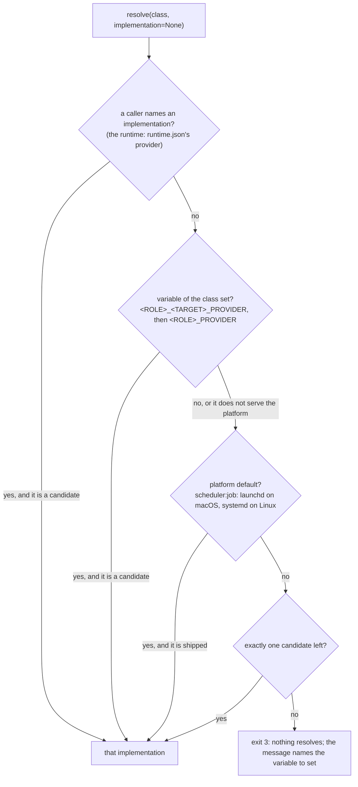

# Layer 3: providers

Part of [the platform map](README.md). Every layer page has the same eight sections, in this order.

## Purpose

A provider is a self-contained script that satisfies one requirement class (`integration:vcs`, `scheduler:job`, `publisher:<platform>`) when the harness has no connector for it. A skill, the task runtime and the first runtime never name a provider: they name a class, and one function, `providers/resolve.py`, turns the class into the script that serves it. A provider executes and does not decide: the confirmation gate lives in the skill or in the runtime's code, and the provider refuses a side-effect verb that carries neither `--dry-run` nor `--confirmed`.

The contract is [providers/CONTRACT.md](../../../providers/CONTRACT.md); the classes are [contracts/environment.md](../../../contracts/environment.md); the secrets are [contracts/secrets.md](../../../contracts/secrets.md); each folder's `README.md` says what its implementations do and what was measured on the live service. This page maps them and does not repeat them.

## Artifacts it owns

Where: **repo** is this repository, **data** is the provider's data folder on the machine (`~/Library/Application Support/ai-workbench/` on macOS, `$XDG_DATA_HOME/ai-workbench/` or `~/.local/share/ai-workbench/` elsewhere), **store** is the OS secret store (service `ai-workbench`).

| Path | Where | Format | Written by | Read by | Lifecycle | Versioned | Generated |
|---|---|---|---|---|---|---|---|
| `providers/CONTRACT.md` | repo | the interface every provider implements, the verbs and the keys each verb prints, per class | maintainers | provider authors, callers | changed by pull request; a verb is added with the skill that needs it | yes | no |
| `providers/resolve.py` | repo | Python 3.9, standard library only; `LISTED`, `ROLES`, `FIXED`, `ALIASES`, `PARAMETER_ROLES`, `PLATFORM_DEFAULTS` | maintainers | skills (by command), `runtime/board.py`, `runtime/documents.py`, `runtime/effects.py`, `scripts/runtime.py`, `scripts/doctor.py` | a class is added here and in the environment contract in one change | yes | no |
| `providers/<folder>/<impl>.py` | repo | one script per implementation, PEP 723 header with exact pins; `auth.py` beside it is a helper, never an implementation | maintainers | the resolver (by name), its callers (by the printed path) | changed by pull request, with offline tests | yes | no |
| `providers/<folder>/tests/` | repo | pytest, offline: a stand-in service on 127.0.0.1, fake tokens | maintainers | CI, the commit hook | grows with each verb | yes | no |
| `providers/<folder>/README.md` | repo | setup, usage, calls made, live measurements | maintainers | people | updated with each verb and each measurement | yes | no |
| `providers/secrets/resolver.py` (`REGISTRY`) | repo | the one lookup of a secret by name: environment, aliases, then the store | maintainers | every provider, `runtime/ops.py`, `evals/eval_run.py`, `scripts/doctor.py` | a secret is added here and in the secrets contract in one change | yes | no |
| `publisher-<platform>.json`, `vcs-github.json`, `issue-tracker-notion.json`, `documents-notion.json` | data | idempotency ledgers, mode 0600, under a file lock | the provider that owns each | that provider; `posts` reads the publisher's | grows; a pending key waits for `resolve` | no | yes |
| `scheduler/<id>/` (macOS) or the systemd user units (Linux) | data | one job folder: `job.json`, the snapshot copies (0400), `run.lock`, logs, `runs.jsonl`; `.history/` keeps the last 100 | the scheduler provider | its runner copy | moved to `.history/` when the id is scheduled again | no | yes |
| `<dir>/<id>.md`, `<dir>/.keys.json` (local board); `<dir>/<path>`, `<path>.comments.md` (local documents) | a folder the project configuration names, outside the project | Markdown items and documents, a key file | `issue-tracker/local.py`, `documents/local.py`; a person edits the Markdown | the same providers | as the board and the documents move | no | partly |
| The store's database (`--db` or `STORE_SQLITE_PATH`) | wherever the caller says; the task runtime puts it in its data folder | SQLite, WAL, 0600 in a 0700 folder | `providers/store/sqlite.py` only | its verbs; the task runtime through its functions | migrations only grow (`MIGRATIONS`) | no | no |
| Secret records | store | one entry per store username of `REGISTRY` (an OAuth record is a JSON object written by `auth.py`) | `keyring set` by a person, or an `auth.py` after the browser consent | the resolver | replaced on a new authorization | no | no |
| `~/.cache/ai-workbench/vcs-github-work/` | the machine's cache | a shallow clone, 0700 | `vcs/github.py commit-files` | itself | removed after each call | no | yes |

**The classes and their implementations, as built.** A row with no implementation is a reserved shape: a skill that requires it degrades as its body says.

<!-- generated: provider-classes -->
| Class | Folder | Implementation | Verbs |
|---|---|---|---|
| `publisher:<platform>` | `publisher/` | `linkedin.py` (PLATFORMS: linkedin) | `--check`, `publish`, `comment`, `resolve`, `posts` |
| `sender:email` | `mailer/` | none ships | - |
| `reader:email` | `mailbox/` | `gmail.py` | `--check`, `search`, `get`, `read-eml` |
| `generator:image` | `generator/` | none ships | - |
| `generator:video` | `generator/` | none ships | - |
| `search:web` | `search/` | none ships | - |
| `integration:vcs` | `vcs/` | `github.py` | `--check`, `alerts`, `dismiss-alert`, `read-file`, `commit-files`, `open-pr`, `resolve` |
| `integration:issue-tracker` | `issue-tracker/` | `local.py` | `--check`, `list`, `get`, `comments`, `upsert`, `resolve` |
| `integration:issue-tracker` | `issue-tracker/` | `notion.py` | `--check`, `list`, `get`, `comments`, `upsert`, `resolve` |
| `integration:documents` | `documents/` | `local.py` | `--check`, `stat`, `read`, `comments`, `write`, `notice`, `resolve` |
| `integration:documents` | `documents/` | `notion.py` | `--check`, `stat`, `read`, `comments`, `write`, `notice`, `resolve` |
| `scheduler:job` | `scheduler/` | `launchd.py` | `--check`, `schedule`, `list`, `cancel`, `resolve`, `run` |
| `scheduler:job` | `scheduler/` | `systemd.py` | `--check`, `schedule`, `list`, `cancel`, `resolve`, `run` |
| `store:runtime` | `store/` | `sqlite.py` | `--check`, `init`, `cursor-get`, `cursor-set`, `cursor-clear`, `event-add`, `event-next`, `event-done`, `run-start`, `run-end`, `runs`, `inbox-add`, `inbox-list`, `inbox-resolve`, `action-add`, `actions`, `action-count`, `export` |
<!-- /generated -->

Generated: the classes are the rows of the "Verbs per class" table of `providers/CONTRACT.md`, the folder is `providers/resolve.py`'s, and the verbs are read from each file's text (its `VERBS`, the choices of its `verb` argument, a `--check` flag), never by running it. Not generated: `sqlite.py`, `launchd.py`, `systemd.py` and both `local.py` are standard library only and run on Python 3.9, the two `notion.py` run with `uv run`; `auth.py` and `notion_blocks.py` are helpers; the store's task tables have no verb and are reached through its functions; `run` of the scheduler is internal; `integration:design-tool` is a class of the environment contract with no row in the verbs table.

**The secrets registry, per provider** (`REGISTRY` of `providers/secrets/resolver.py`, equal cell by cell to the table of [contracts/secrets.md](../../../contracts/secrets.md)): `vcs/github.py` reads an everyday token (alerts, `read-file`) and a separate pull-request token (`open-pr` only); `publisher/linkedin.py` and its `auth.py` read the platform's access token, client id and client secret; `mailbox/gmail.py` and its `auth.py` read a refresh token, client id and client secret; `issue-tracker/notion.py` and `documents/notion.py` share one integration token. `commit-files` reads no token: it uses the person's own git and SSH key. The store, the scheduler and both `local.py` read no secret. The keys of the model providers are registered by the adapters, never here (layer 5).

## Abstractions

**Class.** `<role>:<target>`: a fixed target (`integration:vcs`, `scheduler:job`) or a parameter (`publisher:<platform>`, the one class whose part after the colon is handed to the implementation as `--platform`). Four classes were bare names until 2026-10-02 and keep their folders and variables (`mailbox`, `mailer`, `scheduler`, `store`); the resolver still reads the old names as aliases.

**Implementation.** A file `providers/<folder>/<name>.py` that is not a helper (`auth`). An implementation of a class with a parameter declares the platforms it serves in one top-level line, `PLATFORMS = (...)`, which the resolver reads as text without importing the file; a file that declares nothing serves nothing.

**The resolver and its precedence.** First match wins:

A candidate is an implementation shipped in the class's folder and, for `publisher:
`, one that serves `
`. A name is never used as a path. The workbench root is `WORKBENCH_ROOT`, else the checkout the resolver is in.

**Verb.** One subcommand that prints one JSON object on stdout; diagnostics go to stderr. The "Prints" column of the contract names the keys a caller may depend on, and a second implementation is written against that column, never against the first one's output. Exit codes have one reading for `--check` and every verb: 0 ready or done, 1 a service or provider error, 2 usage, 3 not configured (the person has something to do).

**Dry run and `--confirmed`.** Every verb with a side effect takes one of the two. A dry run prints the exact payload, reads no credential and makes no call; the one exception is `commit-files --dry-run`, which clones the branch over SSH to show the diff and writes nothing. `resolve` writes a ledger, so it takes them too.

**Idempotency key and ledger.** A verb that publishes, sends or creates a record takes a required key. The key is written `pending` in the ledger, under a file lock, before the request, and `done` with the service's identifier after it. An unknown outcome (a timeout, a 5xx, a 408, a 429, a crash) keeps it pending and blocks every new attempt until `resolve` records what the person found; a definite refusal (a 4xx other than 408 and 429, or a failure before the request) releases it. The same key with other content is refused. A ledger is state, not cache: it lives in the data folder, and a ledger found at its old cache place is copied, never moved.

**The approval by payload hash.** The approval is the gate's, not the provider's: the gate shows what a dry run printed and the approval binds a hash of it ([contracts/environment.md](../../../contracts/environment.md), "Side effects and consent"). Two providers carry part of it in code: the scheduler's dry run prints an `approved` digest of every file the deferred command reads, the program and the runner, and `schedule --confirmed` must pass it back (a mismatch at run time refuses and records `refused`); `commit-files` compares the blob of every committed path with the sha256 of the file it was given and pushes nothing when one differs. The store records an approval hash and compares it with nothing: the caller hashes the file again before it acts.

**The credential by name.** A provider asks the resolver for a registered name and never reads its own variable or the store directly; the lookup is the environment variable, its aliases, then the store, and the provider prints where it found it, never the value. An `auth.py` writes the store once, after the browser consent. A request that carries a credential never follows a redirect.

**A provider's interpreter declaration.** A provider's header is what decides how it is started: a header with `dependencies = []` runs on the caller's interpreter (the set that must run on the system Python 3.9 is listed in `scripts/tests/test_runtime_python39.py`); any other header is started with `uv run <script>`, never with the caller's interpreter. `resolve.interpreter_for` reads the header to decide, once, for every caller of the task runtime; `scripts/doctor.py` runs every `--check` through `uv run`.

**The stand-in service.** Tests never reach a real service. An override of the service's address (`*_API_BASE`) or binary (`SCHEDULER_SYSTEMCTL`, `VCS_GIT_REMOTE`) is honoured only with a loopback URL or an explicit test flag, and then the secret store is never read. `providers/documents/tests/fake_notion.py` is the stand-in both page-based classes share: it serves exactly the calls of the providers' `CALLS` tables, refuses what the reference says the service refuses, and decides what the reference leaves open from the live measurements (a comment does not move the version; a code language off the list is refused).

**Document types and the fidelity test.** A skill's runtime manifest marks each document it writes `editable` or `read_only`. A type is `editable` only when it survives the trip to the platform's blocks and back: `providers/documents/tests/test_document_types.py` runs the skill's own checker on its fixture before and after `notion_blocks.round_trip` (or, with no checker, checks that no word is lost). A type that fails is set to `read_only`; the converter is not changed to make it pass. A `read_only` page carries one notice, its first block, which `read` returns apart and never as content.

**The task board's fields and states mapping.** The board owns only what a person edits: title, text, state, comments; everything else is written to a `shown` property and never read back. A platform board's configuration maps `fields` (`title`, `state`, `shown` to the base's property names) and `states` (each of the nine task states to an option); an option the map does not know reads as `null`, a row with no option is `requested`, and two states on one option is a usage error.

## Dependencies

**What it reads.**

| What | How | Why |
|---|---|---|
| The environment | the class's variable; the provider's own configuration variables; `WORKBENCH_ROOT` | which implementation, which ledger, which root |
| The secret store | `providers/secrets/resolver.py` only | credentials, by name |
| A JSON configuration file (`--config-file`) | the board's and the documents' object of the project's `runtime.json`, written by the runtime to a 0600 temporary file | where the board and the documents are |
| A platform's data file | a path given by flag (`media.max_count`, the notification header prefix) | design rule 2: a provider holds no platform's rules beyond what its own service requires |
| The machine's tools | `git` and `ssh` (`commit-files`), `launchctl` or `systemctl` (the scheduler), `uv` | each with a timeout and an argument list |

A provider never reads a skill, the store (except the store provider itself), anything under `runtime/` or an adapter. The one cross-class load is `issue-tracker/notion.py` loading `documents/notion_blocks.py` by path, which a test asserts is the only one.

**Who calls it.**

- **Skills' scripts and steps**, by class: `python3 <workbench root>/providers/resolve.py --class <class>` prints the path, and the skill runs it. The skill holds the gate; the provider holds `--confirmed`.
- **The task runtime**, by class through `resolve.call(cls, verb, args, implementation=<the configuration's name>, config=...)`, the one function that resolves, picks the interpreter, starts the verb, maps the exit code and parses the one JSON object (`ProviderCallError`; "Calling a provider from code" of `providers/CONTRACT.md`): the board (`runtime/board.py`, class `integration:issue-tracker`), the documents (`runtime/documents.py`, `integration:documents`), the effects (`runtime/effects.py`, `integration:vcs`: `commit-files` then `open-pr`), the published-posts handler (`publisher:<platform>`, the read-only `posts`), and the store (`store:runtime`, whose task functions `runtime/ops.py` imports).
- **The first runtime** (`scripts/runtime.py`, `scripts/runtime_vote.py`, `scripts/vote_job.py`), which the scheduler starts on the system interpreter: the store's verbs, the mailbox, the publisher.
- **`scripts/doctor.py`**, which runs each class's `--check` through `uv run` and reports `connector`, `provider`, `missing` or `unknown`.

**The rules.**

- The core (this folder included) names no AI tool and never reads an adapter: `scripts/validate.py`, check `harness-name`; `providers/secrets/tests/test_resolver.py::test_the_core_registry_names_no_adapter`.
- Nothing outside `providers/` builds a provider's path: the resolver is the one door (`scripts/tests/test_provider_resolve.py::test_a_name_is_never_a_path`; `scripts/tests/test_doctor.py::test_a_class_is_checked_through_the_resolution_function`).
- Every class of the environment contract is in `LISTED`, and a contract row that ships nothing says so: `test_every_class_of_the_environment_contract_is_listed`, `test_a_verbs_row_says_when_no_implementation_ships` (both in `scripts/tests/test_provider_resolve.py`).
- The live measurements of a platform are recorded in its provider's README, each row as observed, with the command, the answer and the date; where a row is not measured, the stand-in decides by the reference and says so.

## Business rules

Each invariant with its guard. A test is in the provider's own `tests/` folder unless its path is given.

**Testing and the hook.**

- Every provider class has offline tests, and the commit hook refuses a commit that leaves an existing class without them: `.githooks/pre-commit` (rule 3); `scripts/tests/test_checks_wiring.py::test_the_hook_maps_each_folder_to_the_tests_that_cover_it`, `test_every_test_folder_of_this_repository_is_in_the_list_ci_runs`.
- Contract tests run on every implementation of the two runtime classes: `test_issue_tracker_contract.py` and `test_documents_contract.py`, each with `test_every_implementation_has_a_harness`. The scheduler's two implementations are held together by `test_scheduler_parity.py` (`test_a_shared_function_is_the_same_text_in_both_providers`, `test_the_contract_row_and_the_readme_name_every_verb_flag_and_key`). The other classes have one implementation and its own tests; no contract test exists for them.
- No network in tests: no guard found that blocks a socket for the whole suite. What holds it is the loopback rule, tested per provider (`test_a_base_address_that_is_not_loopback_is_refused` for both page-based providers; `test_rejects_non_loopback_api_base` for `vcs/github.py`).

**Selection.**

- The environment wins most specific first, a caller's explicit name wins over it, and both must be candidates: `test_environment_wins_most_specific_first`, `test_an_explicit_implementation_wins_over_the_environment`, `test_a_name_is_never_a_path`.
- A second publisher for another platform breaks nothing for the first, and a file that declares no platform serves none: `test_a_second_publisher_does_not_break_the_first`, `test_the_declaration_is_read_as_text_and_a_file_that_declares_nothing_serves_nothing`.
- A provider that needs dependencies is started through `uv run`, never with the caller's interpreter: `runtime/tests/test_system_python_starts.py::test_what_does_not_run_on_the_system_python_is_started_through_uv`; `scripts/tests/test_doctor.py::test_without_uv_a_provider_is_missing_and_never_run_with_the_callers_interpreter`.
- Every script the scheduler starts runs on Python 3.9: `scripts/tests/test_runtime_python39.py` (`ON_SYSTEM_PYTHON`) and the CI job `python39`.

**Secrets.**

- The secrets table of the contract equals the registry cell by cell: `providers/secrets/tests/test_resolver.py::test_the_contract_table_equals_the_registry_cell_by_cell`.
- No value is ever printed: `test_report_never_carries_a_value`, `test_cli_check_and_list_print_no_value` (resolver); `test_check_says_not_configured_with_exit_3_and_prints_no_secret` (both contract suites).
- A request with a credential never follows a redirect: `test_redirect_is_not_followed_with_the_token` (`vcs`, `publisher`), `test_redirect_is_refused` (`mailbox`), `test_the_token_is_never_printed_and_a_redirect_is_refused` (both page-based providers).
- The pull-request token is separate: only `open-pr` reads it, it is read first and named, and the everyday token is the fallback only when it is found nowhere: `test_only_open_pr_reads_the_pull_request_token`, `test_open_pr_reads_its_own_token_first_and_names_it_never_its_value`, `test_open_pr_falls_back_to_the_everyday_token_only_when_its_own_is_not_found`; `test_the_pull_request_token_has_a_row_of_its_own_and_the_everyday_token_lost_that_permission` (resolver).
- `git` run by `commit-files` gets neither the caller's `GIT_*` variables nor any registered secret: `test_git_gets_neither_the_callers_git_variables_nor_the_secrets`.

**Side effects.**

- A side-effect verb without `--confirmed` or `--dry-run` is refused, and a dry run changes nothing: `test_a_write_without_confirmation_is_refused_and_a_dry_run_changes_nothing` (both contract suites), `test_dismiss_refuses_without_confirmed`, `test_open_pr_needs_confirmed`, `test_open_pr_dry_run_prints_the_request_and_reads_no_token`.
- A skill that writes to a remote must declare it: `scripts/security_scan.py`, rule `undeclared-side-effect` (`scripts/tests/test_security_scan.py::test_remote_write_needs_declared_side_effects`, `test_remote_write_in_a_step_of_skill_md`).
- One record per idempotency key, and an unknown outcome blocks the key until `resolve`: `test_the_same_idempotency_key_creates_one_item`, `test_the_same_idempotency_key_creates_one_document`, `test_a_creation_with_an_unknown_outcome_blocks_its_key_until_resolve` (both page-based providers), `test_an_unknown_push_outcome_stays_pending_until_resolved`, `test_resolve_settles_a_pending_pull_request_either_way`, `test_open_pr_refuses_a_key_used_for_another_title_body_or_branch`.
- A 429 or a 5xx is exit 1 and is never retried by the provider: `test_too_many_requests_exits_1_with_the_status_and_is_not_retried` (documents). The board's is asserted inside its `test_a_creation_with_an_unknown_outcome_blocks_its_key_until_resolve`, with no test named after it.

**The versioned output shapes.** The keys of the "Prints" column are what a caller depends on: the contract suites assert them for the board and the documents (`test_an_item_that_was_created_is_read_back_with_its_title_text_and_state`, `test_stat_reports_the_version_read_reports`), `test_publisher_posts_verb.py` for `posts` (`test_posts_lists_only_published_posts_since_the_given_time`, `test_a_published_post_whose_time_cannot_be_read_is_undated`), and `test_open_pr_creates_one_pull_request_and_prints_its_number_and_url`. The service's own API version is pinned in each provider (a version header per call). A second implementation of `integration:vcs` or `publisher:<platform>` would have no contract suite to run against: none exists.

**Documents and the board on a platform.**

- A write replaces the whole document and never merges: `test_a_write_replaces_the_whole_document`.
- The replacement appends the new blocks first and deletes the old ones after, so a failure never leaves a page empty: the calls are bounded by `test_a_long_document_is_written_in_calls_no_larger_than_the_limit`; the order itself has no guard found.
- A page that changed since the runtime last wrote it is never written over: the provider writes whatever it is given; the guard is the runtime's read before every write (`runtime/tests/test_documents_mirror.py`, `test_a_document_both_sides_changed_is_overwritten_on_neither_side_until_the_person_takes_one`). Two edits within one minute give one version (measured, N1), so that read is the only guard for that minute.
- A fence language the platform does not know goes up as plain text and comes back unchanged: `test_a_fence_word_the_service_does_not_know_goes_up_as_plain_text_and_a_known_one_is_unchanged` (converter), `test_a_fenced_block_whose_language_the_service_does_not_know_goes_up_as_plain_text_and_comes_back_unchanged` (provider).
- An editable type keeps passing its skill's checker after the trip: `test_an_editable_document_still_passes_its_skills_checker_after_the_trip`, `test_every_editable_document_type_has_a_fixture`.
- The notice is the page's first block once, and never part of what is read: `test_a_notice_is_the_pages_first_block_once_and_never_part_of_what_is_read`, `test_notice_adds_the_notice_to_a_page_that_has_none_and_nothing_to_one_that_has_it`.
- The board's `base` is the data source's id, not the database's: a wrong id is not configured (exit 3), as measured (N10); a test with a well-formed id the integration cannot see covers the parent page (`test_a_parent_the_integration_was_not_given_is_not_configured`); no test gives a database id in place of a data source id.
- A row in the trash is got as `archived`, with no body and no comments: `test_a_row_in_the_trash_is_got_as_archived_with_no_body`.
- A comment on a block is read with its page or item, and `comments` is one listing of the page's own comments whatever the version: `test_a_comment_on_one_block_is_read_with_the_document`, `test_comments_is_one_listing_of_the_pages_own_comments_and_a_comment_does_not_move_the_version`, and the board's pair. The runtime calls `comments` for every mirrored item and page at every pull: `runtime/tests/test_board_mirror.py::test_a_comment_added_on_an_unchanged_item_is_saved_by_the_next_pull`, `runtime/tests/test_documents_mirror.py::test_a_comment_added_on_an_unchanged_page_is_saved_by_the_next_pull`.
- A write of the state alone keeps the title and the text a person edited, and a write of values already on a row sends no change: `test_a_write_of_the_state_alone_keeps_the_title_and_the_text_a_person_edited`, `test_a_write_of_values_already_on_the_row_sends_no_change`.

**`commit-files`.**

- Every path matches an `--allow` glob, part by part; `*` never crosses `/` and no wildcard matches a leading dot: `test_paths_outside_allow_are_refused_before_cloning`, `test_a_wildcard_does_not_admit_a_dotfile`. The runtime passes each path of the change set as its own `--allow` (`runtime/effects.py`).
- One signed commit with exactly the files given; an unsigned commit is never pushed; a hook or an attribute that changes a file stops the push: `test_confirmed_pushes_one_signed_commit_with_exactly_the_files`, `test_an_unsigned_commit_is_never_pushed`, `test_a_hook_that_changes_a_file_stops_the_push`, `test_an_attribute_that_changes_a_file_stops_the_push`.
- Never written through a symlink; a deletion is never of a folder nor through a link: `test_a_symlink_in_the_repository_is_never_written_through`, `test_a_delete_through_a_symlink_or_of_a_folder_is_refused_and_nothing_is_pushed`.
- A moved branch is retried once from a fresh clone; only a definite refusal releases the key: `test_a_moved_branch_is_retried_once_from_a_fresh_clone`, `test_a_push_the_remote_refused_releases_the_key`, `test_a_push_whose_remote_did_not_report_keeps_the_key_pending`.
- A tag is refused as a branch; `--from-branch` starts a missing branch from the base and is ignored when the branch exists: `test_a_tag_is_refused_as_branch`, `test_from_branch_creates_the_branch_from_the_base_when_the_remote_lacks_it`, `test_from_branch_is_not_used_when_the_branch_already_exists`.

**The store.** One call is one transaction; the task tables have no verb; a `waiting` task has one open pending decision; `approvals` only grows: `providers/store/tests/test_sqlite_tasks.py`, `test_sqlite_platform.py`, `test_sqlite_approvals.py` (the database triggers), `test_sqlite_stage6.py`. The runtime's page lists the invariants that rest on them.

## Entry points

Every provider takes `--help` and `--check`. Side-effect verbs take `--dry-run` or `--confirmed`. Run a provider whose header has dependencies with `uv run providers/<folder>/<impl>.py`.

**The resolver and the doctor.**

| Command | What it does |
|---|---|
| `python3 providers/resolve.py --class <class> [--json] [--root <dir>]` | the path of the implementation chosen now (exit 3 when nothing resolves) |
| `python3 providers/resolve.py --list` | every class, its folder, its variables, its implementations and the one that resolves |
| `python3 providers/secrets/resolver.py --list` / `--check <NAME>` [`--registry <file>`] | which secrets are found and where, never a value |
| `python3 scripts/doctor.py [--harness <name>] [--json] [--strict]` | every class the skills require: `connector`, `provider`, `missing` or `unknown`; every registered secret |

**Per class.**

| Class | Verb | Side effect | Credential |
|---|---|---|---|
| `store:runtime` | `init`, `cursor-get`, `cursor-set`, `cursor-clear`, `event-add`, `event-next`, `event-done`, `run-start`, `run-end`, `runs`, `inbox-add`, `inbox-list`, `inbox-resolve`, `action-add`, `actions`, `action-count`, `export` | local only; none takes `--confirmed` | none |
| `scheduler:job` | `schedule --id (--at \| --every) --command-file (--dry-run \| --confirmed --approved <digest>)` | registers a job | none |
| | `list`; `cancel --id`; `resolve --id (--done \| --failed)`; `run --id` (internal) | `cancel`, `resolve` | none |
| `integration:vcs` | `alerts`; `read-file` | none | everyday token (anonymous for a public file) |
| | `dismiss-alert --idempotency-key` | dismisses an alert | a separate write token |
| | `commit-files --repo --branch --message-file --file ... --allow ... --idempotency-key` | one signed commit, pushed | none: the person's git and SSH key |
| | `open-pr --repo --head --base --title-file --body-file --idempotency-key` | opens one pull request | the pull-request token |
| | `resolve --idempotency-key (...) --confirmed` | the ledger | none |
| `integration:issue-tracker` | `--check`, `list`, `get --id`, `comments --id` | none | the integration token (`notion.py`) |
| | `upsert [--id] --item-file --idempotency-key`, `resolve` | creates or updates an item | the same |
| `integration:documents` | `--check`, `stat --id`, `read --id`, `comments --id` | none | the integration token (`notion.py`) |
| | `write [--id] --path --markdown-file --idempotency-key [--notice]`, `notice --id --text`, `resolve` | replaces a whole document; adds the notice | the same |
| `publisher:<platform>` | `publish --platform --text-file --idempotency-key [--media] [--first-comment-file]`; `comment ...`; `resolve ...` | publishes a post or a comment | the platform's token |
| | `posts --platform --since <time with offset>` | none: reads the ledger only | none |
| `reader:email` | `search --query`, `get --id`, `read-eml --file` | none (read only by scope) | the refresh token and client |

**One-time authorizations**: `uv run providers/publisher/auth.py --provider <impl>`, `uv run providers/mailbox/auth.py --provider <impl>`; a token without OAuth is stored with `uv run --with keyring==25.7.0 keyring set ai-workbench <store username>` at a hidden prompt.

**Tests**: `uv run --with pytest==9.1.1 pytest -q providers/<folder>/tests`; the resolver's in `scripts/tests/test_provider_resolve.py`.

## Known limits and improvements

| Limit or improvement | Where it is recorded |
|---|---|
| The live measurements of the page-based providers were made through the API, not by hand: an edit, a comment, a resolved comment, archiving and an unshared page by hand are still to measure (N1, N3, N4, N5, N8, N10); a 429 was not provoked (N6) | [providers/documents/README.md](../../../providers/documents/README.md) and [providers/issue-tracker/README.md](../../../providers/issue-tracker/README.md), "Measured on the live service" |
| One social platform, of one shape (text with optional media); a platform of another shape edits three skills | `providers/publisher/`; [AGENTS.md](../../../AGENTS.md), design rule 3 |
| One task-board platform and one documents platform besides `local` | the two folders' READMEs |
| `integration:documents` has no row in the environment contract and is not in `LISTED`; it resolves by its folder until the router's routing table first changes | [providers/CONTRACT.md](../../../providers/CONTRACT.md), its row; `test_the_class_resolves_by_its_folder_and_is_not_in_the_listed_classes` |
| Fidelity is per document type and per provider: a fenced block in a language the platform does not know failed to be written before the plain-text fallback | [stage 3 findings](../stage-3-findings-2026-10-06.md), finding 14; N11 of the documents README |
| A sync lists comments for every mirrored item and page at every pull, and a `read` lists the comments block by block (a 296-block page took about two minutes) | [stage 3 findings](../stage-3-findings-2026-10-06.md), finding 7; N4 |
| Rows changed since a time can be asked for in one call (N9); `list` does not use it yet, which is a decision | [providers/issue-tracker/README.md](../../../providers/issue-tracker/README.md), N9 |
| A board's own status property is not written; a base whose status has fewer options than the nine states holds only the mapped ones | [backlog](../../backlog.md), R13 |
| Three glob readings: `commit-files --allow` (`*` never crosses `/`, no leading dot), a policy's `files` (`*` does not cross `/`), a `protected_paths` entry (`*` crosses `/`) | [vcs README](../../../providers/vcs/README.md); [runtime.md](runtime.md), "Known limits and improvements" |
| No contract suite for a class with one implementation (`integration:vcs`, `publisher:<platform>`, `reader:email`): a second implementation has nothing to run against | "Business rules" above |
| The systemd scheduler was written on a machine without systemd and is tested against a fake `systemctl` | [providers/scheduler/README.md](../../../providers/scheduler/README.md), "Not verified yet" |
| The platform's comment endpoint for a member is an undocumented path; its behaviour may change | [providers/publisher/README.md](../../../providers/publisher/README.md), "To verify on first use" |
| `sender:email`, `generator:*`, `search:web` and `integration:design-tool` have no implementation | [providers/CONTRACT.md](../../../providers/CONTRACT.md), "Verbs per class" |
| A password manager as a secrets backend | [backlog](../../backlog.md), S16 |
| The store's README says the runtime calls the store only through its command line; the task runtime imports its functions | [providers/store/README.md](../../../providers/store/README.md), first paragraph; [providers/CONTRACT.md](../../../providers/CONTRACT.md), "Functions of the store" |
| Two README rows (N3 of the documents and the board) say the stand-in still moves the version on a comment; the stand-in no longer does | `providers/documents/tests/fake_notion.py`, its docstring and `comment()` |

## Changes

- 2026-10-06: first version, written from the code at the central branch's head of that day.
- 2026-10-07: `resolve.call` (and `invoke`, `interpreter_for`, `ProviderCallError`): the call of a provider's verb exists once, and the board, the documents, the effects and the published-posts handler use it (WP-R.7).
- 2026-10-06: the volatile tables are generated from the code by `scripts/architecture_tables.py` (the classes, implementations and verbs).
