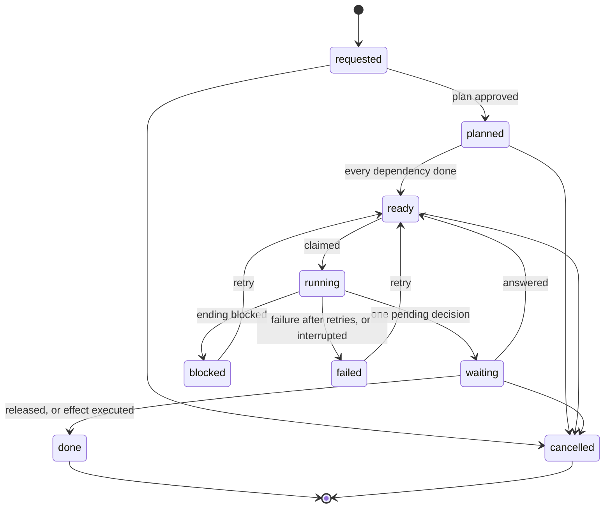

# Layer 6: the runtime

Part of [the platform map](README.md). Every layer page has the same eight sections, in this order.

## Purpose

The task runtime (`runtime/`) turns a person's request into tasks and runs each task as one proven skill, once, in the container the skill was proven in, on a fresh copy of the project that holds only what may enter it. What a run leaves comes back by one rule of paths, and the task then waits for the person on one pending decision; every effect outside the project is executed by code under an approval bound by its hash.

The contract is [contracts/runtime.md](../../../contracts/runtime.md); the module list is [runtime/README.md](../../../runtime/README.md); the design and its stages are [the platform plan](../platform-plan-2026-10-05.md). This page maps them and does not repeat them.

## Artifacts it owns

Where: **repo** is this repository, **project** is the target project, **data** is the project's data folder (`data_dir` of the configuration, outside every repository).

| Path | Where | Format | Written by | Read by | Lifecycle | Versioned | Generated |
|---|---|---|---|---|---|---|---|
| `runtime/*.py`, `runtime/handlers/*.py`, `runtime/README.md` | repo | Python 3.9, standard library only | maintainers | the shells, the scheduler's entry | changed by pull request | yes | no |
| `runtime/secrets.json` | repo | JSON registry of one secret, `WB_RUNTIME_FLOOR_KEY` (store username `runtime-floor`) | maintainers | `ops.py`, through `providers/secrets/resolver.py` | changed by pull request | yes | no |
| `runtime/tests/`, `runtime/tests/corpus/endings.jsonl` | repo | pytest; JSON lines of archived lab runs with labels | maintainers; the corpus by `corpus/build_corpus.py` | CI, the hook, `endings.py --corpus` | grows with each stage | yes | the corpus is |
| `flows/<name>.json` | repo | flow file: `flow`, `title`, `tasks[]` (`key`, `skill`, `title`, `text`, `depends_on`, `milestone`); three today: `market-positioning`, `brand`, `code-change` | maintainers | `runtime/flow_files.py`, `scripts/validate.py` (dependencies, inventory) | changed by pull request | yes | no |
| `skills/<name>/evals/runtime-manifest.json` | repo | runtime manifest: `skill`, `documents[]` (`path`, `checks`, `platform`, `bound_to_approval`), `machine_files`, `mandatory_milestone`, `asking_openings`, `gate`; eleven today, one per skill of the packs in use | maintainers | `runtime/manifest.py` | outside the skill's content hash: no bump, no lab test | yes | no |
| `packs/business.txt`, `brand.txt`, `planning.txt`, `code.txt`, `marketing.txt` | repo | pack patterns | maintainers | `runtime/plan.py` (an area agent's scope), `runtime/manifest.py` (`PACKS_IN_USE`: the first four) | changed by pull request | yes | no |
| The store's task tables (`providers/store/sqlite.py`, migrations 2 and later: below) | data (`store_db`) | SQLite, WAL, mode 0600; one function call is one transaction | `ops.py` only, through the store's functions | `ops.py` only | grows; `approvals` never loses a row | no | no |
| `docs/workbench/runtime.json` | project | JSON, no secret (keys below) | the person | `runtime/project_config.py`; the scheduler's entry checks its hash against the pin | accepted by its hash; every change accepted again | the project decides | no |
| `docs/workbench/state.md` | project | the state contract ([contracts/state.md](../../../contracts/state.md)) | `core-project-init` owns it; the runtime writes into it through `runtime/state_merge.py` only | runs (it enters every copy), the engagement gate script | updated after each run, answer, approval and mode change | the project's `Docs in git` decision | its `Checkpoints` line and the runtime's approval rows are |
| `docs/workbench/policies/<policy>.json` | project | bounds of a standing approval: `policy`, `agent`, `effects`, `targets`, `files`, `max_per_day`, `max_items_per_run` | the person | `runtime/autonomy.py` (`bounds_of`, `covers`) | bound by its hash; an edit covers nothing until approved again | the project decides | no |
| `.workbench-local/drop/<task id>/` | project | the files the person handed to one task | `runtime/drop.py` (`hand-over`) | `runtime/workcopy.py` (enters that task's runs only) | never comes back changed | no (the folder must be ignored by git) | no |
| `.workbench-local/evidence/` | project | field evidence: one use per run, one verdict per run | `scripts/evidence.py`, called by `ops.py` | `evidence.py export` | grows | no | no |
| `<data_dir>/task-runs/<run id>/` | data | `prompt.md`, `cwd/` (the copy as the run left it), `outputs/` (`response.md`, `timing.json`, `raw.json`, `stderr.log`, `stream.jsonl`), attempts set aside; for a code task `changeset/` (`changeset.json`, `files/`); for a gate run its temporary folder, `payload.md` and `effect.json` | `runtime/lab.py`, `changeset.py`, `effects.py` | `pending --id`, `approve` of an effect | kept; never committed | no | yes |
| `<data_dir>/prepared/<run id>/` | data | files written for one run before they enter its copy | `runtime/workcopy.py` | `runtime/lab.py` | removed after the run | no | yes |
| `<data_dir>/run.lock` | data | an empty file under an exclusive lock | `ops.py` | `ops.py` | held while a run, a route, a sync or an effect is in progress | no | yes |
| `<data_dir>/proof.json` | data | the proof file: each skill's band, score and checks per model, and the hash of its inputs | `runtime/proof.py` | `runtime/proof.py` | rebuilt when the gate file, a version file, an evidence file or the skill's content changes | no | yes, a cache |
| `<data_dir>/deps/<key>/` | data | an installed dependency folder, keyed by recipe, files and image digest | `runtime/deps.py` | `runtime/deps.py` (copied into a code run) | installed once per content and image | no | yes |
| `<data_dir>/effects/<pending id>/` | data | the files code hands the code provider for one effect | `runtime/effects.py` | the code provider | kept | no | yes |
| `<data_dir>/documents/not-taken/`, `imported.json`, `notices.json` | data | page texts not taken; the last import of each document; the read-only pages that carry the notice | `runtime/documents.py` | `runtime/documents.py`, `ops.task_prompt` (the imported line) | grows | no | yes |
| `<data_dir>/dispatch-pin.json` | data | the path and sha256 of the accepted `runtime.json`, mode 0600 | `cli.py pin` | `runtime/dispatcher.py` (the scheduler's entry) | written again after each accepted change | no | yes |

**The store, as built.** Migration 1 holds the first runtime's tables (`cursors`, `events`, `runs`, `inbox`, `actions`); the task runtime uses `cursors` and `actions` too. The migrations, generated from `MIGRATIONS` of `providers/store/sqlite.py`:

<!-- generated: store-migrations -->
Schema version 7: the highest migration of `MIGRATIONS`.

| Migration | Description | Tables created | Columns added | Triggers |
|---|---|---|---|---|
| 1 | cursors, events, runs, inbox and actions | `cursors`, `events`, `runs`, `inbox`, `actions` | - | - |
| 2 | tasks, task_runs and pending_decisions of the task runtime | `tasks`, `task_runs`, `pending_decisions` | - | - |
| 3 | the number of values the lab replaced in what a task run left | - | `task_runs.redactions` | - |
| 4 | a task's item on the task board, the records of mirrored documents and saved platform comments | `document_records`, `platform_comments` | `tasks.remote_id`, `tasks.remote_version`, `tasks.remote_written_sha256` | - |
| 5 | the approvals table: what the person approved, a record that only grows | `approvals` | - | `approvals_never_deleted`, `approvals_only_status_moves` |
| 6 | the messages of the conversation with the planning agent | `conversation_messages` | - | - |
| 7 | tasks, task runs and pending decisions are never deleted | - | - | `tasks_never_deleted`, `task_runs_never_deleted`, `pending_decisions_never_deleted` |
<!-- /generated -->

The task runtime's tables, those that migration 2 and later create, with their columns (generated from the same source):

<!-- generated: task-runtime-tables -->
| Table | Created by migration | Columns |
|---|---|---|
| `tasks` | 2 | id, parent_id, flow, key, skill, agent, title, text, state, depends_on, milestone, note, created_at, updated_at, remote_id (migration 4), remote_version (migration 4), remote_written_sha256 (migration 4) |
| `task_runs` | 2 | id, task_id, skill, skill_version, skill_sha256, model, adapter, web, status, failure, ending, attempts, started_at, ended_at, cost_usd, tokens, duration_ms, skill_loaded, image_digest, run_dir, error, redactions (migration 3) |
| `pending_decisions` | 2 | id, task_id, run_id, kind, title, body, payload, payload_sha256, status, resolution, answer, created_at, resolved_at, resolved_by |
| `document_records` | 4 | id, path, provider, remote_id, written_sha256, remote_version, read_sha256, status, note, updated_at |
| `platform_comments` | 4 | id, provider, remote_id, subject, task_id, document_path, author, text, created_at, saved_at, status, used_by_pending |
| `approvals` | 5 | id, scope, what, payload_sha256, policy_sha256, bounds, task_id, pending_id, approved_at, approved_by, expires_at, status, executed_at |
| `conversation_messages` | 6 | id, conversation, role, text, task_id, run_id, created_at |
<!-- /generated -->

The cursors the runtime writes: `config:accepted-sha256` (the accepted configuration, written only by `accept_config`), `board:configured` (when the board was first written), `use:<run id>` (the recorded use of a run), and each handler's own (`routine:published-posts`).

**The project configuration's keys** (`runtime/project_config.py`; the keys are closed: an unknown key is refused (exit 3) with the nearest known name, and the first runtime's keys, a second closed tuple that leaves with stage 7, stay valid in the same file): `workbench`, `data_dir`, `store_db` (required, absolute); `area_agents` (`pack`, `enabled`, `mode`, `max_runs_per_day`, `max_usd_per_day`); `protected_paths`; `task_board` and `documents` (`provider`, and `expires` for a provider other than `local`, plus the provider's own keys); `code` (`provider`, `repo`, `base`, `branch_prefix`); `dependencies` (`recipe`, `file`); `handlers`; `path`; `max_cost_usd_per_run`. Planned: `model_prices`.

## Abstractions

**Task and its nine states** (the store's CHECK): `requested`, `planned`, `ready`, `running`, `waiting`, `blocked`, `done`, `failed`, `cancelled`. A `waiting` task has exactly one open pending decision; one task is `running` at a time per database.

**Request.** A task with no parent and no skill, in the person's words. With a flow named it is planned at once; without, it stays `requested` until its route becomes an approved plan. A request written on the task board waits in an `acceptance` first.

**Run and attempt.** A run is one row of `task_runs`: one skill, once, in a new copy. Inside it, the lab's one function (`evals/run_attempts.py`) makes attempts: it pauses on the account limit without counting a failure, retries a timeout, an adapter failure, a refusal or an early end, and never retries a refused credential. A failed run has a failure kind from a closed list: `timeout`, `refused`, `auth`, `adapter`, `early_end`, `settings`, `stopped`, `internal`.

**The six endings** of a run that did not fail (`runtime/endings.py`): `done` (a declared output written, nothing asked; or nothing changed and the declared output already there), `question` (nothing written, or only the state file, and it asks), `draft_with_questions` (a declared output written and it still asks), `gate` (the file of its confirmation gate written and it asks), `blocked` (it stopped on a missing input another skill writes), `unclassified` (no rule holds; the person reads the whole reply).

**The pending-decision kinds and their resolutions.**

| Kind | Opened when | Resolutions |
|---|---|---|
| `plan` | code built a plan from a route or a named flow | `approved`: the tasks are created; `rejected`: the request is cancelled |
| `question` | ending `question` | `answered`: the task is `ready`; the answer is written into the state file by code |
| `review` | ending `done`, `draft_with_questions`, `unclassified`, or a `gate` whose effect could not be opened | `released`: the task is `done`, still a draft; `answered`: the task runs again with the text |
| `effect` | ending `gate`, with the payload recovered, parsed, agreeing with the configuration and an unblocked change set | `approved` (only with its hash, then executed by code); `answered`: sent back; `rejected`: the task is cancelled, nothing sent |
| `acceptance` | a request written on the board; sub-tasks beyond the plan's limits (`subtasks`); a request a mode completed (`deliveries`) | `accepted`, `rejected` |
| `your_document` | reserved: a task in which the person writes the document | `delivered` (planned) |

A pending decision is `open`, `resolved` or `cancelled`. A release by an autonomy mode is recorded with `resolved_by` `mode:<mode>`.

**Approvals and their scopes** (table `approvals`, the three scopes of [contracts/environment.md](../../../contracts/environment.md)): `action` (one exact payload by its hash: today an effect), `standing` (a policy file by its hash, with bounds and an expiry of at most 365 days), `plan` (reserved). Statuses move only forward: `pending-execution` to `executed` or `revoked`; `active` to `expired` or `revoked`. The rows in the state file's `## Approvals` are copies code generates.

**The effect and its hash.** The pull-request skill runs up to its confirmation gate and writes its payload to a temporary file whose path and sha256 its reply states; code recovers that file only when the hash matches, parses it, and writes `effect.json`, which binds the configuration's repository and base, the head the runtime names (`<branch_prefix>request-<id>`), the title and body the skill showed, and every file of the change set by its hash. The effect's hash is the sha256 of that document.

**The change set.** What a code task (a skill of the engineering or delivery area) did to versioned files: the difference between the copy's base commit and its working tree, taken by git in the run's container, then classified, checked and hashed by the host. A refused path (a link, a path the code provider does not take, over its size, a credential format, a tool's settings, a protected path) blocks the whole set. The next code task of the request starts from the newest unblocked set.

**The proof and the tiers.** Two tiers, `strong` (the reference model) and `floor` (the floor model), named only in `evals/eval-gate.json`. A run goes to the floor tier only when the skill is `reliable` there, the measurement files of the checkout are the recorded ones, the eval image is the evidence's, and a key for the floor model is found; otherwise to the strong tier. The person may ask for the strong tier (`run-next --tier strong`); nobody can ask for the floor tier.

**The autonomy modes, from three facts.** Each area agent (an entry of `area_agents`) has one of five modes: `stopped`, `supervised`, `milestones` (default), `autonomous`, `autonomous-with-policy`. They rest on three facts: whether the agent is enabled, the checkpoints of its mode (`every-phase`, `milestones`, `end`) and whether a standing approval is in force; `mode_of` maps the facts back, so a policy mode whose approval expired acts as `autonomous`. **Daily caps**: runs per day on the reference model and dollars per day on the floor model; an absent cap is 0, and a floor run of unknown cost counts at `max_cost_usd_per_run` (default 0.5).

**The handler.** A routine under `runtime/handlers/`, configured under `handlers` of the configuration, with its own verbs, started as a separate process with one JSON object out. One today: `published-posts` (verbs `tick`, `preview`). A handler prepares an effect (a JSON document: policy, kind, target, files, items, idempotency key, payload hash, and the provider verb's own flags) and hands it to `ops.execute_under_policy` through `cli.py execute-under-policy`. That one operation holds limit L15 for policy effects: it checks the standing approval and every bound with `autonomy.covers`, holding the run lock and counting the day's actions again; it adds `--allow` for exactly the approval's file globs and the idempotency key, makes the provider's dry run and then its confirmed call (`effects.provider_call`), and records the action. A handler never passes the confirming flag, never re-reads the bounds and never records an action; a test keeps those words out of `runtime/handlers/`.

**The mirror and its records.** The board mirror keeps a task's item (`remote_id`, `remote_version`, the hash last written); the person owns the title, the text, the state and the comments, the rest is shown. The documents mirror keeps one `document_records` row per document, with the status `mirrored`, `read_only` or `rejected` and a note. A saved comment is `open`, `used` (by one pending decision) or `dismissed`.

**The drop.** The file drop: one folder per task in the project's `.workbench-local/drop/`, entering that task's runs only, listed in their prompt, never brought back.

## Dependencies

**What it reads.**

| What | How | Why |
|---|---|---|
| The lab (`evals/eval_run.py`, `evals/run_attempts.py`, the status script, the gate file) and, through it, the adapters and the container | `runtime/lab.py` only, which reads the runner through a list of allowed names (`ALLOWED`) and refuses the measuring ones (`FORBIDDEN`) | a run is the lab's run without the grading |
| The providers | by class through `providers/resolve.py`: `store:runtime`, `integration:issue-tracker`, `integration:documents`, `integration:vcs`, `publisher:<platform>` (the handler's read-only `posts`) | never a provider path built by hand |
| The skills | their frontmatter (`runtime/skill_meta.py`), their runtime manifests, and a few sentences of their text that the classifier and the merge read, each bound by a test (`runtime/tests/test_skill_text_binding.py`) | what the frontmatter declares is never repeated |
| The packs and flow files | `scripts/select_skills.py`, `runtime/flow_files.py` | the scope of an area agent; the tasks of a flow |
| The contracts | the state file's form, the approval scopes, the secrets lookup | the runtime writes into artifacts others own |
| The secret store | `providers/secrets/resolver.py`, with `runtime/secrets.json` | the runtime's own floor key, by name only |

**Who reads it.** The shells (`runtime/cli.py`, `runtime/chat.py`, later the local interface's service) through `runtime/ops.py` only; the scheduler's two jobs through `runtime/dispatcher.py`; the handlers read the store only through its provider's verbs and hand an effect to `cli.py execute-under-policy` (they confirm no provider verb and read no bound themselves), and import nothing of `runtime/`.

**The rules.**

- No module under `runtime/` names an AI tool or a model: the model and its adapter come from the gate file (test `test_no_module_of_the_runtime_and_no_flow_file_names_an_ai_tool`).
- `runtime/` is outside the core directories of the validator on purpose: it reads adapters through the lab, as `evals/` does, which the core may never do.
- The facade is the only door to the lab: no other module imports anything under `evals/` (`test_no_other_module_of_the_runtime_reads_the_lab`), and the runtime has no attempt loop of its own (`test_the_runtime_has_no_loop_of_its_own`).
- The store's functions are the contract: one function, one transaction; the task tables have no command-line verb, and `export` prints them.

## Business rules

Each invariant with its guard. A test is in `runtime/tests/` unless its path is given.

**The limits that live in code** ([contracts/runtime.md](../../../contracts/runtime.md), "The limits").

<!-- generated: limits -->
| # | Limit | Built by | Test named after it |
|---|---|---|---|
| L1 | Every run starts from a new copy, with the skills installed again from the fixed checkout | stage 2 | `runtime/tests/test_run_limits.py`, `test_limit_01_every_run_starts_from_a_new_copy_with_the_skill_staged_again` |
| L2 | What enters: versioned files, the project's documents, the machine files the skills use, and what the person handed over through the file drop. No other file outside git. The store and the runtime's configuration never | stage 2 (the file drop: stage 3) | `runtime/tests/test_run_limits.py`, `test_limit_02_only_versioned_files_documents_and_declared_machine_files_enter_and_never_the_store_or_the_configuration` |
| L3 | A task with the web receives only the artifacts its skill declares | stage 2 (strict form: no allowance for web and code together) | `runtime/tests/test_run_limits.py`, `test_limit_03_a_run_with_the_web_receives_only_the_artifacts_its_skill_declares` |
| L4 | A tool's configuration files are removed at any depth | stage 2 | `runtime/tests/test_run_limits.py`, `test_limit_04_a_tools_configuration_files_are_removed_at_any_depth` |
| L5 | The project's `AGENTS.md` enters when the skill declares it | stage 2 | `runtime/tests/test_run_limits.py`, `test_limit_05_agents_md_enters_only_when_the_skill_declares_it_and_without_the_two_lines_the_container_cannot_serve` |
| L6 | No credential enters the container | stage 2 (first form in stage 1) | `runtime/tests/test_run_limits.py`, `test_limit_06_no_credential_enters_the_container` |
| L7 | The destination of each returned file comes from the path rule | stage 2 (first form in stage 1) | `runtime/tests/test_run_limits.py`, `test_limit_07_the_destination_of_each_returned_file_comes_from_the_path_rule` |
| L8 | Only a regular file, with its real path inside the copy, comes back | stage 2 (first form in stage 1) | `runtime/tests/test_run_limits.py`, `test_limit_08_only_a_regular_file_with_its_real_path_inside_the_copy_comes_back` |
| L9 | Code comes back as a change set; the commit is one, made by the code provider with the person's own git and signature | stage 4 | `runtime/tests/test_changeset.py`, `test_limit_09_code_comes_back_as_a_change_set_with_created_changed_and_removed_paths_and_the_executable_bit` |
| L10 | The state file comes back through a merge made by one module | stage 2 | `runtime/tests/test_run_limits.py`, `test_limit_10_the_state_file_comes_back_through_the_merge_and_only_code_writes_what_is_the_persons` |
| L11 | A working document never enters a commit | stage 4 | `runtime/tests/test_changeset.py`, `test_limit_11_a_working_document_never_enters_a_commit` |
| L12 | What comes back never overwrites what changed at the origin | stage 2 (first form in stage 1) | `runtime/tests/test_run_limits.py`, `test_limit_12_what_comes_back_never_overwrites_what_changed_at_the_origin` |
| L13 | A record only grows | stage 4 (approvals); tasks, runs and pending decisions: migration 7 of the store | `providers/store/tests/test_sqlite_approvals.py`, `test_limit_13_an_approval_is_never_deleted_and_its_status_only_moves_forward` |
| L14 | Everything passes the credential scan before it leaves | stage 2 | `runtime/tests/test_run_limits.py`, `test_limit_14_everything_passes_the_credential_scan_before_it_leaves` |
| L15 | An external effect is executed by code, with the exact content approved or inside an approved policy; inside a policy, by one operation (`ops.execute_under_policy`) that checks every bound and records the action | stage 4 (the exact content; a policy: stage 6; the one operation: WP-R.1) | `runtime/tests/test_effects.py`, `test_limit_15_the_effect_is_executed_by_code_with_exactly_the_approved_content` |
| L16 | A skill with a confirmation gate runs up to the gate; what it shows there is what the person approves | stage 4 | `runtime/tests/test_effects.py`, `test_limit_16_a_skill_with_a_gate_runs_up_to_the_gate_and_what_it_showed_is_what_the_person_approves` |
| L17 | The approval lives in the approvals table; the rows in the state file are generated copies | stage 4 | `runtime/tests/test_effects.py`, `test_limit_17_the_approval_lives_in_the_table_and_the_state_file_row_is_a_generated_copy` |
| L18 | A document bound to an approval by hash is a machine file | stage 6 | `runtime/tests/test_run_limits.py`, `test_limit_18_a_document_bound_to_an_approval_by_hash_is_a_machine_file` |
| L19 | The planning agent creates no task: it returns the route, and code builds the plan | stage 3 | `runtime/tests/test_run_limits.py`, `test_limit_19_the_planning_agent_creates_no_task_it_returns_the_route_and_code_builds_the_plan` |
| L20 | The measurement files are not changed | stage 4 (for the change set: the project lists them in its protected_paths) | no test named |
<!-- /generated -->

The limit's text and the stage that built it come from the contract's table; the last column is every test named `test_limit_<nn>_...` under `runtime/tests/` and `providers/store/tests/`. The other guards of each limit are named in the contract's table. A limit with no test named after it is guarded today by: L18, `test_the_facts_of_later_stages_move_a_path_to_machine_or_versioned`; L19, `test_a_valid_route_opens_a_plan_and_approving_it_creates_the_tasks`; L20, for a change set, the project's `protected_paths` (`test_a_change_to_a_protected_path_blocks_the_change_set_and_names_the_path`) and, in this repository, the fingerprint check of `scripts/validate.py`.

`test_every_limit_built_so_far_has_a_test_named_after_it` checks the eleven limits stage 2 built (L1 to L8, L10, L12, L14).

**Configuration and checkout.**

- Every operation refuses a configuration whose hash is not the accepted one, and a configuration that names another checkout than the one running: `test_config_hash.py`; `test_a_project_that_is_not_configured_or_names_another_checkout_is_refused`.
- A board or documents provider other than `local` is written to only until its `expires`: `test_no_write_is_made_after_the_date_the_configuration_gives_or_under_an_unaccepted_hash`.

**Runs and the copy.**

- One running task per database, and one run at a time per project (the run lock): `providers/store/tests/test_sqlite_tasks.py`, `test_one_task_runs_at_a_time`; `test_one_task_at_a_time_per_project_and_an_interrupted_run_is_ended_at_the_next_one`.
- The clean-tree rule holds for a code task only: a code run is refused while tracked files other than the state file have uncommitted changes; a document task is not held to it and makes no change set: `test_a_code_run_is_refused_while_tracked_files_of_the_project_have_uncommitted_changes`, `test_a_code_task_runs_when_the_only_uncommitted_tracked_change_is_the_state_file`, `test_a_document_task_runs_while_tracked_files_of_the_project_have_uncommitted_changes`, `test_a_document_task_never_makes_a_change_set_and_lists_a_tracked_file_it_changed_in_kept`.
- A skill without a well-formed runtime manifest does not run: `test_a_skill_without_a_manifest_does_not_run`; `test_every_skill_of_a_pack_in_use_has_a_runtime_manifest_that_is_well_formed`.
- The prompt names no skill: `test_the_prompt_of_a_run_names_no_skill_and_keeps_its_form`.
- The facade never builds the eval image: `test_the_runtime_never_builds_the_eval_image_a_missing_one_is_an_error`.
- Dependencies are installed by code, in a step that sees only the dependency files, and a failed install fails the run before any model call: `test_the_install_step_sees_only_the_dependency_files`; `test_a_failed_install_fails_the_run_before_any_model_call`.
- A use is recorded for every run and never stops it; a verdict is the person's, one per run: `test_a_use_that_cannot_be_recorded_does_not_stop_the_run`; `test_a_verdict_is_one_of_three_words_and_no_code_path_gives_one`.

**The model and the key.**

- The floor tier only by proof; the person may ask for the strong tier, never for the floor: `test_proof_routing.py`, `test_the_person_can_ask_for_the_reference_model_and_never_for_the_floor_model`.
- The key's precedence: the runtime's own key wins when stored; else the lab's key for the floor model; else the run goes to the reference model. The routing names the key by its source, never its value: `test_a_floor_run_carries_the_runtimes_own_key_and_the_environment_is_restored`, `test_without_a_key_of_its_own_a_floor_run_uses_the_labs_key_and_the_runtime_sets_nothing`, `test_without_any_key_no_run_goes_to_the_floor_model`, `test_the_key_value_never_appears_in_what_the_operation_prints_or_logs`.

**Endings and pending decisions.**

- The classifier never guesses, and the count of unclassified corpus runs does not grow: `test_endings_corpus.py`, `test_the_number_of_unclassified_runs_does_not_grow`; `test_no_run_that_changed_no_file_is_called_done_or_a_draft`.
- A `waiting` task has exactly one open pending decision: `test_a_waiting_task_always_points_to_an_open_pending_decision`; `test_a_waiting_task_has_exactly_one_open_pending_decision_on_every_path_of_an_effect`.
- A question is answered, never released: `test_a_question_is_answered_never_released_and_an_answer_needs_its_text`.
- A mandatory milestone is one whatever the flow file says: `test_a_manifest_makes_a_task_a_milestone_whatever_the_flow_file_says`.

**The state file.**

- A run may add a `draft` row of the skill that ran, a decision attributed to it, and a new open question in any list form (written as `- [ ] <text>`); it never sets `approved` or `skipped`, never closes, rewords or removes a question, and never writes a line attributed to the person or another skill: `test_state_merge.py`.
- What changed at the origin during the run wins line by line; a state file a run emptied is a conflict: `test_what_changed_at_the_origin_since_the_copy_wins_line_by_line`; `test_a_state_file_a_run_emptied_is_a_conflict_and_nothing_is_written`.
- Only code writes the person's answer, the `Checkpoints` line and the approval rows: `test_the_persons_answer_is_written_by_code_as_a_decision_of_the_user`; `test_the_state_file_s_checkpoints_line_is_the_most_careful_of_the_enabled_agents`.

**Plans and the router.**

- The router's reply is a route only when it holds exactly one route line; a reply that asks is a question; `Route: none`, a name in prose or two route lines are unclassified: `test_router_step.py`.
- A route is refused when its flow has no flow file or its skill is outside the packs of the enabled agents: `test_a_flow_route_is_valid_only_when_its_flow_file_exists`; `test_a_skill_route_is_valid_only_when_the_skill_is_in_the_pack`.
- A router run is refused while a task runs or the request has an open pending decision: `providers/store/tests/test_sqlite_platform.py`, `test_a_route_run_is_refused_while_a_task_runs_or_a_plan_is_open`.
- A plan is approved only by its hash: `test_the_plan_hash_changes_with_any_task_and_approve_refuses_another_hash`.
- At most 8 deliveries per request; a second route to the brief skill is not followed; sub-tasks beyond the approved plan's limits wait for an acceptance: `test_more_deliveries_than_the_limit_are_refused_before_any_run`; `test_a_second_route_to_clarify_is_not_followed`; `test_sub_tasks_beyond_the_limits_wait_for_the_person_s_acceptance`.

**Autonomy, approvals and effects.**

- A mode never releases a question, an unclassified reply, a draft with open questions, a gate, a `done` with no change, a blocked change set, an unproven skill or a mandatory milestone: `test_a_question_and_an_unclassified_reply_are_never_released_by_a_mode`; `test_a_mandatory_milestone_is_held_in_every_mode`; `test_a_skill_that_is_not_proven_is_held_in_every_mode`.
- A release by a mode stays a draft and is recorded as the mode's; a set a mode completed ends in one acceptance: `test_a_release_by_a_mode_is_recorded_as_the_mode_s_and_the_delivery_stays_a_draft`; `test_a_set_released_by_a_mode_ends_with_one_acceptance_for_the_person`.
- Only `autonomous-with-policy` makes a standing approval cover an effect, inside every bound, and an edited bounds file covers nothing: `test_only_the_policy_mode_makes_an_approval_cover`; `test_an_edited_bounds_file_covers_nothing_until_it_is_approved_again`.
- A standing approval needs the hash shown and a future expiry; a new one revokes the earlier: `test_an_approval_needs_the_hash_shown_and_a_future_expiry`; `test_a_new_approval_of_a_policy_revokes_the_earlier_one`.
- An effect is executed only with its exact hash, only when nothing moved since the gate, and an approval word typed as an answer is refused: `test_a_file_changed_after_the_gate_is_a_deviation_and_nothing_is_sent`; `test_a_base_that_moved_or_a_branch_that_already_exists_is_a_deviation_and_nothing_is_sent`; `test_answering_an_effect_with_only_an_approval_word_is_refused`.
- The pull request is opened only after the commit succeeded, and a provider failure leaves the effect open with the same idempotency keys: `test_the_pull_request_is_opened_only_after_the_commit_succeeded`; `test_a_provider_failure_leaves_the_pending_decision_open_and_approving_again_uses_the_same_keys`.
- Protected paths are checked again, with the accepted configuration, before the commit: `test_protected_paths_are_checked_again_with_the_accepted_configuration_before_the_commit`.

**Mirrors and the drop.**

- Only tasks still open when the board is configured are mirrored: `test_a_task_already_final_when_the_board_is_configured_is_never_mirrored_and_the_count_is_said`.
- The board takes three state moves and writes back any other; an item a person wrote waits for acceptance: `test_a_state_change_the_table_does_not_list_is_refused_and_written_back`; `test_an_item_a_person_wrote_on_the_board_waits_for_acceptance_and_cannot_be_routed_before_it`.
- A page that changed since the runtime last wrote it is never written over: `test_a_document_both_sides_changed_is_overwritten_on_neither_side_until_the_person_takes_one`; `test_a_read_only_page_edited_after_the_last_write_is_not_overwritten_and_is_rejected`.
- A read-only type's edit is never imported, and its page carries the notice: `test_a_read_only_page_carries_the_notice_once_and_an_editable_page_never`; `test_take_page_keeps_a_read_only_page_and_the_file_is_not_mirrored_until_it_changes_again`.
- A person's edit is taken only when the checker passes on a scratch copy, and a task that reads a rejected document does not start: `test_the_checker_runs_on_a_scratch_copy_and_never_on_the_project`; `test_a_task_that_reads_a_rejected_document_does_not_start`.
- The imported edit is named once to the next run of a task that reads it: `test_an_imported_edit_is_named_once_to_the_next_run_of_a_task_that_reads_it`.
- A comment enters an answer only on the person's command: `test_a_comment_is_saved_once_and_enters_an_answer_only_on_the_persons_command`.
- The drop refuses a link, a folder, a file over 25 MB, a bad or repeated name, a credential, a git project that does not ignore it, and a web task: `test_file_drop.py`.

**The dispatcher and the caps.**

- Nothing starts while a task of the project runs; the oldest ready task whose agent may start is the one started: `test_dispatcher.py`.
- An absent cap is 0; a stopped agent or one at its cap may not start: `test_an_absent_cap_is_zero_and_never_unlimited`; `test_a_stopped_agent_and_an_agent_at_its_cap_may_not_start`.
- A round stops at its budget (2,700 s), after a failure the next run would repeat, and without the reference model's credential: `test_a_round_stops_at_its_budget_and_starts_no_new_run`; `test_a_round_stops_after_a_failure_the_next_run_would_repeat`; `test_a_round_without_the_reference_model_s_credential_starts_nothing_and_says_why`.
- The poller calls no model and starts no task: `test_the_poll_calls_no_model_and_starts_no_task`.
- The scheduler's entry refuses a configuration that is not the pinned one before it loads any code of the checkout, starts with the system interpreter, and its check names what it could not import: `test_dispatcher_entry.py`.
- Every module runs on Python 3.9: `test_every_module_of_the_runtime_is_on_the_list_the_python_39_job_checks`; the CI job `python39`.

## Entry points

**The terminal shell**, `python3 runtime/cli.py <verb> --project <dir> ...`: one verb per operation, one JSON object printed, exit 0 ok, 1 failed or refused, 2 usage, 3 not configured. `python3 runtime/cli.py --help` gives every flag.

<!-- generated: cli-verbs -->
| Verb | Flags it reads | Operation |
|---|---|---|
| `request` | `--text \| --text-file` `[--flow]` `[--title]` | `request` |
| `run-next` | `[--tier]` | `run_next` |
| `pending` | `[--id]` | `pending` |
| `answer` | `--id` `--text \| --text-file` `[--with-comments]` | `answer` |
| `release` | `--id` | `release` |
| `retry` | `--task` | `retry` |
| `cancel` | `--request` | `cancel` |
| `status` | - | `status` |
| `accept-config` | `--sha256` | `accept_config` |
| `proof` | `[--skill]` | `proof` |
| `verdict` | `--run` `--word` | `verdict` |
| `route` | `--request` `[--flow]` | `route` |
| `approve` | `--id` `[--sha256]` | `approve` |
| `reject` | `--id` `[--note]` | `reject` |
| `sync` | `[--dry-run]` `[--take]` `[--path]` | `sync` |
| `hand-over` | `--task` `--file` | `hand_over` |
| `deps` | - | `deps` |
| `progress` | `[--since]` | `progress` |
| `set-mode` | `--agent` `--mode` | `set_mode` |
| `approve-policy` | `--file` `--agent` `[--sha256]` `[--expires]` `[--what]` | `approve_policy` |
| `revoke-policy` | `--id` | `revoke_policy` |
| `standing` | `--policy` | `standing` |
| `execute-under-policy` | `--policy` `--effect-file` | `execute_under_policy` |
| `dispatch` | - | `dispatch` |
| `poll` | - | `poll` |
| `handler` | `[--arg]` `--name` `--verb` | `handler_call` |
| `pin` | - | `pin` |
| `say` | `--text \| --text-file` | `say` |
<!-- /generated -->

The verbs that call a model: `route` (without `--flow`), `run-next`, `dispatch`, and `say` for a new request.

**The conversation**, `python3 runtime/chat.py --project <dir>`: each line is a turn of `ops.say`; a line starting with `/` is one of the commands below (`SAY_COMMANDS`); any other line answers the router's question or is a new request.

<!-- generated: say-commands -->
| Command | What it does (its line of `SAY_HELP`) |
|---|---|
| `/help` | this text |
| `/status` | requests, tasks and what waits for you |
| `/progress [since]` | where the work stands and what happened (since: 7d, <n>d or YYYY-MM-DD) |
| `/pending [id]` | what waits for you; with an id, that decision whole |
| `/answer <id> <text>` | answer a pending decision |
| `/release <id>` | release a delivery (it stays a draft) |
| `/approve <id> [sha256]` | approve a plan, an acceptance, or an effect with its hash |
| `/reject <id> [note]` | reject a plan, an acceptance or an effect |
| `/retry <task id>` | make a failed or blocked task ready again |
| `/cancel <request id>` | cancel a request |
| `/new <text>` | start a new request, whatever is open |
<!-- /generated -->

**The operations**, `runtime/ops.py`: its public functions, the verb of `cli.py` that calls each, and the first sentence of each docstring. A function with no verb is used by other modules and tests. Each takes the project folder first and returns a JSON-serialisable object or raises `OpsError` with code 1, 2 or 3.

<!-- generated: operations -->
| Operation | Verb of `cli.py` | What it does (first sentence of its docstring) |
|---|---|---|
| `store_module` | - | The store provider as a module, found by its class through providers/resolve.py, never by a path built here. |
| `context` | - | What every operation starts from: {"cfg", "store", "conn"}. |
| `task_prompt` | - | The text of one run: the request in the person's words, the task's own text, and, on a run made after an answer, every earlier question of this task with its answer. |
| `request` | `request` | Record a request. |
| `run_next` | `run-next` | Run the next ready task of the project, if no task of it is running: one skill, once, on the model its proof gives (runtime/proof.py: the floor model only where the skill is reliable there and the proof holds on this checkout; the reference model otherwise). |
| `code_task` | - | A code task: its skill is of a code area (workcopy.CODE_AREAS, the areas of the code-change flow's skills). |
| `deps` | `deps` | Install every dependency set the project's configuration declares, by code, with no model: {"dependencies": [{"recipe", "file", "applies", and when it applies "key", "cached", "duration_ms"}]}. |
| `pending` | `pending` | What waits for the person. |
| `answer` | `answer` | Answer a pending decision. |
| `release` | `release` | Release a delivery (a pending decision of kind review). |
| `retry` | `retry` | Make a failed or blocked task ready again. |
| `cancel` | `cancel` | Cancel a request, its tasks that are not done, and their open pending decisions. |
| `proof` | `proof` | The model each skill would run on now, by its proof, with the two checks and the bands: {"skills": {name: proof.route(...)}}, for the named skill or for every skill of the packs in use (manifest.skills_in_use). |
| `verdict` | `verdict` | Record the person's verdict on the use of one run, with the recorder (scripts/evidence.py record --verdict): {"run_id", "use", "verdict"}. |
| `accept_config` | `accept-config` | Record the hash of the project's configuration that the person accepts, after reading the file. |
| `approve_policy` | `approve-policy` | A standing approval of a policy file for one area agent (limits L15, L17; contracts/environment.md, rule 7). |
| `revoke_policy` | `revoke-policy` | End a standing approval: the row becomes revoked and its generated row leaves the state file. |
| `standing` | `standing` | Whether an active standing approval covers a policy now: a read, it executes nothing. |
| `execute_under_policy` | `execute-under-policy` | The one place an effect under a standing approval is executed (limit L15). |
| `set_mode` | `set-mode` | Set one area agent's autonomy mode: only area_agents.<agent>.mode of runtime.json changes (decision P1: the mode is the configuration's word). |
| `status` | `status` | {"config": {"path", "sha256"}, "requests": [{"id", "title", "flow", "state", "tasks": [{"id", "key", "skill", "state", "note"}]}], "pending": [...], "documents": [{"path", "status", "note", "on_platform"}], "board": {"left_out_final"} or None}: everything from the store's records. |
| `progress` | `progress` | Where the work stands and what happened in a period, from the store's records only (runtime/progress.py): no model is called and no number is estimated. |
| `route` | `route` | Plan a request that waits for its route. |
| `approve` | `approve` | Approve a pending decision of kind `plan` (its tasks are created as the plan lists them, and those with no dependency are ready) or `acceptance` (the request written on the task board is kept, and waits for its route). |
| `sync` | `sync` | Mirror the project's task board (runtime/board.py) and its documents (runtime/documents.py), holding the run lock. |
| `hand_over` | `hand-over` | Put one file of the person's in a task's file drop, <project>/.workbench-local/drop/<task id>/ (runtime/drop.py): it enters the runs of that task only, and their prompt lists it. |
| `reject` | `reject` | Reject a pending decision of kind `plan` or `acceptance`: the request is cancelled, with what is open under it. |
| `dispatch` | `dispatch` | The dispatcher (decision P5): one round. |
| `pin` | `pin` | The pin of the dispatcher's two jobs, <data_dir>/dispatch-pin.json (mode 0600): the path and the hash of the project's runtime.json, which must be the accepted one. |
| `poll` | `poll` | The short job (decision P5): mirror the task board and the documents when the project has them (an error is recorded, not raised), expire the standing approvals past their expiry, rewrite the state file's generated lines (the Checkpoints line, the standing rows) when they changed, and release what each agent's mode releases. |
| `handler_call` | `handler` | Start one verb of a handler (runtime/handlers/<name with underscores>.py of the checkout) with this interpreter and --project, and return the one JSON object it printed, with "exit_code". |
| `chat_memory` | - | The conversation's memory for the router (T23: workaround 2, the floor model's adapter takes the request as one argument, so the memory travels inside it, bounded): the plain lines and the router's replies after the newest reply whose request reached `planned`, `done` or `cancelled` (settled: those request ids); commands and their replies are left out. |
| `say` | `say` | One turn of the conversation with the planning agent (decision D12), one more shell of this layer. |
<!-- /generated -->

**The dispatcher's jobs**, `/usr/bin/python3 runtime/dispatcher.py <verb> --project <dir> [--pin <file>]`, run by the scheduler from a copy kept in the job folder:

<!-- generated: dispatcher-jobs -->
| Verb | Flags | What it does (the module's docstring) | Time limit (`JOBS`) |
|---|---|---|---|
| `poll` | `--project <dir> [--pin <file>]` | ops.poll: the short job | 5 minutes |
| `work` | `--project <dir> [--pin <file>]` | ops.dispatch: the worker | 240 minutes |
| `check` | `--project <dir>` | can this interpreter run them? | - |
| `command-file` | `--job poll\|work --project <dir> --pin <file>` | - | - |
<!-- /generated -->

`poll` mirrors, expires approvals, rewrites the state file's generated lines and makes the releases a mode makes, with no model and no task; `work` runs the handlers' ticks, the releases, then the runs one at a time while modes and caps allow, and starts no new run after 2,700 s; `check` looks for every module, the lab, the secret store, the credential, docker, uv and git; `command-file` prints a job's command file for the scheduler.

**The handlers**, `python3 runtime/handlers/published_posts.py tick|preview --project <dir>`, or `cli.py handler --name published-posts --verb tick|preview`.

**Inspection, no model**: `python3 runtime/manifest.py --check`, `python3 runtime/flow_files.py --check`, `python3 runtime/endings.py --corpus runtime/tests/corpus/endings.jsonl`, `python3 runtime/path_rule.py <path>...`, `python3 runtime/project_config.py --project <dir>`, `python3 runtime/lab.py reference`.

## Known limits and improvements

| Limit or improvement | Where it is recorded |
|---|---|
| Closing an open question when the person's answer settles it | [stage 3 findings](../stage-3-findings-2026-10-06.md), finding 10 |
| A bulleted request becomes one router run per bullet; the count could be shown first, or deliveries that route to one skill offered as one | [stage 3 findings](../stage-3-findings-2026-10-06.md), finding 12 |
| A `done` whose document waits for answers, or whose reply ends on numbered questions, should be `draft_with_questions` | [stage 3 findings](../stage-3-findings-2026-10-06.md), finding 13 |
| Fidelity per document type and per provider: a fenced block in a language the platform does not know | [stage 3 findings](../stage-3-findings-2026-10-06.md), finding 14 |
| The imported-edit line is built and tested, not yet seen in a live run | [stage 3 findings](../stage-3-findings-2026-10-06.md), findings 8 and 15 |
| A sync lists comments for every mirrored item and page at every pull, so its cost grows with the store | [stage 3 findings](../stage-3-findings-2026-10-06.md), finding 7 |
| A file cannot be handed to a task with the web until the maintainer answers question 3 of part 3 | `runtime/drop.py`, `WEB_TASK_TAKES_DROP` |
| `skill_loaded` is stored as reported and read by no rule | [backlog](../../backlog.md), R12 |
| The board's own status property is not written | [backlog](../../backlog.md), R13 |
| The checkout's revision is not in the dispatcher's pin (open point O11), and a scheduled job's interpreter may not read the secret store (open point O1) | [contracts/runtime.md](../../../contracts/runtime.md), "The dispatcher's two jobs" |
| Eight workarounds leave with the next change of reference model, each marked `T23:` in the code | [backlog](../../backlog.md), T23 |
| Two glob rules: a `protected_paths` entry's `*` crosses `/` (`changeset.matches`), a policy's `files` glob's `*` does not (`autonomy.covers`) | the module docstrings of `runtime/project_config.py` and `runtime/autonomy.py` |
| L18 and L19 have no test named after them, and the limit-name test checks only the eleven limits of stage 2 | `runtime/tests/test_run_limits.py` |
| The naming test reads `runtime/*.py`, the README and the flow files, not `runtime/handlers/`, and it looks for AI tool names, not model ids | `runtime/tests/test_runtime_rules.py` |
| `chat.py` has a test that it imports only the operations layer; `cli.py` has none | `runtime/tests/test_chat.py` |
| The runtime contract lags the code: its module table lists the stage 1 and 2 modules, its store paragraph stops at migration 3, its pending-decision table shows the two kinds of stage 1, it says a run goes to the reference model and that a `gate` opens a review, and it names three packs with manifests where the code has four | [contracts/runtime.md](../../../contracts/runtime.md), "Pieces", "A task run", "Records"; [runtime/README.md](../../../runtime/README.md) says "migrations 2 to 4" |

## Changes

- 2026-10-06: first version, written from the code at the central branch's head of that day.
- 2026-10-06: the volatile tables are generated from the code by `scripts/architecture_tables.py` (the migrations, the task-runtime tables, the limits, the verbs, the conversation's commands, the operations, the dispatcher's jobs).
