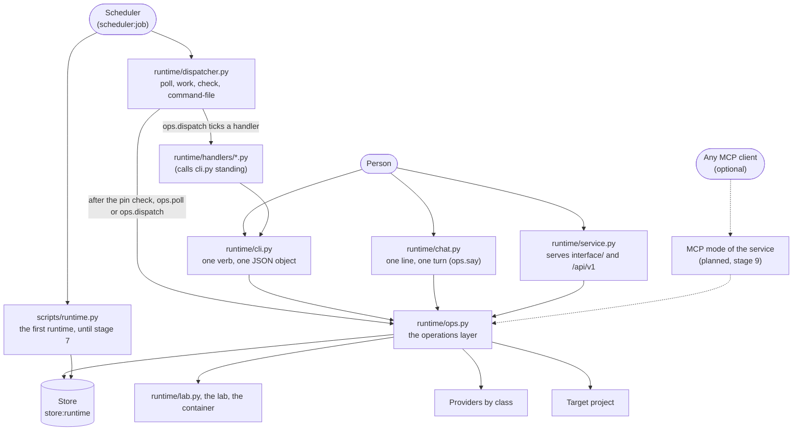

# Layer 7: the shells

Part of [the platform map](README.md). Every layer page has the same eight sections, in this order.

## Purpose

A shell is a surface a person (or a scheduler) uses to reach the task runtime: it parses what was typed, calls one function of the operations layer (`runtime/ops.py`) and prints what that function returned. A shell holds no rule of its own: which actions a pending decision allows, what a state leads to, what a hash must equal are decided by the operations layer and the store. Three shells exist today, the terminal command (`runtime/cli.py`), the conversation (`runtime/chat.py`) and the local service (`runtime/service.py`, which serves the pages of `interface/` and one API route per operation); the scheduler's entry (`runtime/dispatcher.py`) is a shell of another kind, started by a machine. Planned: the pages themselves, one scene and its views (stage 9 of [the platform plan](../platform-plan-2026-10-05.md)), and an MCP mode of the service (decided on 2026-10-06, not yet in the committed plan).

The first runtime (`scripts/runtime.py`) has its own command and is not a shell of the operations layer; it stays as it is until stage 7 of [the platform plan](../platform-plan-2026-10-05.md).

The operations are described on [the runtime's page](runtime.md); the contract is [contracts/runtime.md](../../../contracts/runtime.md). This page maps the surfaces and does not repeat them.

A dashed arrow is planned (the MCP mode). No shell has an arrow to the store, the lab, a provider or the project: those are reached only through `ops.py`.

## Artifacts it owns

Where: **repo** is this repository, **project** the target project, **data** the project's data folder (`data_dir` of its configuration, outside every repository).

| Path | Where | Format | Written by | Read by | Lifecycle | Versioned | Generated |
|---|---|---|---|---|---|---|---|
| `runtime/operations.py` | repo | Python 3.9, standard library only; a pure literal (`OPERATIONS`, `CHAT_OWN`) and the pure functions that read it | maintainers | `ops.py` (which re-exports it), `effects.py`, the generator of the tables | changed by pull request: one row per operation | yes | no |
| `runtime/cli.py` | repo | Python 3.9, standard library only; its docstring is the `--help` text; its parser is built from the table | maintainers | the person, a handler (`cli.py standing`, `execute-under-policy`) | changed by pull request | yes | no |
| `runtime/chat.py` | repo | Python 3.9, standard library only | maintainers | the person | changed by pull request | yes | no |
| `runtime/dispatcher.py` | repo | Python 3.9, standard library only; started alone, from a copy | maintainers | the scheduler (a copy in its job folder), the person (`check`, `command-file`) | changed by pull request; a scheduled copy changes only when the jobs are scheduled again | yes | no |
| The scheduler's command files of the two jobs | data (the scheduler's job folder) | JSON: `argv` (starts with `/usr/bin/python3`), `cwd`, `snapshot` (the entry and the pin), `timeout_minutes` | `dispatcher.py command-file`, then the scheduler provider | the scheduler | replaced when the jobs are scheduled again | no | yes |
| `<data_dir>/dispatch-pin.json` | data | the path and sha256 of the accepted `runtime.json`, mode 0600 | `cli.py pin` (`ops.pin`) | `dispatcher.py poll`, `work` | written again after each accepted change | no | yes |
| The conversation (`conversation_messages`, migration 6) | data (`store_db`) | one row per turn side: `role`, `text`, `task_id`, `run_id`; one conversation per project, named `project` | `ops.say` only | `ops.say` (the memory, the last request) | grows | no | no |
| `scripts/runtime.py`, `scripts/runtime_vote.py`, `scripts/vote_job.py` | repo | Python 3.9, standard library only | maintainers | the scheduler (the tick, a vote job), the person (`approve`, `reject`, `status`, `inbox`) | until stage 7 | yes | no |
| `<data_dir>/tick-pin.json`, `tick.lock`, `events/`, `runs/` | data | the first runtime's pin (runtime.json and the gate script by sha256), lock, inbox files and run folders | `scripts/runtime.py` | `scripts/runtime.py` | until stage 7 | no | yes |
| `runtime/service.py` | repo | Python 3.9, standard library only; its docstring is the `--help` text; it imports `ops.py` and nothing else of the runtime | maintainers | the person (`python3 runtime/service.py --project <dir>`) | changed by pull request | yes | no |
| `interface/` | repo | static files (HTML, CSS, ES modules, vendored libraries with their licence and hash), no build step; `interface/README.md` says what the folder holds | maintainers | the service, from this folder only | changed by pull request | yes | no |
| `<data_dir>/service.token` | data | the token, 64 hexadecimal characters, mode 0600 | `runtime/service.py` | the person (pasted once per browser session) | new at every start, removed when the service stops | no | yes |
| `<data_dir>/uploads/<random>/<name>` | data | a file a page handed to a task, in a folder of mode 0700 | `runtime/service.py` | `ops.hand_over` | removed right after the hand-over | no | yes |

Built in stage 9 with the service: the operations `config`, `task`, `flows` and `stop-runs`, each with its terminal verb, and `actions` on every pending decision. Planned with the views: `agents`, `conversation`, `skills`, `costs`, `connections`.

## Abstractions

**Shell.** A thin front over the operations layer: it parses, calls one operation, prints its result. It decides nothing a second shell would have to decide again (rule 3 of [the platform plan](../platform-plan-2026-10-05.md): there is one operations layer only). The terminal, the conversation and the scheduler's entry are shells today.

**Operation.** One function of `runtime/ops.py` and one row of the table of operations (`runtime/operations.py`: the verb, the function, the arguments, the channels that may call it, whether it calls a model), taking the project folder first and returning a JSON-serialisable object, or raising `OpsError` with an exit code: 1 failed or refused, 2 usage, 3 not configured. Every operation but `accept_config` starts from `ops.context`, which loads `runtime.json`, refuses another checkout than the running one, opens the store and refuses a configuration whose hash is not the accepted one. The operations are listed on [the runtime's page](runtime.md), "Entry points".

**Verb.** One word of `cli.py`, which is the `name` of one row of the table of operations (`runtime/operations.py`, listed under "Entry points"). The parser is built from the table: every flag of every row, once; a verb that needs a flag it was not given is a usage error (exit 2).

**The JSON a shell prints.** `cli.py` prints one JSON object on stdout (indented), diagnostics on stderr, nothing on stdout when it fails. `chat.py` prints each reply as text and a blank line, or with `--json` one object per line, `{"reply", "request_id", "pending_id", "ran"}`. `dispatcher.py` prints one JSON object for `poll`, `work`, `check` and `command-file`.

**Pending decision, the unit a shell shows.** What a task waits for the person to decide, of six kinds (`plan`, `question`, `review`, `effect`, `acceptance`, `your_document`). Listed (`pending`) it shows `id`, `kind`, `title`, `task_id`, `created_at`, and for a plan its tasks and the hash to approve; whole (`pending --id`) it shows the body (the reply) and the payload. A shell resolves it with one of `answer`, `release`, `approve` (with the hash for a plan or an effect) or `reject`; the operation refuses a resolution the kind does not take. Each carries `actions`, the resolution words the store allows for it now (built from the store's own tables; `[]` once it is resolved, and for a `your_document` until its delivery exists; an open `effect` lists `approved` and `rejected`). The page draws one card per kind, with a button for each word in `actions` and no other.

**Turn.** One line of the conversation, `ops.say`: a line that starts with `/` is read by `operations.parse_chat`: it is `/help`, `/new <text>`, or one row of the table that lists the `chat` channel, which calls its operation once and no model (an operation the table does not list for chat gets the help); any other line answers the router's open question on the conversation's last request, or else is a new request, routed (a model call) only when the planning agent may start (its mode and its cap). A model's reply is stored and shown, never executed.

**The conversation's memory and its place in a request.** `ops.chat_memory`: the plain lines and the router's replies after the newest reply whose request reached `planned`, `done` or `cancelled`; commands and their replies are left out; the newest 6 turns (`MEMORY_TURNS`), each cut to 600 characters (`MEMORY_CUT`), the whole cut to 4000 (`MEMORY_CHARS`) by dropping the oldest. It is written in front of the new line, under `Earlier in this conversation, oldest first:` and above `The request now:`, and that whole text becomes the request's text. The first line of an exchange reaches the router plain, as the router was measured. It is a bounded text because the floor model's adapter takes the request as one argument (workaround 2 of [backlog](../../backlog.md) T23, marked `T23:` in the code).

**The scheduler's entry.** `dispatcher.py` in a second role: a copy kept in the scheduler's job folder, started with `/usr/bin/python3`, which checks `runtime.json` against the pin before it imports anything of the checkout, then loads that checkout's `ops.py` and calls `ops.poll` (the short job) or `ops.dispatch` (the worker). Its `decide` function, the dispatcher proper, is a pure function of the runtime's layer.

**The channel rule.** Each row of the table of operations lists the channels that may call it (`terminal`, `chat`, `page`). A row whose function takes the channel (`channel_arg`: `approve`) is told which one called, and `ops.approve` refuses an `effect` from any channel but the terminal and the page (decision D8, extended on 2026-10-07): an effect is approved in the terminal or on the local page, with the content's hash typed or clicked there. A chat message is a weaker trust surface than the person's own machine; the planned MCP mode reached from a messaging app stays under the same rule, and the local page is a channel of its own, which the service passes itself (a request cannot name one). A row exists as a route only when it lists `page`; the ones that widen what an agent may do on its own (`accept-config`, the standing approvals) or run the next task by hand (`run-next`) are terminal only. Planned: through a chat channel only a request, a question, an answer and the release of a draft.

## Dependencies

**What a shell reads.** Only `runtime/ops.py`, and through it everything else. `cli.py` imports `argparse`, `json`, `os`, `sys` and `ops`; `chat.py` imports `json`, `os`, `sys` and `ops`. The scheduler's entry imports only the standard library until the pin check passes, then the `ops.py` of the checkout `runtime.json` names, and refuses one loaded from anywhere else.

**Who reads a shell.** The person; the scheduler (the entry's copy, by its command file); a handler, which reads the standing approvals by starting `cli.py standing` and imports nothing of `runtime/`.

**The rules.**

- A shell imports only the operations layer. Guarded for `chat.py` by a test; for `cli.py` no guard found.
- The operations layer never learns which shell called: no operation takes a caller argument. Its texts that name a command (the configuration refusal, the `next` of `set_mode`, the approve line of an effect, the conversation's `PLAN_NEXT` and `ASK_NEXT`) are built by `operations.command_line` and `operations.chat_line`, and the conversation's commands and help text are the table's (`chat_commands`, `chat_help`): `test_no_module_of_the_runtime_but_the_table_spells_the_terminals_command_outside_a_docstring`. The one channel it is told about is the argument of the rows that name it (`approve`).
- A shell never reads the store, the lab facade, a provider or a project's file by itself ([runtime/README.md](../../../runtime/README.md), "Rules of the folder"). Guarded by the import tests above, where they exist.
- The service reaches the store and the facade only through the operations layer, and a page imports neither: `runtime/tests/test_service.py`, `test_the_service_reaches_the_store_and_the_facade_only_through_the_operations_layer`; the layer map gives `runtime/service.py` one arrow, to `runtime/ops.py`.
- The planned MCP mode exposes the same operations to any MCP client, a chat-first agent platform among them, as an option and never a requirement: the local interface stays the default shell, so that a person who installs the workbench needs nothing else.
- The first runtime shares the store (migration 1 tables) and the `runtime.json` file with the task runtime, and nothing else.

## Business rules

Each invariant with its guard. A test is in `runtime/tests/` unless its path is given.

**The terminal shell.**

- One JSON object on stdout for a command that succeeded; nothing on stdout and `error: ...` on stderr, never a traceback, for one that did not; the exit codes 0, 1, 2 and 3 as documented: `test_task_ops.py`, `test_the_shell_prints_one_json_object_and_uses_the_documented_exit_codes`.
- Every script of `runtime/` prints its help (exit 0) and refuses an unknown flag (exit 2) without a traceback: `test_every_script_of_the_runtime_prints_its_help_and_refuses_an_unknown_call`.
- A configuration not accepted is exit 3, with the hash and the `accept-config` command in the message: `test_config_hash.py`, `test_the_shell_exposes_accept_config_and_exits_3_on_a_configuration_that_was_not_accepted`.
- `cli.py` imports only the operations layer: no guard found.

**Every operation behind every shell.**

- The configuration's hash is checked by every operation but `accept_config`, which accepts only the hash the person typed: `test_config_hash.py`, `test_no_operation_runs_before_the_person_accepted_the_configuration`, `test_accepting_takes_the_hash_the_person_typed_and_refuses_another`, `test_a_configuration_that_changed_after_it_was_accepted_stops_every_operation_and_names_both_hashes`.
- A configuration that names another checkout, or puts the data inside the project or the checkout, is refused: `test_a_project_that_is_not_configured_or_names_another_checkout_is_refused`.
- An effect is approved only with its hash, and an approval word typed as an answer is refused, whatever shell sent it: `test_an_approval_with_another_hash_executes_nothing`; `test_answering_an_effect_with_only_an_approval_word_is_refused`.

**The conversation.**

- `chat.py` imports only the operations layer, reads standard input line by line and exits 0 at its end, 2 on usage, 3 when the project is not configured: `test_chat.py`, `test_the_shell_reads_lines_from_standard_input_and_imports_only_the_operations_layer`.
- A command calls its operation once and no model; an unknown command, missing arguments and the commands left out on purpose (`/approve-policy`, `/set-mode`, `/pin`) get the help and run nothing: `test_a_command_calls_its_operation_once_and_no_model`; `test_an_unknown_command_gets_the_help_and_runs_nothing`. `accept-config` and `execute-under-policy` are not commands either (the table lists them for the terminal only): `test_a_command_the_conversation_does_not_offer_gets_the_help_and_runs_nothing`.
- A reply of the model is never read as a command: `test_a_reply_of_the_model_is_never_read_as_a_command`.
- The planning agent stopped or at its cap runs nothing and says why: `test_the_planning_agent_at_its_cap_runs_nothing_and_says_why`.
- The first line of an exchange reaches the router plain; the memory is the last turns within its budget: `test_the_first_line_of_an_exchange_reaches_the_router_without_memory`; `test_the_memory_is_the_last_turns_cut_to_its_budget_oldest_dropped_first`.
- A line after the router's question is its answer; `/new` starts another request whatever is open: `test_a_line_after_the_router_s_question_is_its_answer`; `test_new_starts_another_request_whatever_is_open`.
- Both sides of the conversation are kept in the store: `test_both_sides_of_the_conversation_are_kept_in_the_store`.

**The scheduler's entry.**

- A changed `runtime.json`, or a pin of another project, is refused before any code of the checkout is loaded: `test_dispatcher_entry.py`, `test_a_changed_configuration_is_refused_before_any_code_of_the_checkout_is_loaded`, `test_a_pin_of_another_project_is_refused`.
- A copy of the entry alone loads the checkout the configuration names: `test_a_copy_of_the_entry_alone_loads_the_checkout_the_configuration_names`.
- The command file starts the system interpreter and snapshots the entry and the pin; the poller's limit is 5 minutes and the worker's the provider's maximum: `test_the_command_file_starts_the_system_interpreter_and_snapshots_the_entry_and_the_pin`; `test_the_poller_s_limit_is_five_minutes_and_the_worker_s_the_provider_s_maximum`.
- The pin is written only for an accepted configuration: `test_the_pin_is_written_only_for_an_accepted_configuration`.
- `check` names every module it could not import and starts nothing: `test_the_check_names_every_module_it_could_not_import`.
- The decision function changes nothing and imports no sibling: `test_dispatcher.py`, `test_the_function_changes_nothing_and_imports_no_sibling`. The poll calls no model and starts no task: `test_the_poll_calls_no_model_and_starts_no_task`.
- A handler is started only by a name and a verb it lists: `test_a_handler_is_called_only_by_a_name_and_a_verb_it_lists`.

**The first runtime** (until stage 7; tests in `scripts/tests/test_runtime.py` and `scripts/tests/test_runtime_vote.py`).

- A pinned tick refuses when `runtime.json` or the gate script changed: `test_a_pinned_tick_refuses_when_the_configuration_or_the_gate_changed`.
- `approve` sends only the exact reply shown, once, and never one that holds a credential: `test_approve_sends_only_the_exact_reply_shown`; `test_approving_the_same_item_twice_sends_once`; `test_approve_refuses_a_reply_that_holds_a_credential`.
- One tick at a time; a missing configuration is exit 3: `test_a_second_tick_while_one_runs_does_nothing`; `test_missing_config_exits_3`.

**The channel rule**: an effect is approved only from the terminal or the page, with its hash: `test_operations_table.py`, `test_an_effect_is_approved_in_the_terminal_and_never_from_the_conversation`; `test_task_ops.py`, `test_an_effect_is_approved_from_the_terminal_and_the_page_and_from_no_other_channel`; `test_service.py`, `test_an_effect_is_approved_from_the_page_with_its_hash_and_never_from_chat`. A page never accepts a configuration hash (that stays in the terminal): `test_service.py`, `test_accepting_a_configuration_is_not_a_route`.

## Entry points

**The terminal shell**, `python3 runtime/cli.py <verb> --project <dir> ...`; `--help` prints every verb and flag. Exit 0 ok, 1 failed or refused, 2 usage, 3 not configured. Start the verbs that call a model with the secret store's library available: `uv run --with keyring==25.7.0 python3 runtime/cli.py <verb> ...`.

<!-- generated: cli-verbs -->
| Verb | Flags it reads | Operation |
|---|---|---|
| `request` | `--text \| --text-file` `[--flow]` `[--title]` | `request` |
| `route` | `--request` `[--flow]` | `route` |
| `status` | - | `status` |
| `task` | `--task` | `task` |
| `flows` | - | `flows` |
| `config` | - | `config` |
| `progress` | `[--since]` | `progress` |
| `pending` | `[--id]` | `pending` |
| `answer` | `--id` `--text \| --text-file` `[--with-comments]` | `answer` |
| `release` | `--id` | `release` |
| `approve` | `--id` `[--sha256]` | `approve` |
| `reject` | `--id` `[--note]` | `reject` |
| `retry` | `--task` | `retry` |
| `cancel` | `--request` | `cancel` |
| `deps` | - | `deps` |
| `run-next` | `[--tier]` | `run_next` |
| `accept-config` | `--sha256` | `accept_config` |
| `proof` | `[--skill]` | `proof` |
| `verdict` | `--run` `--word` | `verdict` |
| `sync` | `[--dry-run]` `[--take]` `[--path]` | `sync` |
| `hand-over` | `--task` `--file` | `hand_over` |
| `set-mode` | `--agent` `--mode` | `set_mode` |
| `approve-policy` | `--file` `--agent` `[--sha256]` `[--expires]` `[--what]` | `approve_policy` |
| `revoke-policy` | `--id` | `revoke_policy` |
| `standing` | `--policy` | `standing` |
| `execute-under-policy` | `--policy` `--effect-file` | `execute_under_policy` |
| `contained-run` | `--skill` `--prompt-file` `--out` `[--platform]` `[--timeout-seconds]` | `contained_run` |
| `dispatch` | - | `dispatch` |
| `poll` | - | `poll` |
| `handler` | `--name` `--verb` `[--arg]` | `handler_call` |
| `pin` | - | `pin` |
| `say` | `--text \| --text-file` | `say` |
| `stop-runs` | - | `stop_runs` |
<!-- /generated -->

Every verb also takes `--project <dir>`. The verbs that call a model: `route` (without `--flow`), `run-next`, `dispatch`, and `say` for a new request or an answer to the router.

**The conversation**, `python3 runtime/chat.py --project <dir> [--json]`. Exit 0 at the end of the input, 2 usage, 3 not configured; any other error is printed and the conversation goes on.

<!-- generated: say-commands -->
| Command | What it does (its `help` in the table) |
|---|---|
| `/help` | this text |
| `/status` | requests, tasks and what waits for you |
| `/progress [since]` | where the work stands and what happened (since: 7d, <n>d or YYYY-MM-DD) |
| `/pending [id]` | what waits for you; with an id, that decision whole |
| `/answer <id> <text>` | answer a pending decision |
| `/release <id>` | release a delivery (it stays a draft) |
| `/approve <id> [sha256]` | approve a plan or an acceptance; an effect is approved in the terminal or on the page, with its hash |
| `/reject <id> [note]` | reject a plan, an acceptance or an effect |
| `/retry <task id>` | make a failed or blocked task ready again |
| `/cancel <request id>` | cancel a request |
| `/new <text>` | start a new request, whatever is open |
<!-- /generated -->

Each command calls its operation of the same name once (`/progress` shows its `text`, `/help` calls none, `/new` routes a new request, a model call); any other line is the answer to the router's open question, or a new request, routed.

**The scheduler's entry**, `/usr/bin/python3 runtime/dispatcher.py <verb> --project <dir> ...`. Exit codes of the operation (1, 2, 3); `check` exits 0 only when every module, the lab, the credential, docker and uv are found (git is reported, not required).

<!-- generated: dispatcher-jobs -->
| Verb | Flags | What it does (the module's docstring) | Time limit (`JOBS`) |
|---|---|---|---|
| `poll` | `--project <dir> [--pin <file>]` | ops.poll: the short job | 5 minutes |
| `work` | `--project <dir> [--pin <file>]` | ops.dispatch: the worker | 240 minutes |
| `check` | `--project <dir>` | can this interpreter run them? | - |
| `command-file` | `--job poll\|work --project <dir> --pin <file>` | - | - |
<!-- /generated -->

`poll` is `ops.poll` (mirrors, expired approvals, the state file's generated lines, the releases a mode makes; no model, no task); `work` is `ops.dispatch` (the handlers' ticks, the releases, then the runs one at a time while modes and caps allow); `check` looks for every module, the lab, the secret store, the credential, docker, uv and git; `command-file` prints a job's command file for the scheduler provider.

**The first runtime** (until stage 7), `python3 scripts/runtime.py <verb> --project <dir>`: `tick [--dry-run] [--pin]`, `pin`, `add-comment --link --commenter --text-file`, `status`, `inbox`, `approve --id [--confirmed --sha256]`, `reject --id [--note]`; exit 0 ok, 1 a step failed, 2 usage, 3 not configured. `scripts/vote_job.py` is started by the scheduler at a vote post's slot, never by hand (exit 0, 1, 2).

**The local service (stage 9, built).** `python3 runtime/service.py --project <dir> [--project <dir>]... [--port 8765] [--poll-every 60] [--dispatch-every <seconds>] [--token-file <path>]`: bound to `127.0.0.1` only (no option for another address), a token in a file for its owner, the `Host` and `Origin` checked, no cross-origin header, one route per operation that lists the `page` channel (`/api/v1/...`), a route whose operation's row has `job` returning a job to ask for again. It runs `poll` every 60 s and `dispatch` only when `--dispatch-every` is given. `accept_config` and `run_next` are not routes, on purpose. The rules of a request and the routes are in [contracts/runtime.md](../../../contracts/runtime.md), "The local service". Planned: the pages in `interface/` (the scene, then its views) and the MCP mode.

## Known limits and improvements

| Limit or improvement | Where it is recorded |
|---|---|
| The service is built and `interface/` holds no page yet: the pages come with the next packages of stage 9 | [the platform plan](../platform-plan-2026-10-05.md), stage 9 |
| No MCP mode yet; the channel rule is in code for the effect (`approve`: `terminal` and `page` approve, any other channel is refused) | a maintainer's decision of 2026-10-06 that adds the MCP mode to stage 9; not yet in the committed platform plan |
| `chat.py` imports are guarded by `test_chat.py`, those of `cli.py` by `test_runtime_rules.py` and the layer map | `runtime/tests/test_chat.py`, `scripts/tests/test_layer_map.py` |
| The conversation's memory becomes the request's text, so it reaches every task of the request, not only the router's run | `ops.say`, `ops.task_prompt` |
| One conversation per project (`CONVERSATION = "project"`); the plan's stage 9 names it `"main"` | `runtime/ops.py` |
| The scheduler's pin covers `runtime.json` and the entry, not the checkout's revision (open point O11) | [contracts/runtime.md](../../../contracts/runtime.md), "The dispatcher's two jobs" |
| Two runtimes with two command sets and two pins side by side until stage 7 | [contracts/runtime.md](../../../contracts/runtime.md), "The first runtime (until stage 7)" |
| `ops.py`'s module docstring still says the conversation and the local interface come "later", and [runtime/README.md](../../../runtime/README.md) lists only the stage 1 operations in its `ops.py` row | `runtime/ops.py`; `runtime/README.md` |

## Changes

- 2026-10-06: first version, written from the code at the central branch's head of that day.
- 2026-10-06: the volatile tables are generated from the code by `scripts/architecture_tables.py` (the verbs, the conversation's commands, the dispatcher's jobs).
- 2026-10-07: the local service is built (`runtime/service.py`): the shell, its artifacts, the channel rule with the page, and what stays planned (the pages, the MCP mode).
