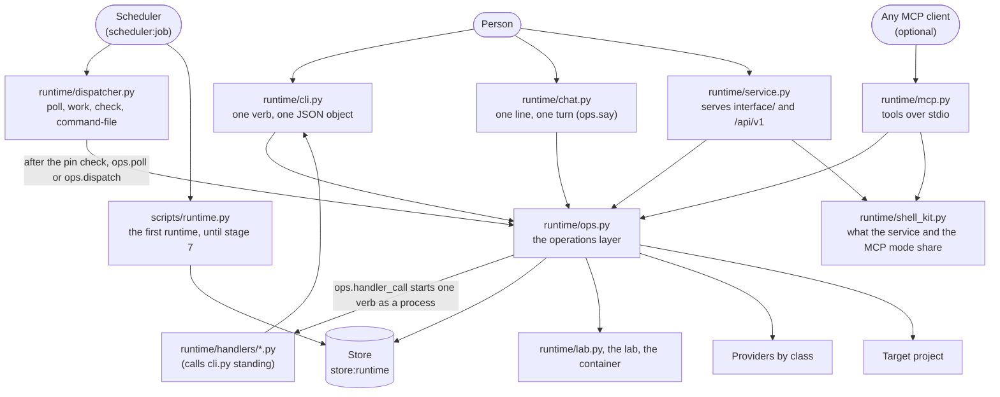

# Layer 7: the shells

Part of [the platform map](README.md). Every layer page has the same eight sections, in this order.

## Purpose

A shell is a surface a person (or a scheduler) uses to reach the task runtime: it parses what was typed, calls one function of the operations layer (`runtime/ops.py`) and prints what that function returned. A shell holds no rule of its own: which actions a pending decision allows, what a state leads to, what a hash must equal are decided by the operations layer and the store. Four shells reach that layer: the terminal command (`runtime/cli.py`), the conversation (`runtime/chat.py`), the local service (`runtime/service.py`, which serves the pages of `interface/` and the routes listed under "Entry points") and the MCP mode (`runtime/mcp.py`, a process that an MCP client starts and speaks to on standard input and output: it is not a mode of the service and it opens no socket). The service and the MCP mode share `runtime/shell_kit.py`, which is not a shell; the scheduler's entry (`runtime/dispatcher.py`) is a shell of another kind, started by a machine.

The first runtime (`scripts/runtime.py`) has its own command and is not a shell of the operations layer; it stays as it is until stage 7 of [the platform plan](../platform-plan-2026-10-05.md).

The operations are described on [the runtime's page](runtime.md); the contract is [contracts/runtime.md](../../../contracts/runtime.md). This page maps the surfaces and does not repeat them.

No shell has an arrow to the store, the lab, a provider or the project: those are reached only through `ops.py`. The service and the MCP mode also have an arrow to the kit, which has none (`ALLOWED` in `scripts/tests/test_layer_map.py`). The arrow from `ops.py` to the handlers is a process boundary, not an import: `ops.handler_call` starts one verb of a handler with `subprocess.run`, and `ops.dispatch` does it for each tick; the dispatcher's entry reaches a handler only through `ops.dispatch`.

## Artifacts it owns

Where: **repo** is this repository, **project** the target project, **data** the project's data folder (`data_dir` of its configuration, outside every repository).

| Path | Where | Format | Written by | Read by | Lifecycle | Versioned | Generated |
|---|---|---|---|---|---|---|---|
| `runtime/operations.py` | repo | Python 3.9, standard library only; a pure literal (`OPERATIONS`, `CHAT_OWN`) and the pure functions that read it | maintainers | `ops.py` (which re-exports it as `ops.operations`, so that the shells read the table through it), `effect_pull_request.py` (to spell the terminal's command), the generator of the tables (as text, with `ast.literal_eval`) | changed by pull request: one row per operation | yes | no |
| `runtime/cli.py` | repo | Python 3.9, standard library only; its docstring is the `--help` text; its parser is built from the table | maintainers | the person, a handler (`cli.py standing`, `execute-under-policy`) | changed by pull request | yes | no |
| `runtime/chat.py` | repo | Python 3.9, standard library only | maintainers | the person | changed by pull request | yes | no |
| `runtime/dispatcher.py` | repo | Python 3.9, standard library only; started alone, from a copy | maintainers | the scheduler (a copy in its job folder), the person (`check`, `command-file`) | changed by pull request; a scheduled copy changes only when the jobs are scheduled again | yes | no |
| The scheduler's command files of the two jobs | data (the scheduler's job folder) | JSON: `argv` (starts with `/usr/bin/python3`), `cwd`, `snapshot` (the entry and the pin), `timeout_minutes` | `dispatcher.py command-file`, then the scheduler provider | the scheduler | replaced when the jobs are scheduled again | no | yes |
| `<data_dir>/dispatch-pin.json` | data | the path and sha256 of the accepted `runtime.json`, mode 0600 | `cli.py pin` (`ops.pin`) | `dispatcher.py poll`, `work` | written again after each accepted change | no | yes |
| The conversation (`conversation_messages`, migration 6) | data (`store_db`) | one row per turn side: `role`, `text`, `task_id`, `run_id`; one conversation per project, named `project` | `ops.say` only | `ops.say` (the memory, the last request) | grows | no | no |
| `scripts/runtime.py`, `scripts/runtime_vote.py`, `scripts/vote_job.py` | repo | Python 3.9, standard library only | maintainers | the scheduler (the tick, a vote job), the person (`approve`, `reject`, `status`, `inbox`) | until stage 7 | yes | no |
| `<data_dir>/tick-pin.json`, `tick.lock`, `events/`, `runs/` | data | the first runtime's pin (runtime.json and the gate script by sha256), lock, inbox files and run folders | `scripts/runtime.py` | `scripts/runtime.py` | until stage 7 | no | yes |
| `runtime/service.py` | repo | Python 3.9, standard library only; its docstring is the `--help` text; it imports `ops.py`, `shell_kit.py` and nothing else of the runtime | maintainers | the person (`uv run --with keyring==25.7.0 python3 runtime/service.py --project <dir>`) | changed by pull request | yes | no |
| `runtime/mcp.py` | repo | Python 3.9, standard library only; its docstring is the `--help` text; it imports `ops.py`, `shell_kit.py` and nothing else of the runtime | maintainers | an MCP client, which starts it as a child process (`python3 runtime/mcp.py --project <dir>`) | changed by pull request | yes | no |
| `runtime/shell_kit.py` | repo | Python 3.9, standard library only; what the service and the MCP mode share: the project id and list, the status words of the operations layer's codes, the argument kinds, the job registry; it imports nothing of the runtime | maintainers | `runtime/service.py`, `runtime/mcp.py` | changed by pull request | yes | no |
| `interface/` | repo | static files (HTML, CSS, ES modules, vendored libraries with their licence and hash), no build step; `interface/README.md` says what the folder holds, and "The pages" under Abstractions what the screens are | maintainers | the service, from this folder only | changed by pull request | yes | no |
| `<data_dir>/service.token` | data | the token, 64 hexadecimal characters, mode 0600; the first project's data folder unless `--token-file` gives another path | `runtime/service.py` | the person (pasted once per browser session) | new at every start, removed when the service stops | no | yes |
| `<data_dir>/uploads/<random>/<name>` | data | a file a page handed to a task, in a folder of mode 0700 | `runtime/service.py` | `ops.hand_over` | removed right after the hand-over | no | yes |

Built in stage 9 with the service: the operations `config`, `task`, `flows`, `stop-runs` and `service-check` (what the service checks at its start), each with its terminal verb, and `actions` on every pending decision; `contained-run`, one skill of an area agent's pack run in the container, is terminal only. Built for the views (WP-9.3a): the reads `agents`, `conversation`, `skills`, `costs`, `connections`, `artifacts` and `artifact`, each with its terminal verb and, since the service's read routes (WP-9.1b), each with its route and the `page` channel. `version`, the change signal of a project's store, lists `page` and `mcp` only: it has no terminal verb, and it has two routes, `GET /projects/{p}/version` and the service's own `GET /versions`. `config` lists `page` and has no route: `GET /projects` carries its hash and whether it was accepted. `say` refuses a line that would route while another run of the project holds the run lock, before it stores the line or a request.

## Abstractions

**Shell.** A thin front over the operations layer: it parses, calls one operation, prints its result. It decides nothing a second shell would have to decide again (rule 3 of [the platform plan](../platform-plan-2026-10-05.md): there is one operations layer only). The terminal, the conversation, the local service and the MCP mode are shells; the scheduler's entry is one of another kind.

**Operation.** One function of `runtime/ops.py` and one row of the table of operations (`runtime/operations.py`: the verb, the function, the arguments, the channels that may call it, whether it calls a model), taking the project folder first and returning a JSON-serialisable object, or raising `OpsError` with an exit code: 1 failed or refused, 2 usage, 3 not configured; the refusal of a configuration that was not accepted also carries `next`, the command that gets past it. Every operation starts from `ops.context`, which loads `runtime.json`, refuses another checkout than the running one, opens the store and refuses a configuration whose hash is not the accepted one; `accept_config`, `config` and `service_check` run it with that check off, and `version` checks the hash itself. The operations are listed on [the runtime's page](runtime.md), "Entry points".

**Verb.** One word of `cli.py`, which is the `name` of one row of the table of operations (`runtime/operations.py`, listed under "Entry points"). The parser is built from the table: every flag of every row, once; a verb that needs a flag it was not given is a usage error (exit 2).

**The JSON a shell prints.** `cli.py` prints one JSON object on stdout (indented), diagnostics on stderr, nothing on stdout when it fails; the one exception is a row with `exit_unless` (`contained-run`), whose result, when the operation returns one, is printed and whose exit code is 1 unless `status` is `ok`. The service and the MCP mode return the operation's result as JSON, unchanged. `chat.py` prints each reply as text and a blank line, or with `--json` one object per line, `{"reply", "request_id", "pending_id", "ran"}`. `dispatcher.py` prints one JSON object for `poll`, `work`, `check` and `command-file`.

**Pending decision, the unit a shell shows.** What a task waits for the person to decide, of six kinds (`plan`, `question`, `review`, `effect`, `acceptance`, `your_document`). Listed (`pending`) it shows `id`, `kind`, `title`, `task_id`, `created_at`, and for a plan its tasks and the hash to approve; whole (`pending --id`) it shows the body (the reply) and the payload. A shell resolves it with one of `answer`, `release`, `approve` (with the hash for a plan or an effect) or `reject`; the operation refuses a resolution the kind does not take. Each carries `actions`, the resolution words the store allows for it now (built from the store's own tables; `[]` once it is resolved, and for a `your_document` until its delivery exists; an open `effect` lists `approved` and `rejected`). The page draws one card per kind, with a button for each word in `actions` and no other.

**Turn.** One line of the conversation, `ops.say`: a line that starts with `/` is read by `operations.parse_chat`: it is `/help`, `/new <text>`, or one row of the table that lists the `chat` channel, which calls its operation once and no model (an operation the table does not list for chat gets the help); any other line answers the router's open question on the conversation's last request, or else is a new request, routed (a model call) only when the planning agent may start (its mode and its cap). A model's reply is stored and shown, never executed.

**The conversation's memory and its place in a request.** `ops.chat_memory`: the plain lines and the router's replies after the newest reply whose request reached `planned`, `done` or `cancelled`; commands and their replies are left out; the newest 6 turns (`MEMORY_TURNS`), each cut to 600 characters (`MEMORY_CUT`), the whole cut to 4000 (`MEMORY_CHARS`) by dropping the oldest. It is written in front of the new line, under `Earlier in this conversation, oldest first:` and above `The request now:`, and that whole text becomes the request's text. The first line of an exchange reaches the router plain, as the router was measured. It is a bounded text because the floor model's adapter takes the request as one argument (workaround 2 of [backlog](../../backlog.md) T23, marked `T23:` in the code).

**The scheduler's entry.** `dispatcher.py` in a second role: a copy kept in the scheduler's job folder, started with `/usr/bin/python3`, which checks `runtime.json` against the pin before it imports anything of the checkout, then loads that checkout's `ops.py` and calls `ops.poll` (the short job) or `ops.dispatch` (the worker). Its `decide` function, the dispatcher proper, is a pure function of the runtime's layer.

**The channel rule.** Each row of the table of operations lists the channels that may call it (`terminal`, `chat`, `page`, `mcp`). A row whose function takes the channel (`channel_arg`: `approve` and `say`) is told which one called, and `ops.approve` refuses an `effect` from any channel but the terminal and the page (decision D8, extended on 2026-10-07): an effect is approved in the terminal or on the local page, with the content's hash typed or clicked there. A chat message is a weaker trust surface than the person's own machine; the MCP mode (`runtime/mcp.py`), reached from a messaging app, is under a stricter rule: a model client may request, route, answer, release a draft and say, and has no tool to approve, reject, cancel or retry, nor can it type those commands into `say` (the row of `say` takes the channel and `ops.say` does a command only when its row lists that channel), and the local page is a channel of its own, which the service passes itself (a request cannot name one). A row exists as a route only when it lists `page` (`config` lists it and has none); the ones that widen what an agent may do on its own (`accept-config`, the standing approvals) or run the next task by hand (`run-next`) are terminal only. The MCP mode exposes only the rows that list `mcp`: the reads (`version` among them), `request`, `route`, `answer`, `release` and `say`, and two tools of its own, `projects` and `job`. A command typed into `say` through a channel its row does not list answers `error: /<name> is done in the terminal or on the page` and does nothing.

**The pages.** `interface/` is one HTML document and ES modules, no build step, which the service serves; `interface/README.md` says what each file is. A page decides nothing: it shows what an operation returned and sends what the person typed or clicked. The router (`js/router.js`) parses the hash, `js/main.js` draws the screen it names, and `js/views/placeholder.js` is what a screen with no view falls back to. The screens:

| Screen | Hash | Tabs |
|---|---|---|
| Token prompt | none: shown before any hash is drawn, until a token is held | - |
| City | `#/` | - |
| Building | `#/p/<id>` | none |
| Floor | `#/p/<id>/floor/<agent>[/<tab>[/<pending id>]]` | Agent, Inbox, Desk, Tasks |
| Lobby | `#/p/<id>/lobby[/<tab>[/<pending id>]]` | Conversation, Inbox, Desk, Tasks, Agent |
| Control room | `#/p/<id>/control[/<tab>]` | Skills, Costs, Connections |

`<id>` is the 12-character project id of the service; the Desk of a floor or of the Lobby takes a document as `/desk/<percent-encoded path>`; an unknown hash is the City. The folders of `interface/js/` are the router, `data.js` (what the City reads), `watch.js`, `api.js` (the one client), `scene/` (the 3D engine and its builders), `frame/` (header, project switcher, cards, bar, terminal-command component), `floor/` (the Floor's panel and the decision cards, the files that send a write), `cards/` (the plan card the Lobby draws), `views/` (one module per screen), `markdown.js` with `markdown-view.js`; beside `js/`, `interface/vendor/` holds two third-party libraries, copied unchanged. The rules the pages keep, each with the test that holds it (`runtime/tests/test_interface_files.py` unless a file is named):

- **The change signal.** `js/watch.js` reads `GET /versions` every second (`EVERY_MS`) while the document is visible and reloads everything the page shows when a number moved; after 30 quiet seconds (`SAFETY_MS`) it reloads once; a failed read is tried again after 10 seconds (`RETRY_MS`); nothing is asked while the document is hidden, and one reload happens when it is visible again; any POST the page sends is followed by a reload (`api.onWrite`). `test_the_page_is_kept_current_by_the_watcher_and_asks_nothing_while_hidden`, and in `test_interface_live.py` `test_the_watcher_reads_every_second_while_visible_and_reloads_only_when_the_number_moves`, `test_the_watcher_asks_nothing_while_hidden_and_reloads_once_on_return`, `test_the_watcher_makes_one_full_reload_after_thirty_quiet_seconds_and_a_reload_starts_the_count_again`, `test_the_watcher_says_a_failed_read_backs_off_to_ten_seconds_and_reloads_when_the_service_is_back`.
- **A configuration not accepted.** The screen keeps the last data it read, dimmed by one class on the frame (`is-unaccepted`), and a band shows the service's sentence with its command; a screen that never read the project shows the placeholder. `test_interface_plates_meters.py`, `test_the_page_keeps_the_floor_dims_it_and_shows_the_command_in_the_band_while_the_configuration_is_not_accepted`, `test_the_not_accepted_dim_is_one_class_with_opacity_and_no_pointer_actions_on_the_scene`.
- **The terminal command.** Wherever something is done in the terminal, the page shows the command the service gave (the `next` of the 412 body, `ApiError.next`; the `wider` and `held[].next` fields), in a code block that wraps whole, with a Copy button (`js/frame/command.js`); the page builds no command. `test_interface_plates_meters.py`, `test_every_notice_that_needs_the_terminal_uses_the_one_component_and_the_page_builds_no_command`, `test_the_command_component_splits_the_services_sentence_copies_whole_and_falls_back_to_selecting`.
- **The project switcher** (`js/frame/switcher.js`): on the City it chooses the project the tracking bar follows; on any other screen it opens the same screen in the project chosen.
- **Markdown** (`js/markdown.js`) renders to DOM nodes only: raw HTML, comments and entities stay text, a link is an anchor only for a route of the page (`#/...`), and the work is bounded (at most 200,000 characters rendered, with the rest shown as one plain block; depth 8; 500 bracket pairs in a paragraph); a "Plain text" toggle (`js/markdown-view.js`) shows the typed text. `test_interface_markdown.py`: `test_hostile_markdown_produces_no_element_of_those_kinds_and_no_attribute_but_class_and_a_route_of_the_page`, `test_a_document_over_200_kb_renders_its_first_200_kb_and_says_the_rest_is_plain`, `test_markdown_js_builds_nodes_only_and_nothing_else_in_the_page_renders_markdown`.
- **The Tasks tab** (`js/floor/tasks-tab.js`) lists the agent's tasks in groups by state, reads `task` for its first twelve rows and for a row when it is expanded, and sends one write, Retry on a failed or blocked task. `test_the_tasks_tab_is_the_fourth_tab_of_a_floor_and_a_tab_of_the_lobby_and_each_view_gives_it_the_floors_client_and_router_links`.
- **The token** (`js/token.js`) lives in memory and in `sessionStorage` under one key, is sent only as `Authorization: Bearer` and is never in a URL. `test_the_client_sends_the_token_only_as_a_bearer_header_and_a_post_as_json`, `test_the_page_sets_no_inline_script_and_no_token_in_a_url_or_storage_other_than_session`.
- **The page decides nothing.** A card draws one button per word of its decision's `actions`; an effect or a plan is approved with the hash the card shows. `test_only_the_floor_folder_sends_a_write_and_it_takes_every_write_from_one_object`, `test_a_card_sends_the_hash_it_shows_read_back_from_its_own_text_and_nothing_decides_for_the_person`.
- **What the files may call and load.** `test_every_route_the_interface_files_call_is_a_route_of_the_service`, `test_the_interface_files_load_nothing_from_another_host`, `test_the_vendored_files_match_the_hashes_their_readmes_record`, `test_no_module_of_the_page_calls_a_function_it_does_not_declare_import_or_get_from_the_browser`.

## Dependencies

**What a shell reads.** Only `runtime/ops.py`, and through it everything else; the service and the MCP mode also read `runtime/shell_kit.py`. `cli.py` imports `argparse`, `json`, `os`, `sys` and `ops`; `chat.py` imports `json`, `os`, `sys` and `ops`. The scheduler's entry imports only the standard library until the pin check passes, then the `ops.py` of the checkout `runtime.json` names, and refuses one loaded from anywhere else.

**Who reads a shell.** The person; an MCP client (it starts `mcp.py` as a child process); the scheduler (the entry's copy, by its command file); a handler, which reads the standing approvals by starting `cli.py standing` and imports nothing of `runtime/`.

**The rules.**

- A shell imports only the operations layer; the two local-only shells, the service and the MCP mode, also import `runtime/shell_kit.py`, which they share and which imports nothing of the runtime (WP-9.9). Guarded for `cli.py` by `test_runtime_rules.py`, `test_the_terminal_shell_imports_only_the_operations_layer`; for `chat.py` by `test_chat.py`, `test_the_shell_reads_lines_from_standard_input_and_imports_only_the_operations_layer`; for the service by `test_service.py`, `test_the_service_reaches_the_store_and_the_facade_only_through_the_operations_layer`; for the MCP mode by `test_mcp.py`, `test_the_shell_imports_only_the_operations_layer_the_shell_kit_and_the_standard_library_and_holds_no_token`; for the kit by `test_shell_kit.py`, `test_the_kit_imports_nothing_of_the_runtime_and_only_the_standard_library`; and for all of them by the layer map, whose `ALLOWED` rows give `cli.py` and `chat.py` one arrow (to `ops.py`), `service.py` and `mcp.py` two (to `ops.py` and `shell_kit.py`) and `shell_kit.py` none (`scripts/tests/test_layer_map.py`).
- The operations layer never learns which shell called: no operation takes a caller argument. Its texts that name a command (the configuration refusal, the `next` of `set_mode`, the approve line of an effect, the conversation's `PLAN_NEXT` and `ASK_NEXT`) are built by `operations.command_line` and `operations.chat_line`, and the conversation's commands and help text are the table's (`chat_commands`, `chat_help`): `test_no_module_of_the_runtime_but_the_table_spells_the_terminals_command_outside_a_docstring`. The one channel it is told about is the argument of the rows that name it (`approve` and `say`).
- A shell never reads the store, the lab facade, a provider or a project's file by itself ([runtime/README.md](../../../runtime/README.md), "Rules of the folder"). Guarded by the import tests above and by the layer map.
- The service reaches the store and the facade only through the operations layer, and a page imports neither: `runtime/tests/test_service.py`, `test_the_service_reaches_the_store_and_the_facade_only_through_the_operations_layer`; the layer map gives `runtime/service.py` two arrows, to `runtime/ops.py` and to `runtime/shell_kit.py`.
- The MCP mode exposes the rows of the table that list `mcp` to any MCP client, a chat-first agent platform among them, as an option and never a requirement: the local interface stays the default shell, so that a person who installs the workbench needs nothing else.
- The first runtime shares the store (migration 1 tables) and the `runtime.json` file with the task runtime, and nothing else.

## Business rules

Each invariant with its guard. A test is in `runtime/tests/` unless its path is given.

**The terminal shell.**

- One JSON object on stdout for a command that succeeded; nothing on stdout and `error: ...` on stderr, never a traceback, for one that did not; the exit codes 0, 1, 2 and 3 as documented: `test_task_ops.py`, `test_the_shell_prints_one_json_object_and_uses_the_documented_exit_codes`.
- A row with `exit_unless` (`contained-run`) prints the result it returned and exits 1 unless the result's `status` is `ok`: `test_contained_run.py`, `test_the_terminal_command_prints_the_result_and_exits_0_when_the_model_answered_and_1_when_it_did_not`.
- Every script of `runtime/` prints its help (exit 0) and refuses an unknown flag (exit 2) without a traceback: `test_every_script_of_the_runtime_prints_its_help_and_refuses_an_unknown_call`.
- A configuration not accepted is exit 3, with the hash and the `accept-config` command in the message: `test_config_hash.py`, `test_the_shell_exposes_accept_config_and_exits_3_on_a_configuration_that_was_not_accepted`.
- `cli.py` imports only the operations layer and loads no module another way: `test_runtime_rules.py`, `test_the_terminal_shell_imports_only_the_operations_layer`.

**Every operation behind every shell.**

- The configuration's hash is checked by every operation but `accept_config`, which accepts only the hash the person typed (and `set_mode`, which accepts by code only the hash of a move down the order of the modes: `test_mode_narrowing.py`), `config`, which reports it and never refuses, and `service_check`, which reports; `version` checks the hash itself: `test_config_hash.py`, `test_no_operation_runs_before_the_person_accepted_the_configuration`, `test_accepting_takes_the_hash_the_person_typed_and_refuses_another`, `test_a_configuration_that_changed_after_it_was_accepted_stops_every_operation_and_names_both_hashes`.
- A configuration that names another checkout, or puts the data inside the project or the checkout, is refused: `test_a_project_that_is_not_configured_or_names_another_checkout_is_refused`.
- An effect is approved only with its hash, and an approval word typed as an answer is refused, whatever shell sent it: `test_an_approval_with_another_hash_executes_nothing`; `test_answering_an_effect_with_only_an_approval_word_is_refused`.

**The conversation.**

- `chat.py` imports only the operations layer, reads standard input line by line and exits 0 at its end, 2 on usage, 3 when the project is not configured: `test_chat.py`, `test_the_shell_reads_lines_from_standard_input_and_imports_only_the_operations_layer`.
- A command calls its operation once and no model; an unknown command, missing arguments and the commands left out on purpose (`/approve-policy`, `/set-mode`, `/pin`) get the help and run nothing: `test_a_command_calls_its_operation_once_and_no_model`; `test_an_unknown_command_gets_the_help_and_runs_nothing`. `accept-config` and `execute-under-policy` are not commands either (the table lists them for the terminal only): `test_a_command_the_conversation_does_not_offer_gets_the_help_and_runs_nothing`.
- A reply of the model is never read as a command: `test_a_reply_of_the_model_is_never_read_as_a_command`.
- The planning agent stopped or at its cap runs nothing and says why: `test_the_planning_agent_at_its_cap_runs_nothing_and_says_why`.
- The first line of an exchange reaches the router plain; the memory is the last turns within its budget: `test_the_first_line_of_an_exchange_reaches_the_router_without_memory`; `test_the_memory_is_the_last_turns_cut_to_its_budget_oldest_dropped_first`.
- A line after the router's question is its answer; `/new` starts another request whatever is open: `test_a_line_after_the_router_s_question_is_its_answer`; `test_new_starts_another_request_whatever_is_open`.
- Both sides of the conversation are kept in the store: `test_both_sides_of_the_conversation_are_kept_in_the_store`.

**The scheduler's entry.**

- A changed `runtime.json`, or a pin of another project, is refused before any code of the checkout is loaded: `test_dispatcher_entry.py`, `test_a_changed_configuration_is_refused_before_any_code_of_the_checkout_is_loaded`, `test_a_pin_of_another_project_is_refused`.
- A copy of the entry alone loads the checkout the configuration names: `test_a_copy_of_the_entry_alone_loads_the_checkout_the_configuration_names`.
- The command file starts the system interpreter and snapshots the entry and the pin; the poller's limit is 5 minutes and the worker's the provider's maximum: `test_the_command_file_starts_the_system_interpreter_and_snapshots_the_entry_and_the_pin`; `test_the_poller_s_limit_is_five_minutes_and_the_worker_s_the_provider_s_maximum`.
- The pin is written only for an accepted configuration: `test_the_pin_is_written_only_for_an_accepted_configuration`.
- `check` names every module it could not import and starts nothing: `test_the_check_names_every_module_it_could_not_import`.
- The decision function changes nothing and imports no sibling: `test_dispatcher.py`, `test_the_function_changes_nothing_and_imports_no_sibling`. The poll calls no model and starts no task: `test_the_poll_calls_no_model_and_starts_no_task`.
- A handler is started only by a name and a verb it lists: `test_a_handler_is_called_only_by_a_name_and_a_verb_it_lists`.

**The local service** (the rules of a request are the numbered list in the docstring of `runtime/service.py` and in [contracts/runtime.md](../../../contracts/runtime.md), "The local service"; tests in `runtime/tests/test_service.py` unless a file is named).

- The checks of a request run in one order and each refusal has its status and word: Host 403 `host`, Origin 403 `origin` (a POST needs one), token 401 `token` (a path under `/api/` only; the static files need none), method 405 `method` (only GET and POST, and no cross-origin header is ever sent), content type 415 `content_type`, length 411 `length`, size 413 `too_large`: `test_the_service_listens_on_the_loopback_address_only`, `test_a_request_with_another_host_header_is_refused`, `test_a_request_from_another_origin_is_refused_and_a_post_without_an_origin_is_refused`, `test_an_api_route_without_the_token_is_refused_and_the_static_page_needs_none`, `test_no_cross_origin_header_is_ever_sent_and_options_is_refused`, `test_a_post_needs_json_a_known_length_and_a_body_the_route_takes`.
- The limits of a request: a body of at most 1 MiB (`JSON_LIMIT`) and, for the file route, 34 MiB (`FILE_LIMIT`; the file itself at most 25 MiB once decoded, `UPLOAD_BYTES`), a path of at most 2048 characters (`PATH_LIMIT`), a query value of at most 512 bytes on the route that names a project file (`QUERY_VALUE_LIMIT`), a static file of at most 16 MiB (`STATIC_LIMIT`); a header that must appear once (Host, Origin, Authorization, Content-Type, Content-Length, Transfer-Encoding) appearing twice, or any Transfer-Encoding, is 400 `usage`; a body is one JSON object whose keys are the row's arguments, with no repeated key: `test_a_post_needs_json_a_known_length_and_a_body_the_route_takes`, `test_a_file_over_the_limit_is_refused_after_it_is_decoded_and_the_name_pattern_is_the_drops`, `test_the_read_routes_call_their_operations_with_the_query_they_take_and_refuse_any_other_key`.
- An error body is `{"error": <word>, "message": <text>}`, with `next` when the operations layer's refusal carries one (the 412 of a configuration not accepted, with the `accept-config` command). The words are `host`, `origin`, `token`, `content_type`, `length`, `too_large`, `method`, `not_found`, `usage`, `refused`, `not_configured`, `busy`, `stopping` and `internal`; a code 1 of the operations layer is 409 `refused`, 2 is 400 `usage`, 3 is 412 `not_configured`, anything else is 500 `internal` with the traceback on standard error only (`shell_kit.STATUS_OF_CODE`, the mapping the MCP mode shares): `test_a_refused_operation_becomes_its_documented_status`, `test_the_config_operation_never_refuses_an_unaccepted_configuration_and_the_project_list_shows_it`, `test_the_status_words_are_one_mapping_and_both_shells_answer_with_it` (`test_shell_kit.py`).
- Every response carries `Cache-Control: no-store` and `X-Content-Type-Options: nosniff`; an HTML or SVG document also carries the policy `default-src 'self'; frame-ancestors 'none'` and `Referrer-Policy: no-referrer`. A static file is served only when its real path is inside `interface/`, its extension is one the service lists, no part of the path starts with a dot and it is a regular file; there is no directory listing, and `/favicon.ico` is answered with `favicon.svg`. The log line of a request is the method, the path without its query, the status and the duration, never a header, a body or the token: `test_every_response_carries_the_cache_and_sniffing_headers_and_a_page_the_policy`, `test_a_static_path_never_leaves_the_interface_folder`, `test_favicon_ico_is_answered_with_the_favicon_svg_and_needs_no_token`, `test_the_token_is_never_in_a_response_a_url_or_a_log_line`.
- A project whose configuration is not accepted is listed by `GET /projects` with `accepted: false` and the operation's message, never refused, and every other route of it answers 412: `test_the_project_list_shows_each_projects_hash_and_counts_and_a_refused_project_only_its_message` (`test_shell_kit.py`).
- The service runs two loops, `poll` and `dispatch`, each going through the projects in turn at the interval of its flag; a project that has a job running is skipped, the `dispatch` loop holds the project's model slot while a round runs, and an error in a round is logged once while it repeats and the loop goes on. A job that calls a model started while another holds the slot (a job, or the `dispatch` loop) is refused with 409 `busy`: `test_the_dispatch_loop_calls_the_dispatcher_for_each_project_and_survives_an_error`, `test_the_dispatch_loop_skips_a_project_that_has_a_job_running_and_the_poll_loop_calls_poll`, `test_a_second_turn_while_a_job_that_calls_a_model_runs_is_refused_by_the_service`, `test_a_second_model_job_is_busy_a_stopping_registry_starts_none_and_a_job_without_a_model_takes_no_slot` (`test_shell_kit.py`).
- The last 200 finished jobs are kept in memory (`JOBS_KEPT`); an older or unknown one is 404 `not_found`, and the records are in the store: `test_only_the_last_finished_jobs_are_kept` (`test_shell_kit.py`).
- On SIGINT or SIGTERM the service stops accepting requests, starts no job (503 `stopping`), calls `ops.stop_runs` at least once and waits for the job threads for up to 120 seconds (`STOP_WAIT`), ignores a second signal and removes the token file: `test_the_service_ends_the_runs_it_started_before_it_exits`, `test_the_token_file_is_for_its_owner_only_and_is_removed_when_the_service_stops`, `test_ending_the_runs_calls_stop_runs_at_least_once_waits_for_the_threads_and_counts_what_is_left` (`test_shell_kit.py`).
- The channel `page` is passed by the service to the rows that take a channel; a request cannot name one: `test_an_effect_is_approved_from_the_page_with_its_hash_and_never_from_chat`.

**The MCP mode** (the contract is [contracts/runtime.md](../../../contracts/runtime.md), "The MCP mode"; tests in `runtime/tests/test_mcp.py`).

- It speaks JSON-RPC 2.0, one message per line on standard input and output, nothing but messages on standard output (a line over 1 MiB is -32600); it answers `initialize` (the client's protocol version when it is one of `PROTOCOLS`), `ping`, `tools/list` and `tools/call` and accepts every notification without answering; its tools are the rows that list `mcp` and the two of its own; a job that ends within one second (`GRACE`) is returned ended: `test_the_handshake_negotiates_the_version_and_offers_the_tools_capability`, `test_the_tools_are_the_rows_of_the_table_that_list_the_mcp_channel_and_the_two_of_the_shell`, `test_the_command_writes_only_messages_to_its_standard_output`, `test_a_job_that_ends_at_once_is_returned_ended_and_a_failure_is_the_error`.
- A refusal of the operations layer (`refused`, `not_configured`, `busy`) is a tool result with `isError: true` and the sentence as text. The rest is the protocol's error object, whose `data` is `{"error": <word>, "status": <n>}`: -32700 a line that is not JSON, -32600 a message that is not a request, -32601 an unknown method, -32602 an unknown tool or an argument that does not fit, -32603 an internal failure, -32002 a request before `initialize`: `test_a_refusal_is_a_tool_result_and_the_rest_is_the_protocols_error_with_the_services_word_and_status`, `test_malformed_messages_get_the_protocols_error_and_the_server_goes_on`, `test_a_bad_argument_is_an_invalid_parameter_and_calls_nothing`, `test_a_request_before_initialize_is_refused_but_ping_is_answered`.
- The channel rule has two mechanics here. A row that does not list `mcp` has no tool, and the tool `say` is called as the channel `mcp`, which a client cannot change, so `ops.say` does a typed command only when its row lists `mcp`: `test_nothing_is_approved_rejected_cancelled_or_retried_from_here_as_a_tool_or_typed_into_say`, `test_say_is_called_as_the_channel_mcp_and_the_client_cannot_change_it`.
- The log goes to standard error and holds the method, the tool, the outcome and the duration of a call, no argument and no result; an internal failure also logs its traceback, which may name a path: `test_the_log_goes_to_standard_error_and_holds_no_argument_result_or_secret`. There is no token and no background loop: the client that started the process is the only reader of its pipes.
- On the end of the input, SIGINT or SIGTERM it ends the runs its jobs started before it exits: `test_the_start_ends_the_runs_the_jobs_started_before_it_returns`.

**The shell kit** (`runtime/tests/test_shell_kit.py`). Each name the two shells share is defined in the kit and in no other module of the runtime, and the shells hold the kit's own objects, not copies: `test_each_shared_name_is_defined_in_the_kit_and_in_no_other_module_of_the_runtime`, `test_the_two_shells_hold_the_kits_own_objects_not_copies`.

**The first runtime** (until stage 7; tests in `scripts/tests/test_runtime.py` and `scripts/tests/test_runtime_vote.py`).

- A pinned tick refuses when `runtime.json` or the gate script changed: `test_a_pinned_tick_refuses_when_the_configuration_or_the_gate_changed`.
- `approve` sends only the exact reply shown, once, and never one that holds a credential: `test_approve_sends_only_the_exact_reply_shown`; `test_approving_the_same_item_twice_sends_once`; `test_approve_refuses_a_reply_that_holds_a_credential`.
- One tick at a time; a missing configuration is exit 3: `test_a_second_tick_while_one_runs_does_nothing`; `test_missing_config_exits_3`.

**The channel rule**: an effect is approved only from the terminal or the page, with its hash: `test_operations_table.py`, `test_an_effect_is_approved_in_the_terminal_and_never_from_the_conversation`; `test_task_ops.py`, `test_an_effect_is_approved_from_the_terminal_and_the_page_and_from_no_other_channel`; `test_service.py`, `test_an_effect_is_approved_from_the_page_with_its_hash_and_never_from_chat`. A page never accepts a configuration hash (that stays in the terminal): `test_service.py`, `test_accepting_a_configuration_is_not_a_route`.

**Narrowing from the page.** What `set_mode` does is under "Entry points". The rule is the operation's, so the terminal narrows in the same way, and code accepts no other change of the configuration. The order of the modes is data in `runtime/autonomy.py` (`MODES`, `narrows`). The change takes the configuration lock, and a call that finds the file or the accepted hash moved since it began writes nothing and is refused: `test_mode_narrowing.py`, `test_the_order_of_the_modes_is_data_in_autonomy`, `test_a_move_down_the_order_is_accepted_by_code_and_a_move_up_never_is`, `test_from_the_page_a_narrowing_is_accepted_and_the_next_read_succeeds_and_a_widening_is_refused_with_the_command`, `test_two_set_modes_at_once_never_make_code_accept_a_widening`, `test_a_configuration_edited_by_hand_and_not_accepted_is_never_accepted_by_a_narrowing`, `test_no_other_operation_writes_the_cursor_of_the_accepted_hash`.

**Held tasks.** A held task is a ready task that the last round of the dispatcher did not start. `held_of` in `runtime/dispatcher.py` gives each one a reason, a word of the closed list `REASONS`; `ops.dispatch` writes the round's record as the store cursor `dispatch:held` (at most 20 tasks, with the time they began to be held and the names, never the values, of the variables that a missing key needs), and writes nothing when the same tasks are held for the same reasons, since a write moves the change signal and every open page reloads for it. `status` lists the held tasks with `next` (the command or the sentence that gets past a reason, or none when nothing a command can say does) and `agents` counts them per agent; while the local service dispatches nothing, `status` holds every ready task with the service's own reason, whatever the record says. A reason a rule function gives that is not in the list is reported as the list's last word, so free text never reaches a page. The words come from the constants of `runtime/autonomy.py` (the three of `may_start`), of the dispatcher, of the checks `ops.dispatch` makes before a start and of the service: `test_held_tasks.py`, `test_the_vocabulary_of_the_held_reasons_is_closed`, `test_every_ready_task_a_decision_held_gets_its_reason_and_its_agent`, `test_an_unchanged_set_of_held_tasks_writes_nothing_and_keeps_its_time`, `test_the_record_stays_inside_the_store_s_cap_when_many_tasks_are_held`, `test_a_service_that_dispatches_nothing_says_dispatch_off_for_every_ready_task`.

The words a held ready task carries, from `REASONS` of `runtime/dispatcher.py`:

<!-- generated: held-reasons -->
| Word | Constant that names it |
|---|---|
| `stopped` | - |
| `cap: runs per day` | - |
| `cap: usd per day` | - |
| `credential` | - |
| `secret store` | - |
| `image` | - |
| `dispatch off` | `DISPATCH_OFF` |
| `job running` | `JOB_RUNNING` |
| `no enabled agent owns the task` | `NO_AGENT` |
| `other` | `OTHER` |
<!-- /generated -->

## Entry points

**The terminal shell**, `python3 runtime/cli.py <verb> --project <dir> ...`; `--help` prints every verb and flag. Exit 0 ok, 1 failed or refused, 2 usage, 3 not configured. Start the verbs that call a model with the secret store's library available: `uv run --with keyring==25.7.0 python3 runtime/cli.py <verb> ...`.

<!-- generated: cli-verbs -->
| Verb | Flags it reads | Operation |
|---|---|---|
| `request` | `--text \| --text-file` `[--flow]` `[--title]` | `request` |
| `route` | `--request` `[--flow]` | `route` |
| `status` | - | `status` |
| `task` | `--task` | `task` |
| `flows` | - | `flows` |
| `config` | - | `config` |
| `progress` | `[--since]` | `progress` |
| `pending` | `[--id]` | `pending` |
| `answer` | `--id` `--text \| --text-file` `[--with-comments]` | `answer` |
| `release` | `--id` | `release` |
| `approve` | `--id` `[--sha256]` | `approve` |
| `reject` | `--id` `[--note]` | `reject` |
| `retry` | `--task` | `retry` |
| `cancel` | `--request` | `cancel` |
| `deps` | - | `deps` |
| `run-next` | `[--tier]` | `run_next` |
| `accept-config` | `--sha256` | `accept_config` |
| `proof` | `[--skill]` | `proof` |
| `verdict` | `--run` `--word` | `verdict` |
| `sync` | `[--dry-run]` `[--take]` `[--path]` | `sync` |
| `hand-over` | `--task` `--file` | `hand_over` |
| `set-mode` | `--agent` `--mode` | `set_mode` |
| `approve-policy` | `--file` `--agent` `[--sha256]` `[--expires]` `[--what]` | `approve_policy` |
| `revoke-policy` | `--id` | `revoke_policy` |
| `standing` | `--policy` | `standing` |
| `execute-under-policy` | `--policy` `--effect-file` `[--replay-log]` | `execute_under_policy` |
| `contained-run` | `--skill` `--prompt-file` `--out` `[--platform]` `[--timeout-seconds]` | `contained_run` |
| `dispatch` | - | `dispatch` |
| `poll` | - | `poll` |
| `handler` | `--name` `--verb` `[--arg]` | `handler_call` |
| `pin` | - | `pin` |
| `say` | `--text \| --text-file` | `say` |
| `agents` | - | `agents` |
| `conversation` | `[--conversation]` `[--after]` | `conversation` |
| `skills` | - | `skills` |
| `costs` | `[--since]` | `costs` |
| `connections` | - | `connections` |
| `artifacts` | - | `artifacts` |
| `artifact` | `--path` | `artifact` |
| `stop-runs` | - | `stop_runs` |
| `service-check` | `[--dispatch-every]` | `service_check` |
<!-- /generated -->

Every verb also takes `--project <dir>`. The parser is built from `terminal_verbs()` of the table, so a row that does not list `terminal` (`version`) has no verb. The verbs that call a model: `route` (without `--flow`), `run-next`, `dispatch`, `contained-run`, and `say` for a new request or an answer to the router.

**The conversation**, `python3 runtime/chat.py --project <dir> [--json]`. Exit 0 at the end of the input, 2 usage, 3 not configured; any other error is printed and the conversation goes on. An empty line is skipped; on a terminal it writes `> ` to standard error before each line; with `--json` each turn is one JSON object on one line.

<!-- generated: say-commands -->
| Command | What it does (its `help` in the table) |
|---|---|
| `/help` | this text |
| `/status` | requests, tasks and what waits for you |
| `/progress [since]` | where the work stands and what happened (since: 7d, <n>d or YYYY-MM-DD) |
| `/pending [id]` | what waits for you; with an id, that decision whole |
| `/answer <id> <text>` | answer a pending decision |
| `/release <id>` | release a delivery (it stays a draft) |
| `/approve <id> [sha256]` | approve a plan or an acceptance; an effect is approved in the terminal or on the page, with its hash |
| `/reject <id> [note]` | reject a plan, an acceptance or an effect |
| `/retry <task id>` | make a failed or blocked task ready again |
| `/cancel <request id>` | cancel a request |
| `/new <text>` | start a new request, whatever is open |
<!-- /generated -->

Each command calls its operation of the same name once (`/progress` shows its `text`, `/help` calls none, `/new` routes a new request, a model call); any other line is the answer to the router's open question, or a new request, routed.

**The scheduler's entry**, `/usr/bin/python3 runtime/dispatcher.py <verb> --project <dir> ...`. Exit codes of the operation (1, 2, 3); `check` exits 0 only when every module, the lab, the credential, docker and uv are found (git is reported, not required).

<!-- generated: dispatcher-jobs -->
| Verb | Flags | What it does (the module's docstring) | Time limit (`JOBS`) |
|---|---|---|---|
| `poll` | `--project <dir> [--pin <file>]` | ops.poll: the short job | 5 minutes |
| `work` | `--project <dir> [--pin <file>]` | ops.dispatch: the worker | 240 minutes |
| `check` | `--project <dir>` | can this interpreter run them? | - |
| `command-file` | `--job poll\|work --project <dir> --pin <file>` | - | - |
<!-- /generated -->

`poll` is `ops.poll` (mirrors, expired approvals, the state file's generated lines, the releases a mode makes; no model, no task); `work` is `ops.dispatch` (the handlers' ticks, the releases, then the runs one at a time while modes and caps allow); `check` looks for every module, the lab, the secret store, the credential, docker, uv and git; `command-file` prints a job's command file for the scheduler provider.

**The first runtime** (until stage 7), `python3 scripts/runtime.py <verb> --project <dir>`: `tick [--dry-run] [--pin]`, `pin`, `add-comment --link --commenter --text-file`, `status`, `inbox`, `approve --id [--confirmed --sha256]`, `reject --id [--note]`; exit 0 ok, 1 a step failed, 2 usage, 3 not configured. `scripts/vote_job.py` is started by the scheduler at a vote post's slot, never by hand (exit 0, 1, 2).

**The local service**, `uv run --with keyring==25.7.0 python3 runtime/service.py --project <dir> [--project <dir>]... [--port 8765] [--poll-every 60] [--dispatch-every 30 | --no-dispatch] [--token-file <path>]`; the `uv` form lets it read the secret store, and without it the pages and the reads work but no run starts. It binds `127.0.0.1` only (no option for another address), writes a token to a file for its owner, checks `Host` and `Origin` and sends no cross-origin header. A route exists for a row of the table that lists the `page` channel (`config` excepted), under `/api/v1/`, and the service has three routes of its own: `GET /projects`, `GET /versions` and `GET /jobs/{id}`; all are in the block below. A route whose operation's row has `job` answers 202 with a job to ask for again, 409 `busy` while another job that calls a model runs for the project, and 503 `stopping` once the service is shutting down.

The flags: `--project` repeats; `--port` takes 0 to 65535 (0 lets the system choose); `--poll-every` and `--dispatch-every` take 0 (off) or a number of seconds from 1 to 86400; `--no-dispatch` and `--dispatch-every` exclude each other; by default it runs `poll` every 60 s and `dispatch` every 30 s. Exit 0 stopped by a signal, 1 the port could not be bound or the token file written, 2 usage, 3 a folder is not a configured project. Its standard output is one JSON line, `{"url", "token_file", "projects": [{"id", "name"}]}`, and never the token. After it, on standard error, it logs what `service_check` found for each project (the secret store, the credential, docker, the image, dispatch, and each problem); when the secret store cannot be read from the interpreter that runs it, the first lines give the `uv run --with keyring==25.7.0` command that starts the service. The result is kept while the process lives, for `connections` (`service`) and for `status` (the held tasks).

Not routes, on purpose: `accept_config` (a configuration hash is accepted in the terminal only), `run_next` (the dispatcher decides what runs), `deps`, `proof`, the standing approvals, `contained_run`, `poll`, `handler`, `pin`, `stop_runs`, `config` and `service_check` (the service calls these last three itself); `test_accepting_a_configuration_is_not_a_route` holds the set. `set_mode` is a route, and from the page it only narrows: a move down the order of the modes is accepted by code (`code:narrowing`); a move up is written to `runtime.json` and left unaccepted, the answer carries `next`, the `accept-config` command, and every route of the project then answers 412 with that `next` until the person types it. The rules of a request are in [contracts/runtime.md](../../../contracts/runtime.md), "The local service".

**The MCP mode**, `python3 runtime/mcp.py --project <dir> [--project <dir>]...`, started by an MCP client as a child process, not by hand: no port and no token. Exit 0 stopped (the input closed or a signal), 2 usage, 3 a folder is not a configured project. The tools and the refusals are under "Business rules"; the contract is [contracts/runtime.md](../../../contracts/runtime.md), "The MCP mode".

The routes of the local service, from `ROUTES` of `runtime/service.py`:

<!-- generated: service-routes -->
| Method | Path | Operation | Bound from the path | Body or query may carry | Hidden (the service supplies) | Special |
|---|---|---|---|---|---|---|
| GET | `/projects` | the service's own `projects` | - | - | - | - |
| GET | `/projects/{p}/status` | `status` | - | none | - | - |
| GET | `/projects/{p}/pending` | `pending` | - | none | - | - |
| GET | `/projects/{p}/pending/{id}` | `pending` | `pending_id` from `{id}` | none | - | - |
| POST | `/projects/{p}/pending/{id}/answer` | `answer` | `pending_id` from `{id}` | every other argument | - | - |
| POST | `/projects/{p}/pending/{id}/release` | `release` | `pending_id` from `{id}` | every other argument | - | - |
| POST | `/projects/{p}/pending/{id}/approve` | `approve` | `pending_id` from `{id}` | every other argument | - | - |
| POST | `/projects/{p}/pending/{id}/reject` | `reject` | `pending_id` from `{id}` | every other argument | - | - |
| GET | `/projects/{p}/flows` | `flows` | - | none | - | - |
| POST | `/projects/{p}/requests` | `request` | - | every other argument | - | - |
| POST | `/projects/{p}/requests/{id}/route` | `route` | `request_id` from `{id}` | every other argument | - | - |
| POST | `/projects/{p}/requests/{id}/cancel` | `cancel` | `request_id` from `{id}` | every other argument | - | - |
| GET | `/projects/{p}/tasks/{id}` | `task` | `task_id` from `{id}` | none | - | - |
| POST | `/projects/{p}/tasks/{id}/retry` | `retry` | `task_id` from `{id}` | every other argument | - | - |
| POST | `/projects/{p}/tasks/{id}/files` | `hand-over` | `task_id` from `{id}` | every other argument | `file` | file upload |
| POST | `/projects/{p}/runs/{id}/verdict` | `verdict` | `run_id` from `{id}` | every other argument | - | - |
| POST | `/projects/{p}/agents/{name}/mode` | `set-mode` | `agent` from `{name}` | every other argument | - | - |
| GET | `/projects/{p}/progress` | `progress` | - | every other argument | - | - |
| GET | `/projects/{p}/agents` | `agents` | - | none | - | - |
| GET | `/projects/{p}/conversation` | `conversation` | - | `conversation`, `after` | - | - |
| GET | `/projects/{p}/skills` | `skills` | - | none | - | - |
| GET | `/projects/{p}/costs` | `costs` | - | `since` | - | - |
| GET | `/projects/{p}/connections` | `connections` | - | none | - | - |
| GET | `/projects/{p}/artifacts` | `artifacts` | - | none | - | - |
| GET | `/projects/{p}/artifact` | `artifact` | - | `path` | - | query value capped |
| GET | `/projects/{p}/version` | `version` | - | none | - | - |
| GET | `/versions` | the service's own `versions` | - | - | - | - |
| POST | `/projects/{p}/conversation` | `say` | - | every other argument | - | - |
| POST | `/projects/{p}/sync` | `sync` | - | every other argument | - | - |
| POST | `/projects/{p}/dispatch` | `dispatch` | - | none | - | - |
| GET | `/jobs/{id}` | the service's own `job` | - | - | - | - |
<!-- /generated -->

## Known limits and improvements

| Limit or improvement | Where it is recorded |
|---|---|
| The MCP mode offers no approval of any kind: `approve`, `reject`, `cancel` and `retry` are not tools and are refused when typed into `say` (decision D8, extended on 2026-10-07) | `runtime/operations.py`, `runtime/ops.py` (`say`), `runtime/tests/test_mcp.py` |
| `chat.py` imports are guarded by `test_chat.py`, those of `cli.py` by `test_runtime_rules.py` and the layer map | `runtime/tests/test_chat.py`, `scripts/tests/test_layer_map.py` |
| The conversation's memory becomes the request's text, so it reaches every task of the request, not only the router's run | `ops.say`, `ops.task_prompt` |
| One conversation per project (`CONVERSATION = "project"`) | `runtime/ops_say.py` |
| The scheduler's pin covers `runtime.json` and the entry, not the checkout's revision (open point O11) | [contracts/runtime.md](../../../contracts/runtime.md), "The dispatcher's two jobs" |
| Two runtimes with two command sets and two pins side by side until stage 7 | [contracts/runtime.md](../../../contracts/runtime.md), "The first runtime (until stage 7)" |
| `ops.py`'s module docstring still says the local interface comes "later" | `runtime/ops.py` |
| The Agent tab takes the commands that store the reference model's credential out of the sentence the service gives for that held reason, with a pattern (`commandsIn` and `STORE` in `js/frame/command.js`), so it depends on the sentence's English wording; with no registered username the command it offers carries `<username>`. The service gives the sentence, not the commands | `interface/js/frame/command.js`, `runtime/ops.py` (`_held_next`) |
| A plain line is a turn of the planning agent, a model run, and a project allows one run at a time: while another run holds the run lock, `say` refuses the line before it stores anything, the composer shows a "Not sent" notice after the send, and the line is not queued for later | `runtime/ops.py` (`say`), `interface/js/views/lobby-model.js` (`noticeFor`) |
| A `your_document` decision takes no action until its delivery is built: its card shows the line "Delivering a document is not available on this page yet." and no button | `runtime/ops.py` (`actions`), `interface/js/floor/cards.js` |

## Changes

- 2026-10-06: first version, written from the code at the central branch's head of that day.
- 2026-10-06: the volatile tables are generated from the code by `scripts/architecture_tables.py` (the verbs, the conversation's commands, the dispatcher's jobs).
- 2026-10-07: the local service is built (`runtime/service.py`): the shell, its artifacts, the channel rule with the page, and what stays planned (the pages, the MCP mode).
- 2026-10-08: the MCP mode is built (`runtime/mcp.py`): the rows of the table that list the `mcp` channel as tools over standard input and output; no approval of any kind is offered, as a tool or typed into `say`.
- 2026-10-08: one kit for the two network-free shells (`runtime/shell_kit.py`, WP-9.9): the project id and list, the status words, the argument kinds and the job registry are defined once; `runtime/service.py` and `runtime/mcp.py` import it and hold no copy (`runtime/tests/test_shell_kit.py`).
- 2026-10-09: the page follows the code of the shells. Four shells and the kit, the MCP mode as a process of its own with a solid arrow, and the kit in the diagram. The table of operations read by `ops.py` and `effect_pull_request.py`; the operations added since (`version`, `service-check`, `contained-run`) and the one route-less `config`. Rules for the service (request checks and limits, error words, headers, static files, log line, loops, 409 busy, shutdown), for the MCP mode (transport, refusals, the channel mechanics, log) and for the kit, and the guards of `cli.py`. Narrowing from the page, and held tasks beside the `held-reasons` block that the generator now writes. Entry points: the flags and exit codes of the service, its start check and one JSON line, the MCP mode's command, the conversation's small rules, and the `service-routes` block in place of "one route per operation". The pages of `interface/` (the screens with their hashes and tabs, the change signal, the not-accepted state, the terminal-command component, Markdown, the Tasks tab, the token, the file tests). Known limits: two stale rows deleted, the date and the unverified claim of two rows corrected, and three open limits added.
