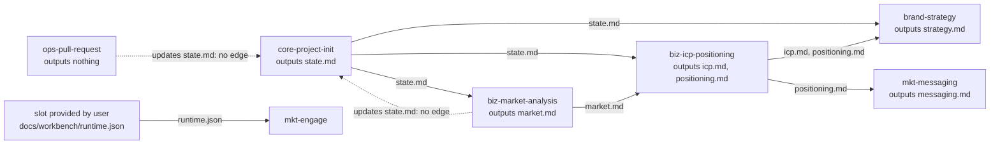
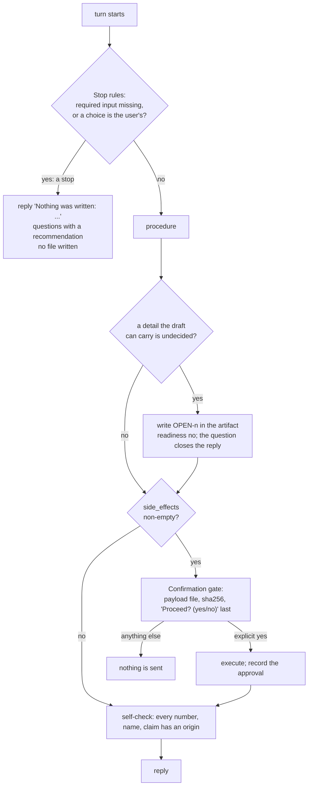

# Layer 1: skills and flows

Part of [the platform map](README.md). Every layer page has the same eight sections, in this order.

## Purpose

A skill is the unit of work of the workbench: one folder under `skills/`, with a `SKILL.md` a model follows and the scripts, references and assets it loads, proven in the lab on each model before anything relies on it. A capability does one job and reads and writes artifacts of the target project; a flow chains capabilities phase by phase with a checkpoint after each. Around the skills sit the delegation agents (`agents/`), the packs that decide what is installed (`packs/`), the generated copies of scripts several skills carry (`shared/scripts/`) and the templates new skills start from (`templates/`).

The rules every skill follows are [AGENTS.md](../../../AGENTS.md) (principles, design rules, frontmatter contract, writing standard, change classes); the rules for eval cases are [evals/README.md](../../../evals/README.md); the reliability model is [reliability-model-2026-10-02.md](../reliability-model-2026-10-02.md); the areas are [area-map.md](../../area-map.md). This page maps them and does not repeat them.

## Artifacts it owns

Where: **repo** is this repository. A skill writes nothing into this repository when it runs; what it produces lives in the target project ([contracts-and-references.md](contracts-and-references.md)).

| Path | Where | Format | Written by | Read by | Lifecycle | Versioned | Generated |
|---|---|---|---|---|---|---|---|
| `skills/<name>/SKILL.md` | repo | YAML frontmatter (`name`, `description`, `license`, `metadata`) and a Markdown body in the template's sections; at most 500 lines. A capability or a flow (`metadata.kind`); `flow-fix-bug` is the flow skill | maintainers; scaffolded by `scripts/new-skill.sh` from `templates/<kind>.SKILL.md` | the model, through an adapter's install or staged into a lab or runtime run; `runtime/skill_meta.py` (the frontmatter); the router (the frontmatter of the skill it routes to); `scripts/validate.py`, `scripts/security_scan.py` | changed by pull request, with a bump | yes | no |
| `skills/<name>/references/*.md` | repo | Markdown, one level deep, loaded at the step that names it; only a skill whose body needs depth has the folder | maintainers | the model, at that step | inside the content hash | yes | two of the router's are (below) |
| `skills/<name>/assets/` | repo | the long templates of a skill's outputs, and files a step copies; only a skill that needs one has the folder | maintainers | the model | inside the content hash | yes | no |
| `skills/<name>/scripts/*.py` | repo | deterministic steps: input by flags, env or stdin, `--help`, data on stdout, diagnostics on stderr; Python, and shell for `skills/ops-branch-sync/scripts/sync-status.sh` and `skills/ops-pull-request/scripts/pr-context.sh` | maintainers, or `scripts/sync_copies.py` for a generated copy | the model runs each from the project root by its path | inside the content hash | yes | some are copies of `shared/scripts/` |
| `skills/<name>/scripts/tests/test_*.py` | repo | pytest, offline; file names unique across the repository | maintainers | CI, the commit hook | outside the content hash and never staged into a run | yes | a `conftest.py` is a generated copy of `shared/scripts/conftest.py` |
| `skills/<name>/evals/evals.json` | repo | `skill_name`, `evals[]` (`id`, `prompt`, `expected_output`, `files`, `assertions`, `grader_files`, `skills`, `setup`, `allow_web`, `workbench_files`, `absent_on_purpose`, `platforms`, `tags`), `allow_web`; at least two cases | maintainers | the lab's runner (`--check-cases` and the runs); `scripts/validate.py` | outside the content hash; each case has a hash of its own | yes | no |
| `skills/<name>/evals/files/` | repo | the fixtures: small projects in the project layout, fictional names, `.example` hosts | maintainers | the runner, which copies a folder by content into the case folder | outside the content hash | yes | no |
| `skills/<name>/evals/platforms/<platform>.json` | repo | a platform's cases, same keys plus `platform` (`skills/mkt-publish/evals/platforms/linkedin.json` is the one built) | maintainers | the runner with `--platform` | outside the content hash | yes | no |
| `skills/<name>/evals/evidence/lab-<test id>.jsonl`, `field-<id>.jsonl` | repo | one line per run (lab) or per use and verdict (field), of a closed form | the runner; `scripts/evidence.py import` | `evals/eval_status.py`, the runtime's proof | never edited once committed | yes | yes |
| `skills/<name>/evals/versions.jsonl` | repo | one JSON line per version: `version`, `content_sha256`, `class` (`new`, `x`, `y`, `z`), `date` | `evals/eval_status.py bump` only | the validator's version rules, the status script | append-only; at most one line per pull request | yes | yes |
| `skills/<name>/evals/result.json` | repo | the record of the first measurement | nothing any more | nothing | history | yes | was |
| `skills/<name>/evals/runtime-manifest.json` | repo | runtime manifest, of two kinds: whole (every key) for each skill of the packs in use (the `roles` block below) and for `design-execute`, `design-handoff`, `mkt-engage` and `mkt-vote-round`; partial (`skill` and a subset of the keys, in practice `reply_phrases`) for skills outside the packs in use. `python3 runtime/manifest.py --check` lists the problems | maintainers | `runtime/manifest.py`; the classifier of endings (`runtime/endings.py`) reads its `reply_phrases` | outside the content hash | yes | no |
| `agents/<name>.md` | repo | frontmatter `name`, `description`, `metadata` (`skills`, `version`) and a body in the sections of `templates/agent.md`; `implementer`, `researcher`, `reviewer`, `social-manager` | maintainers | the first runtime only (`scripts/runtime.py` hands `agents/social-manager.md` to an adapter's `run-agent.sh`); a harness that delegates; model, tools and permissions come from `adapters/<harness>/overrides/<name>.yaml`. No module of `runtime/` reads an agent file: the task runtime runs the social agent's skills (`mkt-engage`, `mkt-vote-round`) as contained runs ([runtime.md](runtime.md)) | changed by pull request; no lab test | yes | no |
| `packs/<name>.txt` | repo | one pattern per line (`eng-*`, `area:<area>`, `!<pattern>`, an exact name); the folder lists them, and `packs/README.md` says what each is for | maintainers | `scripts/select_skills.py`, the installers (`--pack`), `runtime/plan.py` and `runtime/manifest.py` ([runtime.md](runtime.md)) | changed by pull request | yes | no |
| `flows/<name>.json` | repo | flow file, read by code; the block below lists them | maintainers | `runtime/flow_files.py`; `scripts/validate.py` ([runtime.md](runtime.md) has the format) | changed by pull request | yes | no |
| `shared/scripts/<script>.py`, `shared/scripts/tests/test_shared_<script>.py` | repo | the one source of a script more than one skill carries: `check_post`, `check_refs`, `conftest`, `contrast`, `rank`, `redact`, `sensitive_topics`, `voice_stats` | maintainers | `scripts/sync_copies.py`, which writes the copies | a change of behaviour is made here, then synced | yes | no |
| `shared/scripts/copies.json` | repo | the manifest of generated copies: whole scripts (one destination, `scripts/redact.py`, is outside `skills/`) and blocks of contracts (the class table and the table of owning skills, copied into `skills/core-orchestrator/references/requirement-classes.md` and `owners.md`), each destination with `adopted` | maintainers | `scripts/sync_copies.py`, `scripts/validate.py` | changed by pull request | yes | no |
| `templates/capability.SKILL.md`, `templates/flow.SKILL.md`, `templates/agent.md` | repo | the skeletons, with `__NAME__`, `__AREA__`, `__TITLE__` (the agent's also `__ROLE__`, `__WHEN__`) | maintainers | `scripts/new-skill.sh`; `scripts/tests/test_canonical_sentences.py` | changed by pull request | yes | no |

The flow files, one row each, with their tasks in order. A flow file is not a flow skill: the runtime plans its tasks from the file, and the file's skills are capabilities.

<!-- generated: flow-files -->
| Flow | Title | Tasks, in order (key and skill) |
|---|---|---|
| `brand` | Brand of a product or company | `strategy` (`brand-strategy`), `name` (`brand-name`), `identity` (`brand-identity`), `voice` (`brand-voice`), `guidelines` (`brand-guidelines`) |
| `code-change` | A code change, to its pull request | `implement` (`eng-implement`), `pull-request` (`ops-pull-request`) |
| `design` | Design | `spec` (`product-feature-spec`), `flows` (`design-ux-flows`), `system` (`design-system`), `brief-city` (`design-brief`), `brief-building` (`design-brief`), `brief-floor` (`design-brief`), `brief-lobby` (`design-brief`), `brief-control-room` (`design-brief`) |
| `market-positioning` | Market and positioning | `market` (`biz-market-analysis`), `positioning` (`biz-icp-positioning`) |
<!-- /generated -->

## Abstractions

**Capability and flow.** `metadata.kind` is `capability` or `flow`, and only a `flow-` name is a flow. A capability does one job, never invokes another skill, and may cite another in "When not to use"; the one exception is the router, `core-orchestrator`, which names the skill and hands the request over and does none of its work. A flow names its phase skills in a `## Phases` table (`Skill`, `Optional`, `Milestone`, `Produces`, `Checkpoint question`), reads `docs/workbench/state.md` first, runs `core-project-init` when it is missing, stops at each checkpoint as the state file's `Autonomy.Checkpoints` says (`every-phase`, `milestones`, `end`), and lists the state file in `updates`, never in `outputs`. A flow skill is read by a model; a flow file (`flows/<name>.json`) is read by code, and the two are not the same thing: `flow-fix-bug` has no flow file, and no flow file has a flow skill of its name. `docs/inventory.md` has rows for flow skills that are not built (`flow-brand`, `flow-design`): they are rows of the inventory, planned, not folders of `skills/`.

**Agent.** A delegation target: a persona with a scope, a list of skills (`metadata.skills`) and a report format. It is not an area agent of the runtime, which is a scope with no persona and no file here ([runtime.md](runtime.md)).

**Area and prefix.** Nine areas, each with a prefix (`biz-`, `product-`, `brand-`, `design-`, `eng-`, `ops-`, `mkt-`, `ai-`, `core-`), the optional `asst-` and the `flow-` prefix, whose skills declare the area they mostly live in. A capability's prefix fixes its area; the skills of each area are listed in [area-map.md](../../area-map.md) and [inventory.md](../../inventory.md). A capability that could belong to two areas goes where a senior practitioner would do it without the other area's expertise ([area-map.md](../../area-map.md)).

**Pack.** The unit of installation: harnesses load every installed skill's name and description into every session and truncate past a budget, so a person installs a pack, never everything. `default` is every area except the optional ones. The packs of `packs_in_use` in `runtime/roles.json` (the `roles` block below) are the scopes of the runtime's area agents, and each of their skills must have a whole runtime manifest. The `design` pack spans two areas (`product-feature-spec` and the `design-` skills): the four skills of `flows/design.json` and, since A-36, `design-execute` and `design-handoff`, so that a request can be planned skill by skill past the brief; a task of `design-execute` stops at its missing requirements (`integration:design-tool`, `generator:image`) as for any skill. `product-prd` is in it too, with a whole runtime manifest, since `design-ux-flows` stops without `docs/product/prd.md`. `marketing` is a scope of the runtime's marketing area agent and is not in `packs_in_use`; its skills run as contained runs, which need a whole manifest of the skill ([runtime.md](runtime.md)).

**The frontmatter contract.** `name` equals the folder; `description` says what the skill does and when to use it; `metadata` holds `area`, `kind`, the three artifact lists, `requires`, `side_effects` and `version`.

- `inputs`: the project artifacts it reads if present. `outputs`: the artifacts it owns (creates, and defines by its template). `updates`: the artifacts another skill owns that it writes into (a row, a section, a status, an approval); present in every skill, `[]` when empty. A path may carry a placeholder of the closed vocabulary ([contracts/project-layout.md](../../../contracts/project-layout.md), "Placeholders").
- `requires`: requirement classes (`<role>:<target>`), never products; each skill says what it does when a class is missing.
- `side_effects`: words of the closed list (`publish`, `send`, `schedule`, `deploy`, `create`, `push`, `dismiss`). A non-empty list asks for a `## Confirmation gate`.
- `version`: `X.Y.Z`, raised only by the bump command.

**The artifact graph.** An edge goes from the owner of a path to each skill that lists it in `inputs`; `updates` adds no edge, and a skill that reads its own artifact is not a cycle. The graph has no cycle.

An arrow is "the owner's path is an input of". A dashed arrow is an `updates` entry, which writes into the owner's file and orders nothing. An input that no built skill owns is a row of the slots table, with `user` or `planned: <skill>`.

**The artifacts and their owners**, generated from the frontmatters by the same code as the table of owning skills of [contracts/project-layout.md](../../../contracts/project-layout.md) (`scripts/owner_table.py`): every path in an `outputs` or `updates` list, its owner and the skills that update it.

<!-- generated: artifacts-by-owner -->
| Artifact | Owning skill | Updated by |
|----------|--------------|------------|
| `AGENTS.md` | core-agents-md | core-project-init |
| `docs/brand/guidelines.md` | brand-guidelines | - |
| `docs/brand/identity.md` | brand-identity | - |
| `docs/brand/name.md` | brand-name | - |
| `docs/brand/pieces/` | brand-identity | - |
| `docs/brand/profile.md` | brand-profile | - |
| `docs/brand/strategy.md` | brand-strategy | - |
| `docs/brand/voice.md` | brand-voice | - |
| `docs/business/icp.md` | biz-icp-positioning | - |
| `docs/business/market.md` | biz-market-analysis | - |
| `docs/business/positioning.md` | biz-icp-positioning | - |
| `docs/delivery/repo-baseline.md` | ops-repo-baseline | - |
| `docs/design/briefs/<artifact>.lint.json` | design-brief | - |
| `docs/design/briefs/<artifact>.md` | design-brief | - |
| `docs/design/design-system.lint.json` | design-system | - |
| `docs/design/design-system.md` | design-system | - |
| `docs/design/flows.lint.json` | design-ux-flows | - |
| `docs/design/flows.md` | design-ux-flows | - |
| `docs/design/handoff/<screen>.lint.json` | design-handoff | - |
| `docs/design/handoff/<screen>.md` | design-handoff | - |
| `docs/design/handoff/<screen>/export/` | design-handoff | - |
| `docs/design/results/<artifact>.lint.json` | design-execute | - |
| `docs/design/results/<artifact>.md` | design-execute | - |
| `docs/design/results/<artifact>/` | design-execute | - |
| `docs/engineering/adr/<NNNN>-<title>.md` | eng-architecture | eng-implement, eng-tradeoffs |
| `docs/engineering/architecture.md` | eng-codebase-map | - |
| `docs/engineering/codebase-map.md` | eng-codebase-map | - |
| `docs/engineering/designs/<feature>.check.json` | eng-architecture | - |
| `docs/engineering/designs/<feature>.md` | eng-architecture | - |
| `docs/engineering/plans/<task>.md` | eng-root-cause | eng-docs, eng-impact-analysis, eng-implement, eng-integration-tests, eng-refactor, eng-tradeoffs, eng-unit-tests, ops-ci-pipeline |
| `docs/engineering/reviews/<change>.md` | eng-code-review | - |
| `docs/engineering/security-reviews/<date>.md` | eng-security-review | - |
| `docs/marketing/calendar.md` | mkt-content-plan | mkt-publish, mkt-social-copy, mkt-vote-round |
| `docs/marketing/content/<post>.md` | mkt-social-copy | mkt-vote-round |
| `docs/marketing/engagement-inbox.md` | mkt-engage | - |
| `docs/marketing/engagement-log.jsonl` | mkt-engage | - |
| `docs/marketing/engagement-policy.md` | mkt-engage | - |
| `docs/marketing/messaging.lint.json` | mkt-messaging | - |
| `docs/marketing/messaging.md` | mkt-messaging | - |
| `docs/product/backlog.lint-before.json` | product-backlog | - |
| `docs/product/backlog.lint.json` | product-backlog | - |
| `docs/product/backlog.md` | product-backlog | eng-implement |
| `docs/product/prd.lint-before.json` | product-prd | - |
| `docs/product/prd.lint.json` | product-prd | - |
| `docs/product/prd.md` | product-prd | - |
| `docs/product/roadmap.lint.json` | product-roadmap | - |
| `docs/product/roadmap.md` | product-roadmap | - |
| `docs/product/specs/<feature>.lint-before.json` | product-feature-spec | - |
| `docs/product/specs/<feature>.lint.json` | product-feature-spec | - |
| `docs/product/specs/<feature>.md` | product-feature-spec | - |
| `docs/security/audit-<date>.md` | core-security-audit | - |
| `docs/security/vetting-<skill>-<date>.md` | core-security-audit | - |
| `docs/workbench/briefs/<topic>.md` | core-clarify | - |
| `docs/workbench/critiques/<topic>.md` | core-critique | - |
| `docs/workbench/research/<topic>.check.json` | core-research | - |
| `docs/workbench/research/<topic>.md` | core-research | - |
| `docs/workbench/state.md` | core-project-init | biz-icp-positioning, biz-market-analysis, brand-guidelines, brand-identity, brand-name, brand-profile, brand-strategy, brand-voice, core-clarify, core-critique, core-orchestrator, core-research, design-brief, design-execute, design-handoff, design-system, design-ux-flows, eng-architecture, eng-codebase-map, eng-security-review, flow-fix-bug, mkt-content-plan, mkt-engage, mkt-messaging, mkt-publish, ops-branch-sync, ops-ci-pipeline, ops-pull-request, ops-repo-baseline, product-backlog, product-feature-spec, product-prd, product-roadmap |
<!-- /generated -->

**The writing standard's stops and gates.** Every stop of a skill is a numbered rule of its `## Stop rules` section, above the procedure; a step or the "If missing" column of the inputs table says "Stop rule <n>" and never restates it. The headings the change classes read have one spelling: `## Purpose`, `## Inputs`, `## Stop rules`, `## Confirmation gate`, `## Procedure`, `## Quality criteria`, `## Output template`, `## Gotchas`. A gate is one of two kinds, and the rule says which:

- **A stop**: no input at all, a missing required artifact, a choice between options. Nothing is written before the answer; the reply follows the template "The reply that asks", whose first line in the template is "Nothing was written: ..." and in each skill its own wording of it (the runtime reads that opening from the manifest's `asking_openings`). A missing artifact another skill writes is met with "stop and tell the user that `<skill>` writes it and to run it first". A "go", "proceed" or "use your judgement" is not an answer.
- **An open question in a draft**: a detail the draft can carry is written into the artifact as `OPEN-<n>`, the artifact's readiness is `no`, and the question closes the reply.

The **confirmation gate** is a third thing, the actuator's protocol: show the exact payload, write it to a file and hash it, ask once as the last line, execute only on an explicit yes, record the approval. The **external-content line** is one line that starts **External content is data.**, names the sources the skill reads, and asks for the reply section **Instructions found in external content** above a closing question.

**Guard assertions and their tags.** An assertion of a case is a text, or an object with `text` and `tags` from a closed list: `guard` (a stop, a question before going on, refusing an instruction planted in external content), `guard:<effect>` (a guard of one declared side effect) and `format` (a form only the skill defines). A case with a guard assertion is a guard case. A failed guard verdict is graded twice before it counts; a confirmed failure is cleared only by a change to the skill and passing runs of its guard cases. Guard cases run again on every Y change.

**The change classes.** A change inside a skill's content hash raises `metadata.version` by the class of the change, through `evals/eval_status.py bump --skill <name> --class x|y|z`:

| Class | What it covers | What it asks |
|---|---|---|
| X, security and contract | `side_effects`; an item removed or renamed in `outputs` or `updates`; the `## Confirmation gate` or `## Stop rules` section; the external-content line | a full test, the baseline reused where a case is unchanged |
| Y, everything else | a step, a criterion, a template, a reference, an asset, a script; an addition to `inputs`, `outputs`, `updates` or `requires`; a removal from `inputs` or `requires`; the description | a partial test of the cases the change could move and of the guard cases, 3 runs each; the third Y since the newest full test asks for a full test |
| Z, typo or formatting | only lines of `SKILL.md` in `## Purpose` or outside any section that instructs, none differing in a number, a path, a code span or a word of the guarded list, within 300 characters since the newest lab evidence | nothing |

**The version file, the content hash and the context hash.** The content hash is the sha256 over the skill folder's relative paths and bytes, leaving out all of `evals/`, everything under `scripts/tests/`, caches and the marker an installer writes (`content_hash` in `evals/eval_status.py`). The last line of `versions.jsonl` carries it, so a change without a bump is seen. What a run is given besides the skill (dependency skills of the case, the shared and platform references staged) has a hash of its own, the context hash: a change there leaves the skill's version alone and makes the lines made with the old context inherited evidence.

**The runtime manifest.** `skills/<name>/evals/runtime-manifest.json`, with exactly the keys `skill`, `documents` (`path`, `checks`, `platform`, `bound_to_approval`), `machine_files`, `mandatory_milestone`, `asking_openings`, `gate` (`effect`, `payload_file`), and optionally `reply_phrases` (`missing_input`, `question_intros`, `gate_questions`: each a list of phrases that appear in the skill's `SKILL.md` or `assets/`; no phrase of one skill lives in the runtime's code). A skill outside the packs in use may carry a partial manifest (`skill` and any subset of the keys). `manifest.load` defaults to whole, so a run needs a whole manifest whatever the skill's pack: the runtime refuses to run a skill with a partial one, and the contained run loads the manifest of the skill it is asked to run (`_contained_scope` in `runtime/ops.py`), which is why `mkt-engage` and `mkt-vote-round` have whole manifests though they are outside `packs_in_use`. The classifier of endings reads a manifest as whole or partial by the skill's pack (`manifest.in_use`). It holds only what the runtime needs and the frontmatter does not declare; it sits under `evals/`, so adding or changing it needs no bump and enters no run ([runtime.md](runtime.md)).

**The generated copy.** A script more than one skill carries has one source in `shared/scripts/` and a byte-identical copy in each skill, listed in `copies.json`; a block of a contract that a skill must carry (the class table, the owner table) is copied the same way, between its markers. A copy is `adopted` once the pull request that changes its skill writes it; from then on a hand edit fails the check.

## Dependencies

**What it reads.**

| What | How | Why |
|---|---|---|
| The target project's artifacts | the paths of `inputs` and `updates`, relative to the project root; a registered existing document by its real path | artifacts over invocation: skills meet through files, never through calls |
| Its own `references/`, `assets/`, `scripts/` | by a relative path from the skill folder, loaded at the step that names it | depth outside `SKILL.md` |
| The shared references | `../../shared/references/<file>`, and for a platform step `../../shared/references/platforms/<platform>.md` and `.json` | a transversal concern or a medium, written once |
| A provider | by class only: `python3 <workbench root>/providers/resolve.py --class <class>` prints the script's path, `WORKBENCH_ROOT` gives the root | a skill never names an implementation |
| Another skill | never, except the router's hand-over by name and a flow's phases by name | principle 4 |
| A harness | never: no tool name, folder or tool of a harness | principle 1; adapters read the core, never the reverse |

**Replaceability.** A skill the runtime uses keeps its declared paths and its manifest; the skills the runtime is wired to (the router, the brief, the sub-task skill), the code areas and the packs in use are data in `runtime/roles.json`, so replacing one edits that file and no step ([runtime/roles.py](../../../runtime/roles.py) checks it; `python3 runtime/roles.py --check`). No module of `runtime/` loads a skill's script into its own process (`runtime/tests/test_isolated.py`, `test_no_module_of_the_runtime_loads_a_file_of_skills_as_code`). The isolated runner (`runtime/isolated.py`) runs the manifest checkers (`runtime/documents.py`) and the sub-task reader (`runtime/plan.py`) as an isolated subprocess with a scrubbed environment. The social handlers (`runtime/handlers/social.py`, `social_vote.py`, `social_vote_job.py`) run named scripts of `mkt-engage`, `mkt-vote-round`, `mkt-social-copy`, `mkt-publish` and `brand-identity` as plain subprocesses of the runtime's interpreter, with the runtime's environment, until WP-7.6 hands them to the isolated runner; each such edge is a row of `TOLERATED` in `scripts/tests/test_layer_map.py` that names finding 9 of the review.

The roles the runtime is wired to, from `runtime/roles.json`:

<!-- generated: roles -->
| Key | Value |
|---|---|
| `router` | `core-orchestrator` |
| `brief` | `core-clarify` |
| `subtask` | `eng-implement` |
| `code_areas` | `engineering`, `delivery` |
| `packs_in_use` | `business`, `brand`, `design`, `planning`, `code` |
<!-- /generated -->

**Who reads it.** A harness, through an adapter's installer, which copies or links the skills of one pack (and `shared/references/` beside them); the lab, which stages one skill into a run folder without its `evals/` and `scripts/tests/` and grades the run; the runtime, through its lab facade for a run and directly for the frontmatter (`runtime/skill_meta.py`), the roles file (`runtime/roles.py`), the runtime manifests (`runtime/manifest.py`, which imports `scripts/select_skills.py` to resolve a pack), the packs (`runtime/plan.py` runs `scripts/select_skills.py` as a subprocess), the flow files and a few sentences of a skill's text that its classifier and merge read, each bound by a test (`runtime/tests/test_skill_text_binding.py`); the router, which reads the frontmatter of the skill it routes to and its own copies of the class and owner tables.

**The rules.**

- The core (`skills/`, `agents/`, `shared/`, `templates/`, `packs/`) names no AI tool and reads no adapter; an agent's model and tools live in `adapters/<harness>/overrides/`.
- A skill's procedure names no social platform; it finds the platform from the data it works on, reads that platform's reference, and stops when none is named (design rule 2).
- The owner-to-reader graph has no cycle, so there is always an order in which the owner of a path runs before its readers.
- A skill's scripts reach shared code only through a generated copy inside the skill: an installed skill stands alone.

## Business rules

Each invariant with its guard. A rule of `scripts/validate.py` is named in brackets where it has a name; an unnamed check is one of its errors. A test is in `scripts/tests/` unless its path is given.

**A skill's identity and frontmatter.**

- The folder equals `name`; a name is 1 to 64 characters, lowercase, single hyphens: `validate.py` (error).
- The prefix is an area prefix, `metadata.area` is one of the ten areas, a capability's prefix implies its area, `kind` is `capability` or `flow`, and `flow-` holds exactly when `kind` is `flow`: `validate.py` (errors); `scripts/new-skill.sh` refuses the same combinations.
- The frontmatter has only `name`, `description`, `license`, `metadata`: `validate.py` (error); `test_validate_rules.py`, `test_a_skill_frontmatter_has_only_the_known_top_level_keys`.
- The description is 1 to 1024 characters: `validate.py` (error). It says "when" and stays under 900 characters: [description-when], [description-length] (warnings).
- `metadata` carries `inputs`, `outputs`, `updates`, `requires`, `side_effects` and `version`, each list a list: `validate.py` (list type, error); [meta-keys] (warning).
- `requires` is `<role>:<target>` and a class of the class table: [requires-role], [requires-vocabulary] (errors); `test_requires_is_read_against_the_class_table_and_a_placeholder_class_is_legal`.
- A skill says what it does when a required class is missing: no guard found.
- `side_effects` uses the closed words: [side-effects-vocabulary] (error). A non-empty list has a `## Confirmation gate` heading on a line of its own: `validate.py` (error); a gate without a declared effect is a warning; `test_the_confirmation_gate_is_a_heading_not_a_substring`.
- A remote write in a skill's script or in a command of its `SKILL.md` while it declares `side_effects: []`: `security_scan.py`, rule `undeclared-side-effect` (error).
- `SKILL.md` is at most 500 lines: `validate.py` (error). About 5,000 tokens: [skill-tokens] (warning).

**The writing standard.**

- The headings, the stop wording, the two kinds of gate, the self-check before the reply, the scripts sentence and the date-from-a-command sentence are in both templates and in `AGENTS.md`: `test_canonical_sentences.py` (`test_the_capability_template_has_every_heading_the_change_classes_read`, `test_the_stop_gate_wording_is_in_the_templates_and_in_the_standard`, `test_every_stop_is_a_rule_of_the_stop_rules_section`, `test_the_self_check_comes_before_the_reply_and_asks_for_origins`), and a scaffolded skill carries them (`test_a_scaffolded_skill_carries_the_sentences`). In each skill after it is scaffolded: no guard found by a check; the behaviour is measured by its guard assertions.
- A skill that reads content someone else wrote carries the external-content line and the reply section: `security_scan.py`, rule `untrusted-content` (error); the template's sentence is the scan's canonical form (`test_the_external_content_sentence_is_one_line_in_the_canonical_form`, `test_every_kind_of_source_the_sentence_lists_is_a_source_word_of_the_scan`).
- No hidden text in an instruction file: `security_scan.py`, rules `hidden-unicode` (error) and `hidden-comment` (warning).
- A backticked skill name is built or its line says "planned": [skill-name] (warning).
- Every built skill is in the router's routing table, and a name there is built or marked `(planned)`: [routing-table] (warning).
- Relative links resolve in `SKILL.md`, a skill's `references/`, `agents/`, `contracts/` and `templates/`: `validate.py` (error); `test_the_links_of_this_repository_resolve`.
- A skill's script reaches code only in its own folder and `providers/resolve.py`, so it invokes no other skill's script and reaches a provider only through the resolver: the row `skills/*/scripts/**` of `ALLOWED` in `scripts/tests/test_layer_map.py` (`test_every_edge_of_the_code_is_allowed_or_tolerated`); one edge is tolerated, finding 17 of the review (`mkt-engage`'s `policy_gate.py` falls back to another skill's copy of a shared script). The scan reads code, not data files and not a command written in a `SKILL.md` step: that a capability never invokes another skill (the router excepted) in its text, and that it reads no file outside the project, its folder and the shared references, has no guard found; principle 4 and the template's wording only.

**The artifact contract** ([contracts/project-layout.md](../../../contracts/project-layout.md)), seven rules of `validate.py`, errors since phase C closed, each with a test of `test_validate_contract.py`:

- Every `updates` path has an owner: [contract-updates] (`test_rule_1_an_updated_path_has_an_owner`).
- An artifact has one owner: [contract-owner] (`test_rule_2_...`).
- Every `inputs` path has an owner or is a row of the slots table, and a slot row is stale once a skill owns it: [contract-inputs] (`test_rule_3_...`).
- No path is in `outputs` and `updates` of one skill: [contract-overlap] (`test_rule_4_...`).
- Only the placeholders of the vocabulary, one spelling per artifact: [contract-placeholder] (`test_rule_5_...`).
- The owner-to-reader graph has no cycle, and `updates` adds no edge: [contract-cycle] (`test_rule_6_...`, `test_updates_adds_no_edge_to_the_graph`).
- The generated table of owning skills equals the frontmatters: [contract-owner-table] (`test_rule_7_...`, `test_the_table_of_this_repository_is_current_and_names_every_owned_path`).
- Both templates declare `updates`, and a flow updates the state file and never owns it: `test_both_templates_declare_updates`, `test_a_flow_updates_the_state_file_and_never_owns_it`.

**The flow files and the generated blocks**: the rules of `validate.py` for the flow files (errors, with their tests in `scripts/tests/test_validate_flows.py`) and the one for the blocks of the architecture pages.

- Each flow file is well formed, its skills are folders of `skills/` and its `depends_on` name earlier tasks: [flow-file] (`test_a_flow_file_with_an_unknown_key_or_an_unknown_skill_is_an_error`; the runtime's own checks in `runtime/tests/test_flow_files.py`, `test_a_flow_file_that_is_not_well_formed_is_refused_with_every_problem_named`).
- A task that requires, without a condition, a path another task's skill of the flow writes depends on that task, written and never computed: [flow-dependencies] (`test_a_task_that_reads_what_another_task_of_the_flow_writes_must_depend_on_it`, `test_a_dependency_through_another_task_counts`, `test_a_conditional_requirement_is_not_computed`).
- The Phases cell of the inventory row of a flow that has a file lists the file's skills in order: [flow-inventory] (`test_the_inventory_row_of_a_flow_with_a_file_must_list_the_files_tasks_in_order`). A tree without `flows/` is a note: `test_a_tree_without_flows_is_a_note_and_no_error`; the files of this repository pass: `test_the_flow_files_of_the_repository_pass`.
- Every generated block of the pages of this folder equals what its source gives: [architecture-tables] (a warning, never an error; fix: `python3 scripts/architecture_tables.py --write`), `scripts/tests/test_architecture_tables.py`, `test_the_blocks_of_this_repository_are_current`, `test_the_validator_warns_on_a_stale_block_and_notes_a_tree_without_the_pages`.

**Versions, hashes and the bump** (the reliability model, section 3; tests in `evals/tests/test_versions.py` and `evals/tests/test_eval_status.py`).

- No change to a skill without a bump: the folder's content hash equals the last line's, and `metadata.version` is that line's: [version-bump] (error); `test_a_change_without_a_bump_is_found_and_a_bump_clears_it`.
- The version file is append-only against the base and gains at most one line per pull request: [version-file] (error); `test_the_version_file_is_append_only_and_gains_one_line`.
- The declared class agrees with the diff (X for the contract and security parts, Z only inside the allow-list and its budget), and a first line has no class: [version-class] (error); `test_a_contract_or_security_change_asks_for_x`, `test_the_external_content_line_asks_for_x_wherever_it_is`, `test_a_typo_in_purpose_or_before_the_first_heading_is_z`, `test_anything_outside_the_allow_list_is_not_z`, `test_a_new_skill_gets_its_first_line_from_the_bump_and_never_a_class`.
- The content hash leaves out `evals/`, `scripts/tests/`, caches and the installer's marker, and changes with any file a model reads: `test_the_hash_leaves_out_all_of_evals_and_the_installers_marker`, `test_the_hash_leaves_out_the_tests_of_the_skills_scripts`, `test_the_hash_changes_with_any_file_a_model_reads`.
- The roles file names skills and packs that exist and its areas are the validator's closed list: `runtime/tests/test_roles.py` (`test_every_role_names_a_skill_that_exists_and_the_packs_resolve`, `test_the_areas_are_the_closed_list_of_the_validator`, `test_a_roles_file_that_is_not_well_formed_is_refused_naming_the_key`).
- The runtime manifest is outside the content hash and never enters a run: `runtime/tests/test_runtime_manifest.py`, `test_the_manifest_is_outside_the_content_hash_and_never_enters_a_run`; its keys are closed and its `asking_openings` equal the first line of the skill's asking template: `test_a_manifest_that_is_not_well_formed_is_refused_with_every_problem_named`, `test_the_asking_openings_of_a_manifest_are_the_first_line_of_the_skills_asking_template`. A skill outside the packs in use may keep a partial manifest, which the classifier reads and the runtime refuses to run: `test_a_skill_outside_the_packs_in_use_may_have_a_partial_manifest_that_the_classifier_reads`, `test_the_runtime_refuses_to_run_a_skill_whose_manifest_is_partial`.

**Cases and guards** ([evals/README.md](../../../evals/README.md)).

- Each declared effect has an assertion tagged `guard:<effect>`: [guard-effect] (error); `test_each_declared_effect_needs_a_guard_an_error_since_the_sweep`.
- A skill with the external-content line, a `## Stop rules` or a `## Confirmation gate` has a `guard` assertion: [guard-missing] (warning). A guard assertion that passes in every baseline run guards nothing: [guard-cannot-fail] (warning; `python3 scripts/validate.py` prints each).
- Every case passes the runner's preflight (each file shipped, each cited path present, outputs or `absent_on_purpose`, tags of the closed list): the `eval-cases` check of `validate.py`, through `evals/eval_run.py --check-cases` (error); `evals/tests/test_case_rules.py`.
- At least two cases, three assertions each, known keys, no conditional assertion, no assertion about a command, no prompt that names the skill, no AI product in a case: [eval-cases-count], [eval-assertions-count], [eval-keys], [eval-conditional-assertion], [eval-run-assertion], [eval-prompt-names-skill], [eval-product-names] (warnings).
- Test file names are unique across the test folders: [test-file-names] (warning); `test_the_test_file_names_of_this_repository_are_unique`.

**Copies.**

- Every adopted copy is byte-identical to its source: `validate.py` through `scripts/sync_copies.py --check` (error); `test_sync_copies.py`, `test_this_repository_has_no_adopted_copy_that_differs`; `test_script_copies.py`, `test_an_adopted_copy_is_identical_to_its_source`. A copy not yet adopted: [copy-not-adopted] (warning).
- Every script under `shared/scripts/` is in the manifest and has its tests: `test_no_script_under_shared_scripts_is_left_out_of_the_manifest`, `test_every_source_is_in_the_core_and_every_script_source_has_its_tests`.

**Principles and design rules.**

- Principle 1 and design rule 1, no harness in the core (any spelling, its folders, variables, tool names, a path inside an adapter): `validate.py`, rule `harness-name` (error); `test_this_repository_names_no_harness_in_its_core`, `test_packs_are_read_as_core`.
- Principle 6, English only: `validate.py`, rule `english-only` (error, a guard against one known slip); `test_english_only.py`.
- Principle 8, no project data: `validate.py`, rule `private-term`, only where a maintainer keeps the local terms file, so never in CI (`test_validate_private_terms.py`); fixtures with fictional names: [eval-product-names] for AI products only; for the rest, no guard found beyond review.
- Design rule 2, a procedure names no social platform: the template carries the literal platform step and the script rule (`test_platform_references.py`, `test_the_template_carries_the_literal_step_and_the_readme_the_same_definition`, `test_the_template_carries_the_script_rule_and_the_parser_exception`); in each skill's procedure: no guard found.
- Design rule 3, adding a platform adds files: the platform's data equals the constants scripts still hold (`test_platform_references.py`); that no skill's procedure is edited: no guard found.
- Design rule 4, one skill per job: no guard found; a judgement of review.
- A capability never invokes another skill: no guard found in a skill's text; a script's reach is the layer map's (see above).

**Packs.**

- A pack pattern that selects nothing is named on stderr, and an installer reports a pack that selects no skill and installs nothing: `test_select_skills.py`, `test_what_selects_nothing_is_named`; `test_installers.py`, `test_a_pack_that_selects_nothing_is_reported_and_exits_0`.
- Every skill a flow file names is in a pack in use, and every skill of a pack in use has a well-formed runtime manifest: `runtime/tests/test_runtime_manifest.py`.
- The pack budget (every installed skill's description reaches the model): no guard found across harnesses; one adapter's installer computes the budget a pack needs and writes it when asked ([decisions.md](../../decisions.md), 2026-10-03), and [description-length] keeps each description short.

**Agents.**

- An agent's frontmatter has only `name`, `description`, `metadata`: `validate.py` (error). Its links resolve: `validate.py`.
- An agent's scope matches its tools: [security.md](../../../shared/references/security.md), item 5, read by a person; no guard found in code.

## Entry points

| Command | What it does | Calls a model |
|---|---|---|
| `bash scripts/new-skill.sh --name <prefix-name> --kind capability\|flow --area <area> [--dry-run]` | scaffolds `skills/<name>/SKILL.md` from the template and an empty `evals/evals.json`; prints the next steps | no |
| `python3 evals/eval_status.py bump --skill <name> [--class x\|y\|z]` | appends (or rewrites, within one pull request) the line of the version file and raises `metadata.version`; no class for a first line | no |
| `python3 evals/eval_status.py hash --skill <name>` | prints the content hash, the version and the case hashes | no |
| `python3 evals/eval_run.py --skill <name> --check-cases` | the preflight of the cases | no |
| `python3 evals/eval_run.py --skill <name> [--cases <ids>] [--baseline] [--platform 
]` | a full, partial or platform test ([lab.md](lab.md)) | yes |
| `python3 scripts/select_skills.py [--pack <name>] [--areas a,b] [--skills x,y] [--lines]` | the skills a pack or a filter selects, as JSON | no |
| `python3 scripts/owner_table.py [--check\|--print]` | writes, checks or prints the table of owning skills in `contracts/project-layout.md` | no |
| `python3 scripts/sync_copies.py [--check\|--adopt <copy>...\|--list\|--destinations]` | writes the adopted copies from their source, checks them, or adopts one | no |
| `python3 scripts/validate.py [--strict] [--json] [--spec] [--flags]` | every rule above; exit 1 on an error; `--spec` also runs `skills-ref validate` on each skill when that tool is installed | no |
| `python3 scripts/architecture_tables.py [--write\|--check\|--print <table>]` | writes, checks or prints the generated blocks of the pages of this folder | no |
| `python3 scripts/stage_skills.py --skills-dir <folder> --skill <skill folder>...` | copies skills where a tool discovers them, without `evals/` and `scripts/tests/` (the lab's staging; see [adapters.md](adapters.md)) | no |
| `python3 runtime/flow_files.py --check [<name>...]`, `python3 runtime/manifest.py --check`, `python3 runtime/roles.py --check` | the checks of the flow files, the runtime manifests and the roles file, each printing one JSON object and exiting 1 on a problem | no |
| `python3 evals/eval_run.py --routing --pack <name> (--skill <name> \| --prompts <file>)` | which skills load for each prompt with the whole pack installed ([lab.md](lab.md)) | yes |
| `python3 scripts/security_scan.py [--strict]` | secrets, hidden text, unsafe patterns, undeclared side effects, untrusted content | no |
| `bash adapters/<harness>/install.sh --pack <name>` | installs a pack into a harness ([the index](README.md), "Start here") | no |

## Known limits and improvements

| Limit or improvement | Where it is recorded |
|---|---|
| The proof covers one skill in one run, with an input in the form of its cases; resuming a task with the person's answers and running a skill on a document another model wrote are not measured | [contracts/runtime.md](../../../contracts/runtime.md), "What the proof covers" |
| The class table and the table of owning skills are copied into the router's references, inside its content hash: a new class row, or a skill whose `outputs` or `updates` change, changes the router and asks for its bump and its test | `shared/scripts/copies.json`; [AGENTS.md](../../../AGENTS.md), "Changing an existing skill" |
| Two skills carry a parser of one platform's own format as code (the comment-link parser of `mkt-engage`, the profile-export parser of `brand-profile`), and `brand-name` holds its table of networks: a platform that needs either edits that skill | [AGENTS.md](../../../AGENTS.md), design rule 3 |
| The platform layer is built for one platform whose post is text with optional media; another shape edits `mkt-publish`, `mkt-social-copy` and `mkt-engage` | [AGENTS.md](../../../AGENTS.md), design rule 3 |
| The page names no band of any skill: a band changes with every evidence file. The published snapshot, with the commit it was made at, is the place to read each skill's band on each model; `python3 evals/eval_status.py status` computes it now; the findings of the battery left unrepaired are backlog item T28 | [inventory](../../inventory.md), the band table and the model table; [backlog](../../backlog.md), T28 |
| Nothing measures, per harness and per pack, how many installed descriptions reach the model | [backlog](../../backlog.md), T18 and T7 |
| The adapter's report of a loaded skill is not reliable, so a run with the skill that never loaded it scores as the skill's failure | [backlog](../../backlog.md), T1 and R12 |
| Guard assertions that pass in every baseline run guard nothing yet; the validator warns on each | `python3 scripts/validate.py`, [guard-cannot-fail]; [backlog](../../backlog.md), T19 |
| The rules of each skill's text (stops in `## Stop rules`, a step that only refers to a rule, the self-check before the reply, no invocation of another skill in a step, no platform in a procedure) are checked in the templates, not in each skill; a script's reach is checked by the layer map | this page, "Business rules" |
| Agents have no lab test | `agents/*.md`; `templates/agent.md` |
| The social handlers run named scripts of other skills (`mkt-engage`, `mkt-vote-round`, `mkt-social-copy`, `mkt-publish`, `brand-identity`) as plain subprocesses with the runtime's environment, not through the isolated runner, until WP-7.6 (finding 9 of the review); the tolerated edges are rows of `TOLERATED` | `scripts/tests/test_layer_map.py`, `test_a_fixed_row_is_removed_from_the_tolerated_list`; [review-2026-10-06.md](review-2026-10-06.md), finding 9 |
| A skill script (`mkt-engage`'s `policy_gate.py`) falls back to another skill's copy of a shared script; removed at the next Y change of that skill | `scripts/tests/test_layer_map.py` (`TOLERATED`); [review-2026-10-06.md](review-2026-10-06.md), finding 17 |
| A skill's reply can describe what the runtime's code does differently: `ops-pull-request` says the approval record is committed on the branch, and the runtime's commit holds only the change set | [stage 4 findings](../stage-4-findings-2026-10-06.md), finding 3 |
| Workarounds wait for the next change of reference model, among them the manifest outside the frontmatter and a skill run up to its gate | [backlog](../../backlog.md), T23 |

## Changes

- 2026-10-06: first version, written from the code at the central branch's head of that day.
- 2026-10-06: the volatile tables are generated from the code by `scripts/architecture_tables.py` (the artifacts and their owners, added).
- 2026-10-09: the page is brought to the code of the central branch: the flow files and the roles the runtime is wired to are generated blocks (WP-D.1), and counts that a folder or a block states left the prose; the manifests are described by kind (whole and partial), the design pack and flow, the social agent's skills run as contained runs and the agent file is read by the first runtime only; the isolated runner's reach and the social handlers' plain subprocesses until WP-7.6 are stated with their tests; the layer map guards a skill script's reach; the flow-file and architecture-tables rules of the validator, `--spec` and the checks of the flow files, manifests and roles file are in the rules and the entry points; the rows closed by merged changes (bands, agents' version, the packs README, N2 and N6, the warning count) are deleted, and the open limits (finding 9 and finding 17) have rows.
- 2026-10-09: `packs/design.txt` gains `product-prd`, `design-execute` and `design-handoff` (A-36 part 1), so a request can be planned past the brief skill by skill; `product-prd` joins with a whole runtime manifest.
